本页面面向刚接触本仓库的初学者，说明项目的定位、核心能力、技术栈、仓库结构以及推荐的学习路径。阅读完本页后，你将获得一张“地图”，知道各个模块大概在什么位置、下一步该去哪里深入了解。

Agent Template 是一个基于 pnpm Workspace 和 Turborepo 的 TypeScript Agent 平台模板。它把 Next.js 前端、Fastify API、BullMQ 后台任务、Prisma/PostgreSQL 持久化、Redis 队列、MCP Toolbox 工具供给，以及 Claude 与 Eve 两种可选的 Agent runtime，整合进一套可运行的 monorepo。你可以把它当作“带 Agent 能力的全栈应用骨架”：前端提供 Chat 界面，API 负责任务入队和生命周期，Worker 执行队列任务，Agent runtime 连接大模型和工具，Toolbox 提供受控的数据库查询能力。Sources: [README.md](README.md#L1-L9) [AGENTS.md](AGENTS.md#L3-L7)

## 阅读地图（初学者推荐路线）

如果你是第一次打开仓库，建议按以下顺序阅读：先从 [快速启动](2-kuai-su-qi-dong) 把本地服务跑起来，获得直观印象；然后看 [项目目录与模块职责](3-xiang-mu-mu-lu-yu-mo-kuai-zhi-ze) 理解每个目录的边界；接着通过 [核心概念与领域语言](5-he-xin-gai-nian-yu-ling-yu-yu-yan) 熟悉 Agent run、Agent job、Toolbox 等术语；再回到 [开发工作流与常用命令](4-kai-fa-gong-zuo-liu-yu-chang-yong-ming-ling) 掌握日常命令；最后进入 [整体架构与进程边界](7-zheng-ti-jia-gou-yu-jin-cheng-bian-jie) 及后续章节深入源码。Sources: [AGENTS.md](AGENTS.md#L1-L17) [README.md](README.md#L11-L22)

## 核心能力

| 能力 | 说明 | 主要承载模块 |
|------|------|--------------|
| Chat 交互 | 浏览器端通过 SSE 实时查看 Agent 运行事件 | `apps/web` |
| Agent 任务 API | HTTP 接口接收 prompt、创建 Agent run 并入队 | `apps/api` |
| 后台任务执行 | BullMQ Worker 消费队列并驱动 Agent run | `apps/worker` |
| 双 Runtime 支持 | 通过 `AGENT_RUNTIME` 选择 Claude 或 Eve | `packages/agent` / `agent-claude` / `agent-eve` |
| MCP 工具供给 | 通过 Toolbox server 提供只读数据库工具 | `apps/toolbox` / `packages/toolbox-config` |
| 合成验证数据 | 独立 `ecommerce_fixture` schema 用于本地验证 | `packages/ecommerce-fixture` |
| 可安装 CLI | 通过 Incur 提供 `agent-template` 命令行客户端 | `apps/cli` / `packages/agent-client` |
| 项目 Wiki | ZRead 生成 Markdown/Manifest，由 Web `/docs` 渲染 | `.zread` |

这些能力按“进程在 apps、能力在 packages”的方式组织：apps 启动运行进程，packages 提供可复用的 schema、类型、组件、数据库、Agent runtime 和客户端封装。Sources: [README.md](README.md#L54-L74) [AGENTS.md](AGENTS.md#L3-L7)

## 技术栈

| 分层 | 技术 |
|------|------|
| 前端 | pnpm + TypeScript + Next.js + React + Tailwind CSS + shadcn/ui + Vitest |
| 后端 | TypeScript + Fastify + Prisma + PostgreSQL + Redis + BullMQ + Zod + Pino + Vitest |
| Agent 与工具 | Claude Agent SDK、Eve、MCP Toolbox for Databases |
| 工程化 | pnpm Workspace 11.11.0、Turborepo、Node 24.x |

环境统一使用 pnpm 脚本管理，根目录 `package.json` 定义了 dev/build/test/lint/typecheck 等常用命令，以及数据库、Agent 和 Toolbox 的验证脚本。Sources: [README.md](README.md#L5-L9) [package.json](package.json#L1-L44)

## 运行环境与服务端口

本地开发默认使用以下端口，避免与本机默认服务冲突：

| 服务 | 默认地址 |
|------|----------|
| Web 前端 | http://localhost:13000 |
| Eve Agent | http://localhost:13010 |
| API | http://localhost:14000 |
| API 健康检查 | http://localhost:14000/health |
| MCP Toolbox | http://localhost:15000 |
| PostgreSQL | localhost:15432 |
| Redis | localhost:16379 |

所有地址和 Token 通过 `.env` 配置，`.env.example` 提供了不含密钥的模板。Docker Compose 是显式选择的容器启动方式，不是默认构建或回归验证路径。Sources: [README.md](README.md#L25-L33) [.env.example](.env.example#L1-L38)

## 仓库结构

仓库采用 monorepo 结构，根目录下分为 `apps/`、`packages/`、`docs/`、`.zread/` 和 `scripts/`。`apps/` 存放可独立启动的进程，`packages/` 存放跨进程复用的库。用下图可以快速建立目录印象：

```mermaid
graph TD
    Root[agent-template 根目录]
    Root --> Apps[apps/ 运行进程]
    Root --> Packages[packages/ 可复用库]
    Root --> Docs[docs/ ADR 与协作文档]
    Root --> ZRead[.zread/ Wiki 生成产物]
    Root --> Scripts[scripts/ 根级验证脚本]

    Apps --> Web[web Next.js 前端]
    Apps --> Api[api Fastify HTTP]
    Apps --> Worker[worker BullMQ 后台]
    Apps --> Cli[cli Incur 命令行]
    Apps --> Toolbox[toolbox MCP Toolbox 配置]

    Packages --> UI[ui 共享 React 组件]
    Packages --> DB[db Prisma/PostgreSQL]
    Packages --> Logger[logger Pino 日志]
    Packages --> Shared[shared Zod schema 与类型]
    Packages --> Agent[agent 公共 Agent runtime 边界]
    Packages --> AgentClient[agent-client 远程调用客户端]
    Packages --> ToolboxConfig[toolbox-config Toolbox 配置]
    Packages --> AgentClaude[agent-claude Claude runtime]
    Packages --> AgentEve[agent-eve Eve runtime]
    Packages --> EcommerceFixture[ecommerce-fixture 合成零售数据]
```



每个目录的详细职责和“不应该做”的边界，请参见各目录下的 `AGENTS.md`。Sources: [README.md](README.md#L54-L74) [pnpm-workspace.yaml](pnpm-workspace.yaml#L1-L3)

## 整体架构

系统把一次 Agent 交互拆成“入口 → 编排 → 执行 → 工具”四层。用户通过 Web Chat 或 CLI 发起 prompt；API 创建 durable Agent run 后，Chat 用 SSE 实时返回事件，队列任务把 `runId` 交给 Worker；Worker 通过公共 runtime selector 加载当前部署选中的 Claude 或 Eve adapter；Agent runtime 通过各自原生的 MCP Client 直连 Toolbox 获取数据库工具。PostgreSQL 是持久化的真相源，Redis + BullMQ 只负责任务投递。

```mermaid
graph LR
    User[用户/脚本]
    Web[apps/web Next.js]
    CLI[agent-template CLI]
    AgentClient[@agent-template/agent-client]
    API[apps/api Fastify]
    Worker[apps/worker BullMQ]
    AgentRun[AgentRunLifecycle @agent-template/agent]
    Claude[packages/agent-claude]
    Eve[packages/agent-eve]
    Toolbox[apps/toolbox MCP Toolbox]
    Postgres[(PostgreSQL)]
    Redis[(Redis)]

    User --> Web
    User --> CLI
    CLI --> AgentClient
    Web -->|同源 /api/agent/chat| API
    AgentClient -->|HTTP/SSE| API
    API -->|创建 run / SSE| AgentRun
    API -->|enqueue runId| Redis
    Worker -->|consume runId| Redis
    Worker --> AgentRun
    AgentRun -->|AGENT_RUNTIME=claude| Claude
    AgentRun -->|AGENT_RUNTIME=eve| Eve
    Claude -->|MCP Client| Toolbox
    Eve -->|MCP Client| Toolbox
    Toolbox --> Postgres
    AgentRun --> Postgres
```

这个架构的关键边界是：API 和 Worker 不直接依赖具体 runtime 包，只通过 `@agent-template/agent` 的公共 selector 在运行时加载；Claude 和 Eve 各自维护独立的 MCP Client，不共享 Host 也不经过 API 代理；Toolbox 是独立的 Tool provider，只暴露定义好的只读工具。Sources: [AGENTS.md](AGENTS.md#L44-L52) [apps/api/AGENTS.md](apps/api/AGENTS.md#L1-L20) [apps/worker/AGENTS.md](apps/worker/AGENTS.md#L1-L15) [packages/agent/AGENTS.md](packages/agent/AGENTS.md#L1-L13)

## 模块地图

| 模块 | 类型 | 一句话职责 |
|------|------|------------|
| `apps/web` | 运行进程 | Next.js 前端，负责页面、Chat UI 和调用 API 的展示逻辑 |
| `apps/api` | 运行进程 | Fastify HTTP API，负责路由、健康检查、Chat SSE、Agent job 入队 |
| `apps/worker` | 运行进程 | BullMQ 任务进程，消费队列并执行 Agent run |
| `apps/cli` | 运行进程 | 基于 Incur 的可安装命令行，调用远端 Agent API |
| `apps/toolbox` | 运行进程/配置 | MCP Toolbox 的本地工具、语义层和业务 Skill 来源 |
| `packages/ui` | 共享库 | shadcn/ui 风格的共享 React 组件 |
| `packages/db` | 共享库 | 平台 `public` schema、Prisma 配置和持久化 adapter |
| `packages/shared` | 共享库 | Zod schema、TypeScript 类型、队列名和事件协议 |
| `packages/agent` | 共享库 | Agent runtime 公共边界：环境解析、runtime 选择、run lifecycle |
| `packages/agent-client` | 共享库 | Web/CLI 等调用方共用的远程 Agent Client |
| `packages/agent-claude` | 共享库 | Claude Agent SDK runtime adapter |
| `packages/agent-eve` | 共享库 | Eve runtime adapter |
| `packages/toolbox-config` | 共享库 | Toolbox URL、token、capability profile 共享配置 |
| `packages/ecommerce-fixture` | 共享库 | 独立 schema 的合成零售验证数据 |
| `packages/logger` | 共享库 | Pino logger 统一配置 |

模块之间的依赖规则是：apps 只能依赖 packages，runtime 选择通过公共包完成，业务 Skill 和语义目录由 `apps/toolbox` 作为事实源。Sources: [README.md](README.md#L54-L74) [apps/api/AGENTS.md](apps/api/AGENTS.md#L1-L20) [apps/worker/AGENTS.md](apps/worker/AGENTS.md#L1-L15) [packages/agent/AGENTS.md](packages/agent/AGENTS.md#L1-L13)

## 工程与协作原则

项目遵循几条明确的工程原则，确保多人协作和长期演进可控。第一是 **Fail Fast / Errors Never Pass Silently**：错误必须携带上下文显式失败，禁止兜底或伪造成功。第二是 **Make It Observable**：关键路径必须记录关联标识、状态转换和失败上下文，保证可端到端追溯。第三是 **Living Documentation / Single Source of Truth**：技术栈、架构边界或方向变化时，同步更新 `AGENTS.md` 和必要 ADR，文档与代码同批演进。第四是 **Don't Break Mainline**：大规模重构前必须创建独立分支，未验证通过不得合入主线。这些原则也体现在目录边界和构建门禁中，例如 API/Worker 不能静态 import 两套 runtime，构建脚本会检查 bundle 分块。Sources: [AGENTS.md](AGENTS.md#L19-L35) [AGENTS.md](AGENTS.md#L44-L52)

## 下一步

看完本页后，建议你直接进入 [快速启动](2-kuai-su-qi-dong)，按步骤安装依赖、初始化数据库并启动本地服务。如果你想先看代码组织，可以跳转到 [项目目录与模块职责](3-xiang-mu-mu-lu-yu-mo-kuai-zhi-ze)。如果你已经熟悉结构，想理解 Agent run 的完整流程，可继续阅读 [Agent Run 生命周期与执行租约](8-agent-run-sheng-ming-zhou-qi-yu-zhi-xing-zu-yue)。Sources: [README.md](README.md#L11-L22) [AGENTS.md](AGENTS.md#L1-L17)