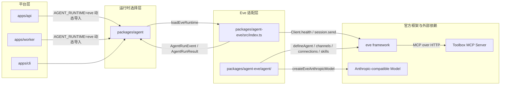
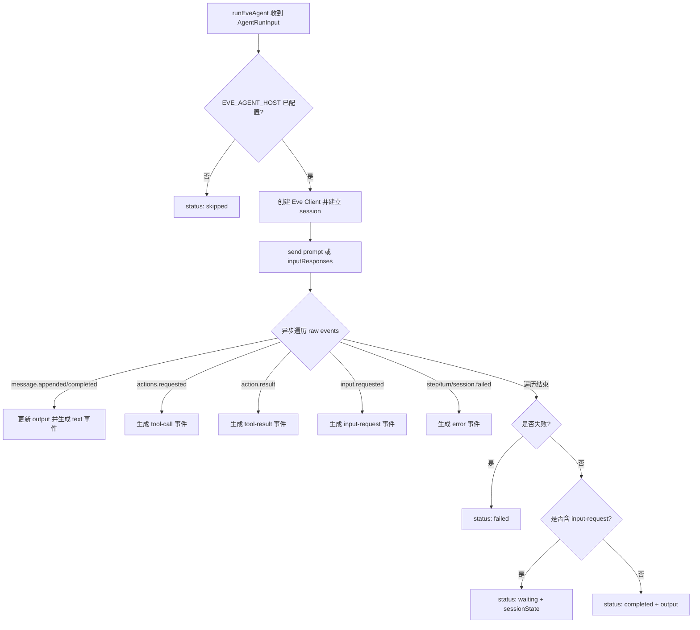

`packages/agent-eve` 是 Agent Template 针对官方 Eve Agent 框架的运行时适配层。它把 Eve 的 HTTP 会话、动态 Skill、MCP 连接和事件协议翻译成平台统一的 `AgentRunInput` / `AgentRunEvent` 契约，使得 API、Worker、CLI 可以通过与 Claude 相同的 `packages/agent` 选择器切换到 Eve 运行。本文档只讨论 Eve 侧的适配边界，不涉及 API 路由、SSE 或 Chat 界面自身的实现细节。

Sources: [packages/agent-eve/AGENTS.md](packages/agent-eve/AGENTS.md#L1-L10), [packages/agent/src/index.ts](packages/agent/src/index.ts#L1-L15)

## 目标与范围

Eve 适配层承担三个核心职责：第一，把官方 `eve` 包的能力封装成平台可消费的运行模块（`runEveAgent`、`checkEveAgentReadiness`、`parseEveAgentConfig`）；第二，在 `agent/` 目录维护 Eve 推荐的 nested authored surface（Agent、Channel、Connection、Skill、Sandbox、Tool 覆盖）；第三，通过 `packages/agent` 的 `AGENT_RUNTIME` 选择器实现部署时无感切换。Claude 相关逻辑保留在 `packages/agent-claude`，不在这里混合。

Sources: [packages/agent-eve/AGENTS.md](packages/agent-eve/AGENTS.md#L1-L10), [packages/agent/src/index.ts](packages/agent/src/index.ts#L16-L30)

## 在整体架构中的位置

运行时选择器由 `packages/agent` 持有，API 与 Worker 只依赖 `@agent-template/agent`，并通过动态导入加载 `@agent-template/agent-eve`。当 `AGENT_RUNTIME=eve` 时，selector 调用 `loadEveRuntime()`，把共享的 `AgentRunInput` 交给 `runEveAgent`。Eve 适配层内部再与官方 `eve` Client、 authored surface、Toolbox MCP Server 和 Anthropic-compatible 模型交互。



Sources: [packages/agent/src/index.ts](packages/agent/src/index.ts#L314-L320), [packages/agent-eve/src/index.ts](packages/agent-eve/src/index.ts#L151-L240)

## 包结构与 Authoring Surface

`packages/agent-eve` 自身就是 Eve 推荐的 filesystem-first app root。`src/` 只保留平台接入层；`agent/` 则按官方 nested layout 组织，避免把运行时代码混进 authored surface。

| 目录/文件 | 职责 |
| :--- | :--- |
| `src/index.ts` | 对外暴露 `runEveAgent`、`checkEveAgentReadiness`、`parseEveAgentConfig` 等运行时 API |
| `src/config.ts` | 读取 `EVE_AGENT_MODEL`、`ANTHROPIC_*` 配置并构造 AI SDK Anthropic provider |
| `agent/agent.ts` | 使用 `defineAgent` 声明模型与 context window |
| `agent/channels/eve.ts` | Eve HTTP 路由的认证策略（service token + Vercel OIDC + 开发 loopback） |
| `agent/connections/toolbox.ts` | 通过 `defineMcpClientConnection` 声明 Toolbox MCP 连接 |
| `agent/skills/*.ts` | 电商业务动态 Skill，仅当所需 Tool 全部可见时才暴露 |
| `agent/lib/capability-profile.ts` | 按 capability profile 校验 Toolbox Tool 可见性 |
| `agent/lib/service-auth.ts` | service token 的 SHA-256 恒定时间比较 |
| `agent/sandbox.ts` | 固定使用官方 `justbash()` 后端 |
| `agent/tools/*.ts` | 显式禁用 `bash`、`web_fetch`、`web_search`、`write_file` |

Sources: [packages/agent-eve/AGENTS.md](packages/agent-eve/AGENTS.md#L10-L20), [packages/agent-eve/agent/agent.ts](packages/agent-eve/agent/agent.ts#L1-L11), [packages/agent-eve/src/config.ts](packages/agent-eve/src/config.ts#L1-L51)

## 配置、模型与状态

`parseEveAgentConfig` 从环境变量中读取 `EVE_AGENT_HOST`、`EVE_AGENT_MODEL`、`EVE_AGENT_SERVICE_TOKEN`，并回退读取 `ANTHROPIC_MODEL` 以兼容 Claude 系列模型变量。`createEveAnthropicModel` 使用 `@ai-sdk/anthropic` 构造 Anthropic-compatible provider，并通过 `readEveAnthropicBaseURL` 把 `ANTHROPIC_BASE_URL` 统一规范到 `/v1` 后缀。`agent/agent.ts` 使用同一模型源，并显式声明 `modelContextWindowTokens: 128_000` 与 `compaction` 参数，因为 `kimi-for-coding` 不是 Eve 内置 catalog 模型。

`getEveAgentRuntimeState` 返回 `{ runtime: "eve", configured, model, authoredSurface }`，其中 `configured` 取决于 `EVE_AGENT_HOST` 是否已设置。未配置时 `runEveAgent` 直接返回 `skipped`，避免拉起一次失败的会话。

| 环境变量 | 用途 | 默认值 |
| :--- | :--- | :--- |
| `AGENT_RUNTIME` | 平台级运行时选择 | `claude` |
| `EVE_AGENT_HOST` | Eve 运行时 HTTP API 地址，例如 `http://localhost:13010` | 无 |
| `EVE_AGENT_MODEL` | 模型 ID，优先于 `ANTHROPIC_MODEL` | `kimi-for-coding` |
| `EVE_AGENT_SERVICE_TOKEN` | 调用 Eve channel 的 service token | 无 |
| `ANTHROPIC_API_KEY` / `ANTHROPIC_AUTH_TOKEN` | 模型提供方鉴权 | 无 |
| `ANTHROPIC_BASE_URL` | Anthropic-compatible API 基础地址 | `https://api.kimi.com/coding/` |

Sources: [packages/agent-eve/src/index.ts](packages/agent-eve/src/index.ts#L86-L113), [packages/agent-eve/src/config.ts](packages/agent-eve/src/config.ts#L1-L51), [packages/shared/src/agent-runtime.ts](packages/shared/src/agent-runtime.ts#L1-L2)

## 执行流程与调用契约

`runEveAgent` 通过 `eve/client` 的 `Client` 与远端 Eve 会话交互。调用时先检查 `EVE_AGENT_HOST`，未配置即 `skipped`；已配置则创建 `session` 并 `send` 用户 prompt 或前一轮的 `inputResponses`。`send` 返回的异步可迭代对象产生 Eve 原始事件，适配层逐条归一化为 `AgentRunEvent`，同时更新 `output` 文本。最终根据是否失败、是否等待用户输入返回 `completed`、`waiting` 或 `failed`，并附带 `sessionState` 用于平台级 conversation continuation。



`packages/agent` 在收到 `waiting` 结果后会把 `sessionState` 作为 opaque continuation 保存到 conversation，下一turn 通过 `toEveSessionState` 还原 `{ streamIndex, continuationToken, sessionId }`。平台 conversation 身份与 Eve 内部 session 标识解耦，符合平台自有 conversation 的边界。

Sources: [packages/agent-eve/src/index.ts](packages/agent-eve/src/index.ts#L151-L227), [packages/agent/src/index.ts](packages/agent/src/index.ts#L195-L227), [packages/agent/src/index.ts](packages/agent/src/index.ts#L302-L312)

## 事件映射与协议归一化

Eve 原始事件与平台 `AgentRunEvent` 之间的映射集中在 `formatEveAgentEvents`。连续文本快照通过 `appendCompactedAgentRunEvent` 合并，避免内存随流式输出二次增长。`updateEveOutput` 只保留最后一次累积文本作为最终 `output`。

| Eve 原始事件 | 映射后的 `AgentRunEvent` | 说明 |
| :--- | :--- | :--- |
| `message.appended` / `message.completed` | `kind: "text"` | 累积文本，最后一条会覆盖前一条 |
| `actions.requested`（含 `kind: tool-call`） | `kind: "tool-call"` | `callId` + `toolName` + `input` |
| `actions.requested`（`kind: subagent-call` / `remote-agent-call`） | `kind: "tool-call"` | `toolName` 规范为 `eve:subagent:<name>` |
| `action.result`（`kind: tool-result` / `subagent-result` / `load-skill-result`） | `kind: "tool-result"` | 只保留 `callId` 与 `toolName` |
| `input.requested` | `kind: "input-request"` | 支持 `approval` / `question` 与 option/action |
| `step.failed` / `turn.failed` / `session.failed` | `kind: "error"` | 失败原因取自 `data.message` |
| 其他 | `kind: "unknown"` | 不伪造 identity |

`readEveFailure` 在流式过程中提前捕获失败；遍历结束后若发现失败，会追加 `error` 事件并返回 `failed`。`inputResponses` 继续下一轮时由 `session.send` 以 `{ inputResponses: [...] }` 形式提交，不需要重新发送 prompt。

Sources: [packages/agent-eve/src/index.ts](packages/agent-eve/src/index.ts#L242-L478), [packages/shared/src/agent-run-events.ts](packages/shared/src/agent-run-events.ts#L1-L82)

## 动态业务 Skill 与能力画像

Eve 侧的业务 Skill 使用 `eve/skills` 的 `defineDynamic` + `defineSkill` 在 `session.started` 事件时动态加载。`hasToolboxCapabilities` 检查当前 `AGENT_CAPABILITY_PROFILE` 下的 `allowedTools` 是否包含 Skill 所需的全部 Tool；若缺少任一 Tool，则不暴露该 Skill，避免模型调用不可用的工具。Skill 的 `markdown`  instructs 模型只调用 `toolbox__*` 前缀的 connection tool，并要求读取 `references/ecommerce-semantic-catalog.yaml` 中的语义目录。

示例 `ecommerce-sales-analysis` 需要 `summarize-ecommerce-sales-by-channel`、`summarize-ecommerce-sales-by-day`、`summarize_sales_by_customer_segment`、`summarize_sales_by_region` 四个 Tool；`ecommerce-fulfillment-operations` 则需要订单与履约异常相关 Tool。这些 Skill 文件与 Claude 侧通过同一根目录生成脚本 `pnpm skills:generate:toolbox` 保持同步，但实现方式不同：Eve 使用 `defineDynamic`，Claude 侧使用自身运行时的 skill manifest 机制。

Sources: [packages/agent-eve/agent/lib/capability-profile.ts](packages/agent-eve/agent/lib/capability-profile.ts#L1-L22), [packages/agent-eve/agent/skills/ecommerce-sales-analysis.ts](packages/agent-eve/agent/skills/ecommerce-sales-analysis.ts#L1-L26), [packages/agent-eve/agent/skills/ecommerce-fulfillment-operations.ts](packages/agent-eve/agent/skills/ecommerce-fulfillment-operations.ts#L1-L24), [packages/agent-eve/agent/lib/ecommerce-semantic-catalog.ts](packages/agent-eve/agent/lib/ecommerce-semantic-catalog.ts#L1-L2)

## 安全、沙箱与最小权限

Eve HTTP 路由的认证策略在 `agent/channels/eve.ts` 中声明。生产环境或已配置 `EVE_AGENT_SERVICE_TOKEN` 时只启用 `apiServiceAuth` 与 `vercelOidc()`；开发环境未配置 token 时才追加 `localDev()`。`apiServiceAuth` 通过 `x-agent-template-eve-token` 请求头与 `matchesEveServiceToken` 做 SHA-256 恒定时间比较，避免时序攻击。`packages/agent-eve` 作为 Client 调用 Eve 时也会把同一 token 放入请求头。

沙箱使用官方 `justbash()` 后端，不依赖 Docker、VM 或真实二进制；默认 harness 中的 `bash`、`web_fetch`、`web_search`、`write_file` 被显式 `disableTool()`，只保留只读文件能力供 Skill 读取 `references/ecommerce-semantic-catalog.yaml`。Toolbox 连接通过 `defineMcpClientConnection` 持有本运行时的 MCP client，URL、Bearer token 与 allowlist 统一来自 `@agent-template/toolbox-config`，符合运行时自有 MCP client 的决策。

Sources: [packages/agent-eve/agent/channels/eve.ts](packages/agent-eve/agent/channels/eve.ts#L1-L47), [packages/agent-eve/agent/lib/service-auth.ts](packages/agent-eve/agent/lib/service-auth.ts#L1-L15), [packages/agent-eve/src/index.ts](packages/agent-eve/src/index.ts#L229-L239), [packages/agent-eve/agent/sandbox.ts](packages/agent-eve/agent/sandbox.ts#L1-L7), [packages/agent-eve/agent/tools/bash.ts](packages/agent-eve/agent/tools/bash.ts#L1-L4), [packages/agent-eve/agent/connections/toolbox.ts](packages/agent-eve/agent/connections/toolbox.ts#L1-L30)

## 就绪性检查

`checkEveAgentReadiness` 使用官方 `eve/client` 的 `Client.health()` 进行检查，检查内容包含 `ok`、`status: "ready"` 与 `workflowId`。未配置 `EVE_AGENT_HOST` 时直接返回 error。API 的 `GET /health` 通过 `packages/agent` 的选择器调用对应运行时的 readiness 函数，并设置约 800ms 超时，就绪失败会导致 API health 降级。

Sources: [packages/agent-eve/src/index.ts](packages/agent-eve/src/index.ts#L121-L147), [packages/agent/src/index.ts](packages/agent/src/index.ts#L131-L167), [docs/adr/0009-runtime-owned-readiness.md](docs/adr/0009-runtime-owned-readiness.md#L1-L19)

## 测试与验证

`packages/agent-eve` 的测试覆盖配置解析、模型读取、Anthropic base URL 规范化、运行时状态、 readiness 契约、事件流映射、input-request 等待与恢复、service token 认证、Toolbox 连接 allowlist 长度、动态 Skill 加载条件以及默认工具禁用。`vitest` 通过 mock `createClient` 注入自定义的 Eve Client 行为，避免依赖真实网络或模型。

本地验证命令：

```bash
pnpm --filter @agent-template/agent-eve lint
pnpm --filter @agent-template/agent-eve test
pnpm --filter @agent-template/agent-eve typecheck
pnpm --filter @agent-template/agent-eve build
pnpm --filter @agent-template/agent-eve eve:info
```

Sources: [packages/agent-eve/src/index.test.ts](packages/agent-eve/src/index.test.ts#L1-L50), [packages/agent-eve/src/service-auth.test.ts](packages/agent-eve/src/service-auth.test.ts#L1-L59), [packages/agent-eve/AGENTS.md](packages/agent-eve/AGENTS.md#L56-L62)

## 参考与下一步

- 与 Claude 运行时的对比请参阅 [Claude Agent Runtime 适配](9-claude-agent-runtime-gua-pei)
- Agent Run 的持久化、租约与重试机制请参阅 [Agent Run 生命周期与执行租约](8-agent-run-sheng-ming-zhou-qi-yu-zhi-xing-zu-yue)
- Toolbox  capability profile、MCP 工具与电商语义层请参阅 [Toolbox 与 MCP 工具供给](11-toolbox-yu-mcp-gong-ju-gong-gei)
- 运行时的 API 路由与 SSE 集成请参阅 [API 路由、SSE 与任务队列](13-api-lu-you-sse-yu-ren-wu-dui-lie)
- CLI 与 Agent Client 的调用方式请参阅 [CLI 与 Agent Client](15-cli-yu-agent-client)