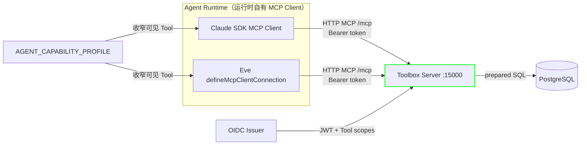
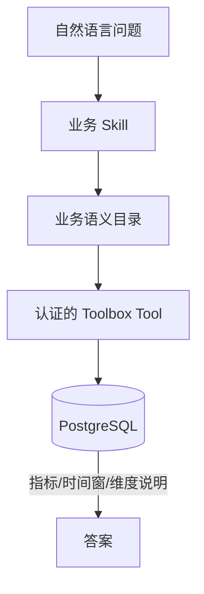
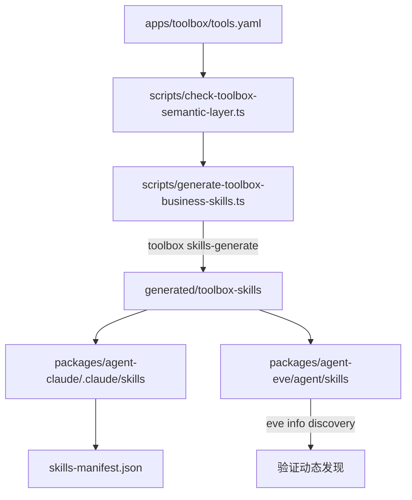
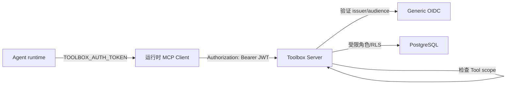

本页说明项目如何通过 Google **MCP Toolbox for Databases** 把 PostgreSQL 只读查询能力以 **MCP Tool** 的形式暴露给 Claude 与 Eve 两个 Agent runtime。核心目标有三：让数据库工具权限集中可审计、让两个 runtime 互不依赖地接入、让生产 Agent 只能看到经过 Capability Profile 收窄的受控工具集。阅读后，你会理解 `apps/toolbox/tools.yaml` 的事实源地位、业务语义目录与 Skill 的生成链路、生产认证与可观测性要求，以及本地验证门禁。

Sources: [apps/toolbox/README.md](apps/toolbox/README.md#L1-L176), [docs/adr/0002-toolbox-server-as-agent-tool-provider.md](docs/adr/0002-toolbox-server-as-agent-tool-provider.md#L1-L40), [docs/adr/0007-agent-runtime-owned-mcp-clients.md](docs/adr/0007-agent-runtime-owned-mcp-clients.md#L1-L8)

## 架构定位：独立的 MCP Tool Provider

项目把 `apps/toolbox` 作为**独立的 Tool Provider**，而不是让某个 runtime 直连数据库。Toolbox 以独立进程运行，暴露 HTTP MCP endpoint，Claude 和 Eve 通过各自框架原生的 MCP Client 连接。这样做的好处是：数据库连接细节只存在 Toolbox 配置中，runtime 只感知 MCP 工具名和 Bearer token；新增工具只需改一份 `tools.yaml`，并同步到共享配置与 Skill。



Claude 使用 SDK 的 `mcpServers` 配置把 Toolbox 注册为远程 HTTP MCP server；Eve 使用 `defineMcpClientConnection` 声明 `toolbox` 连接。两者都读取 `@agent-template/toolbox-config` 解析出的 `allowedTools` 与 `capabilityProfile`，并在连接时携带 `TOOLBOX_AUTH_TOKEN`。

Sources: [packages/agent-claude/src/index.ts](packages/agent-claude/src/index.ts#L650-L757), [packages/agent-eve/agent/connections/toolbox.ts](packages/agent-eve/agent/connections/toolbox.ts#L1-L30), [packages/toolbox-config/src/index.ts](packages/toolbox-config/src/index.ts#L1-L211)

## 配置事实源：tools.yaml

`apps/toolbox/tools.yaml` 是 Tool、Toolset 与 MCP annotations 的**可执行事实源**。文件顶部声明 PostgreSQL source，所有连接参数均为环境变量占位符；随后是若干 `kind: tool`，每个 tool 都是 `type: postgres-sql` 的预定义 SQL，由 Toolbox 以 prepared statement 执行；最后是 `kind: toolset`，用于按业务任务把工具分组。

```yaml
# 示例：source 与 tool 的片段
kind: source
name: agent-template-postgres
type: postgres
host: ${TOOLBOX_POSTGRES_HOST}
# ...
---
kind: tool
name: summarize-ecommerce-sales-by-day
type: postgres-sql
source: agent-template-postgres
annotations:
  readOnlyHint: true
  destructiveHint: false
  idempotentHint: true
  openWorldHint: false
statement: |
  -- 所有带 from/to 的查询都必须调用数据库侧时间窗守卫
  WITH toolbox_window AS MATERIALIZED (
    SELECT * FROM public.validate_toolbox_time_window($1::timestamptz, $2::timestamptz)
  )
  ...
```

设计上有几条硬约束：不暴露 `postgres-execute-sql` 等通用 SQL 工具；所有 Tool 都显式标注 `readOnlyHint: true`、`destructiveHint: false`；不使用 `templateParameters` 让模型控制表名或列名；所有带 `from/to` 的 SQL 都调用 `public.validate_toolbox_time_window`，在数据库层拒绝反向窗口和超过 31 天的窗口。

Sources: [apps/toolbox/tools.yaml](apps/toolbox/tools.yaml#L1-L874), [apps/toolbox/README.md](apps/toolbox/README.md#L33-L55), [packages/db/prisma/migrations/20260711083000_add_toolbox_time_window_guard/migration.sql](packages/db/prisma/migrations/20260711083000_add_toolbox_time_window_guard/migration.sql#L1-L29)

## Tool 与 Toolset 一览

当前 `tools.yaml` 共定义 18 个只读 Tool，分为两大类：Agent 平台运行观测与合成电商业务分析。Toolset 是业务分组的机制，不是运行时授权；运行时的授权由 Capability Profile + Toolbox OIDC/Tool scope 共同完成。

| 类别 | 工具数 | 代表 Tool | 用途 |
| --- | --- | --- | --- |
| 平台运行观测 | 9 | `list-agent-runs`、`summarize-tool-invocations` | 读取 `AgentRun` / `AgentRunEvent` / `TemplateEvent` |
| 电商业务分析 | 9 | `summarize-ecommerce-sales-by-day`、`list-ecommerce-top-products` | 读取 `ecommerce_fixture` 合成业务表 |

| Toolset | 包含工具数 | 对应业务 Skill |
| --- | --- | --- |
| `agent_template_read_model` | 18 | 开发全集（不作为业务分组示例） |
| `ecommerce-sales-analytics` | 4 | `ecommerce-sales-analysis` |
| `ecommerce-product-analytics` | 2 | `ecommerce-product-analysis` |
| `ecommerce-order-operations` | 2 | `ecommerce-order-operations` |
| `ecommerce-fulfillment-operations` | 2 | `ecommerce-fulfillment-operations` |

Sources: [apps/toolbox/tools.yaml](apps/toolbox/tools.yaml#L835-L874), [apps/toolbox/SEMANTIC_LAYER.md](apps/toolbox/SEMANTIC_LAYER.md#L1-L80)

## Capability Profile：模型可见的受控子集

`@agent-template/toolbox-config` 维护了一份共享的 Tool 清单与 Capability Profile。Profile 决定 Agent 模型在 `tools/list` 中能看到哪些 Tool，但**不替代授权**：真正的执行权限仍由 Toolbox OIDC、Tool scope、受限数据库角色和 RLS 控制。

```ts
export const toolboxCapabilityProfiles = {
  "development-all": toolboxToolNames,
  "platform-observability": toolboxToolNames.slice(0, 9),
  "ecommerce-analyst": [ /* 8 个电商工具 */ ],
  "ecommerce-sales": [ /* 4 个 */ ],
  "ecommerce-product": [ /* 2 个 */ ],
  "ecommerce-orders": [ /* 2 个 */ ],
  "ecommerce-fulfillment": [ /* 3 个 */ ],
} as const;
```

配置解析器会强制一条规则：如果传了 `TOOLBOX_AUTH_TOKEN`（生产认证），则必须显式设置 `AGENT_CAPABILITY_PROFILE`，且不能是 `development-all`。Claude 通过 `allowedTools` + MCP server 的 `permission_policy` 应用该 profile；Eve 通过 `tools: { allow: toolbox.allowedTools }` 应用。

Sources: [packages/toolbox-config/src/index.ts](packages/toolbox-config/src/index.ts#L1-L211), [packages/toolbox-config/src/index.test.ts](packages/toolbox-config/src/index.test.ts#L1-L89), [packages/agent-claude/src/filesystem-project.ts](packages/agent-claude/src/filesystem-project.ts#L1-L147)

## 业务语义层与智能问数

项目不把原始表结构交给模型，而是通过**业务语义目录**约束 Agent 只能在受治理的指标、维度、取值和 Tool 中选择。`apps/toolbox/semantic/ecommerce.yaml` 定义了 metrics、dimensions、values 与 `queryContracts`；`apps/toolbox/semantic/ecommerce-evaluation.yaml` 提供 golden cases，覆盖路由、歧义、空结果、越权、分页等场景。



每个认证业务 Tool 都必须在语义目录中有一个 `queryContracts` 条目，声明该工具可返回的指标、维度、结果字段和限制。`scripts/check-toolbox-semantic-layer.ts` 会在生成 Skill 前校验：Tool 名与描述规范、from/to 查询是否调用 `validate_toolbox_time_window`、电商查询是否限定 `ecommerce_fixture` schema、pageable 工具是否返回 `totalCount` 等。

Sources: [apps/toolbox/INTELLIGENT_QUERY.md](apps/toolbox/INTELLIGENT_QUERY.md#L1-L104), [apps/toolbox/semantic/ecommerce.yaml](apps/toolbox/semantic/ecommerce.yaml#L1-L470), [apps/toolbox/semantic/ecommerce-evaluation.yaml](apps/toolbox/semantic/ecommerce-evaluation.yaml#L1-L132), [scripts/check-toolbox-semantic-layer.ts](scripts/check-toolbox-semantic-layer.ts#L1-L757)

## Skill 生成与 Claude/Eve 适配

`pnpm skills:generate:toolbox` 的完整链路是：先运行语义层门禁，再调用 Toolbox 官方 `skills-generate` 为每个业务 Toolset 生成 Skill，最后把产物适配到两个 runtime。



生成产物分为三层：
- `generated/toolbox-skills/`：Toolbox 官方原始完整产物，保留 `SKILL.md`、`assets/tools.yaml` 和 `scripts/*.js`，用于检查和本地诊断。
- `packages/agent-claude/.claude/skills/`：Claude 实际加载的适配版，Tool 名前缀为 `mcp__toolbox__*`。
- `packages/agent-eve/agent/skills/`：Eve 实际加载的适配版，Tool 名前缀为 `toolbox__*`。

生成器还会强制检查：Skill 描述和每个 Tool/参数描述包含中文；引用的 Tool 必须在 `@agent-template/toolbox-config` 中；每个 Tool 必须属于某个 Capability Profile；Eve 的 `toolbox` connection 必须应用 `tools.allow`。

Sources: [scripts/generate-toolbox-business-skills.ts](scripts/generate-toolbox-business-skills.ts#L1-L695), [generated/toolbox-skills/manifest.json](generated/toolbox-skills/manifest.json#L1-L36), [packages/agent-claude/.claude/skills-manifest.json](packages/agent-claude/.claude/skills-manifest.json#L1-L36), [packages/agent-eve/agent/skills/ecommerce-sales-analysis.ts](packages/agent-eve/agent/skills/ecommerce-sales-analysis.ts#L1-L27)

## 生产认证

生产环境使用 `generated/toolbox-production/tools.yaml`，由 `scripts/generate-toolbox-production-config.ts` 从开发配置生成。它在文件顶部增加 Generic OIDC `authService`，并为每个 Tool 附加 `authRequired` 与 `scopesRequired`。



Tool scope 分为两类：`ecommerce:read`（电商分析工具）和 `agent-template:observe`（平台观测工具）。`@agent-template/toolbox-config` 的 `toolboxToolScopes` 维护每个 Tool 到 scope 的穷尽映射；生成器遇到未分类 Tool 会直接失败。生产启动时，Toolbox 通过 `TOOLBOX_OIDC_ISSUER` 和 `TOOLBOX_OIDC_AUDIENCE` 配置 OIDC，Agent runtime 通过 `TOOLBOX_AUTH_TOKEN` 提供 JWT，但 token 不会出现在模型 Tool schema、参数、结果或 Claude 子进程环境变量中。

Sources: [apps/toolbox/PRODUCTION_AUTH.md](apps/toolbox/PRODUCTION_AUTH.md#L1-L70), [scripts/generate-toolbox-production-config.ts](scripts/generate-toolbox-production-config.ts#L1-L91), [generated/toolbox-production/tools.yaml](generated/toolbox-production/tools.yaml#L1-L200), [packages/agent-claude/src/index.ts](packages/agent-claude/src/index.ts#L710-L730)

## 可观测性

Toolbox 进程默认以 JSON 格式输出日志，并启用 SQLCommenter，以便把数据库侧查询关联回 Toolbox 调用。若配置 `TOOLBOX_OTLP_ENDPOINT`，则通过 `--telemetry-otlp` 接入 OpenTelemetry Collector。日志、trace attributes 和 Tool 参数中**不得记录 JWT、数据库密码或完整业务明细**。

本地启动器 `scripts/toolbox/local-toolbox-server.ts` 会构造如下命令行：

```bash
toolbox \
  --config apps/toolbox/tools.yaml \
  --toolbox-url http://127.0.0.1:<port> \
  --address 127.0.0.1 \
  --port <port> \
  --logging-format JSON \
  --sql-commenter \
  --telemetry-service-name agent-template-toolbox
```

生产必看信号包括：MCP 请求量/错误率/延迟、数据库查询耗时与连接池、认证失败与 scope 拒绝、空结果率与澄清率。

Sources: [apps/toolbox/OBSERVABILITY.md](apps/toolbox/OBSERVABILITY.md#L1-L47), [scripts/toolbox/local-toolbox-server.ts](scripts/toolbox/local-toolbox-server.ts#L1-L182)

## 本地验证与门禁

项目提供一系列命令，覆盖配置同步、语义层、Tool 执行、认证隔离和查询计划。

| 命令 | 作用 |
| --- | --- |
| `pnpm toolbox:check` | 语义层检查 + Skill 生成产物检查 + 生产配置检查 |
| `pnpm skills:generate:toolbox` | 重新生成业务 Skill |
| `pnpm toolbox:verify:local` | 启动本地 Toolbox，执行 18 个 Tool 列表、10 个电商场景、5 个 Agent run 场景、分页/空结果/反向窗口/超窗验证 |
| `pnpm toolbox:verify:auth:local` | 启动本地临时 OIDC issuer，验证未认证拒绝、scope 隔离、Capability Profile 匹配 |
| `pnpm toolbox:verify:plans` | 验证 AgentRun 列表、失败 run 窗口、Tool call/result 关联查询是否使用生产索引 |
| `pnpm db:verify:boundaries` | 验证平台表只在 `public`，电商表只在 `ecommerce_fixture` |

`pnpm toolbox:verify:local` 是默认验收路径，不需要 Docker；只有明确要求容器诊断时才使用 `pnpm toolbox:verify:docker`。

Sources: [package.json](package.json#L35-L49), [scripts/toolbox/verify-ecommerce-toolbox.ts](scripts/toolbox/verify-ecommerce-toolbox.ts#L1-L414), [scripts/toolbox/verify-toolbox-auth-local.ts](scripts/toolbox/verify-toolbox-auth-local.ts#L1-L305), [scripts/verify-toolbox-query-plans.ts](scripts/verify-toolbox-query-plans.ts#L1-L182)

## 设计边界与约束

- **不暴露通用 SQL Tool**：所有 Tool 都是预定义 SQL，避免模型生成任意查询。
- **只读且有界**：所有 Tool 标注 `readOnlyHint: true`，列表查询带 `LIMIT/OFFSET` 和 `maxValue`，聚合查询带时间窗。
- **Capability Profile 不是授权**：Profile 只收窄模型可见范围，真实执行权限由 OIDC、Tool scope、数据库角色和 RLS 控制。
- **身份不是模型参数**：租户、组织等范围由可信 JWT claim 注入，不能出现在 Tool 参数中。
- **时间语义统一**：所有时间窗为 ISO-8601 UTC `[from, to)`，数据库函数 `validate_toolbox_time_window` 强制执行。
- **Schema 隔离**：平台表限定 `public`，合成电商表限定 `ecommerce_fixture`，不依赖 `search_path`。

Sources: [apps/toolbox/README.md](apps/toolbox/README.md#L33-L55), [apps/toolbox/INTELLIGENT_QUERY.md](apps/toolbox/INTELLIGENT_QUERY.md#L1-L104), [scripts/check-toolbox-semantic-layer.ts](scripts/check-toolbox-semantic-layer.ts#L200-L757)

## 下一步阅读

- 想了解 Claude 与 Eve 如何各自加载 Skill、连接 Toolbox、执行 Tool 调用，请继续阅读 [Claude Agent Runtime 适配](9-claude-agent-runtime-gua-pei) 与 [Eve Agent Runtime 适配](10-eve-agent-runtime-gua-pei)。
- 想理解 `AgentRun`、`AgentRunEvent`、`TemplateEvent` 的持久化模型与索引设计，请阅读 [数据库模型与持久化边界](12-shu-ju-ku-mo-xing-yu-chi-jiu-hua-bian-jie)。
- 想了解 Toolbox 在整体进程与网络边界中的位置，请阅读 [整体架构与进程边界](7-zheng-ti-jia-gou-yu-jin-cheng-bian-jie)。
- 想查看完整决策背景，请阅读 [架构决策记录（ADR）](19-jia-gou-jue-ce-ji-lu-adr)。