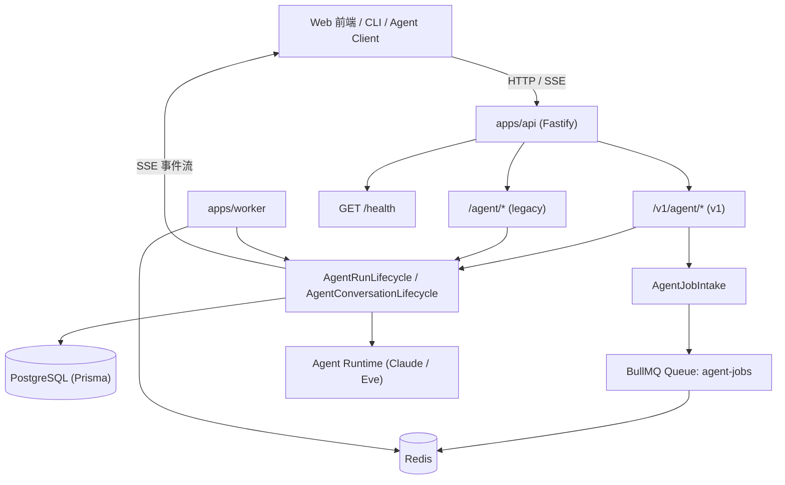
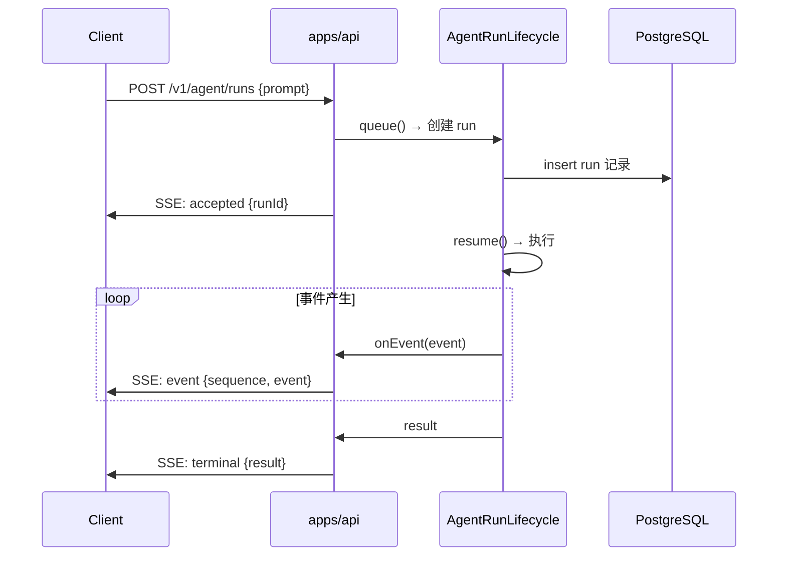

本页聚焦平台的 HTTP 服务面：位于 `apps/api` 的 Fastify 路由层如何暴露 Agent 能力、如何通过 Server-Sent Events（SSE）把运行事件实时推送回客户端，以及 `apps/worker` 怎样通过 Redis + BullMQ 队列消费异步任务。理解这三层后，就能把 “对话/运行请求 → 持久化 → 执行 → 结果回流” 的链路串联起来。

Sources: [app.ts](apps/api/src/app.ts#L1-L142), [worker.ts](apps/worker/src/worker.ts#L1-L15)

## 整体架构：路由、流、队列的分工

HTTP 请求进入 `apps/api` 后，被分成三类处理路径：

- **同步 SSE 流**：`POST /v1/agent/runs` 与 `POST /v1/agent/conversations/:conversationId/runs` 直接调用 Agent Run 生命周期并返回 SSE 流。
- **异步任务**：`POST /v1/agent/jobs` 把运行写入数据库并投递到 BullMQ 队列，由 `apps/worker` 后续消费。
- **事件跟随/回放**：`GET /v1/agent/runs/:runId/events?follow=true` 用 SSE 轮询数据库中的已有事件，支持断线重连。

下图展示了客户端、API、任务队列与执行 Worker 之间的关系：

Sources: [app.ts](apps/api/src/app.ts#L24-L50), [agent-api-v1.ts](apps/api/src/agent-api-v1.ts#L31-L174), [agent-job-intake.ts](apps/api/src/agent-job-intake.ts#L1-L63)

## 路由层：Fastify 应用与 v1 Agent API

`buildApp` 是 `apps/api` 的入口工厂函数，负责创建 Fastify 实例、注册 CORS、健康检查、旧版兼容路由以及 v1 Agent API。生产环境中，`server.ts` 直接调用 `buildApp({ env: loadEnv() })` 并监听 `API_HOST`/`API_PORT`。

Sources: [app.ts](apps/api/src/app.ts#L24-L50), [server.ts](apps/api/src/server.ts#L1-L13)

### v1 Agent API 路由表

`registerV1AgentApi` 以 REST 语义暴露了平台级（platform-owned）的 conversation 与 run 资源，所有 `/v1/agent/*` 端点都共享统一的认证钩子和错误处理。

| 方法 | 路径 | 行为 | 响应类型 |
|------|------|------|----------|
| `GET` | `/v1/agent/meta` | 返回协议版本与能力清单 | JSON |
| `POST` | `/v1/agent/conversations` | 创建 conversation | 201 JSON |
| `GET` | `/v1/agent/conversations` | 分页列出 conversations | JSON |
| `GET` | `/v1/agent/conversations/:conversationId` | 查看单个 conversation | JSON |
| `POST` | `/v1/agent/conversations/:conversationId/runs` | 在 conversation 中发送 prompt 并**流式执行** | SSE |
| `POST` | `/v1/agent/runs` | 独立运行 prompt 并**流式执行** | SSE |
| `GET` | `/v1/agent/runs` | 分页列出 runs | JSON |
| `GET` | `/v1/agent/runs/:runId` | 查看单个 run | JSON |
| `GET` | `/v1/agent/runs/:runId/events` | 获取事件；`follow=true` 时建立 SSE 轮询 | JSON / SSE |
| `DELETE` | `/v1/agent/runs/:runId` | 请求取消 run | JSON |
| `POST` | `/v1/agent/jobs` | 接收任务并**异步排队** | 202 JSON |

Sources: [agent-api-v1.ts](apps/api/src/agent-api-v1.ts#L31-L174)

### 旧版路由与兼容性

在非生产环境或显式开启 `AGENT_LEGACY_ROUTES_ENABLED=true` 时，应用会额外注册 `/agent/jobs`、(`/agent/runs/:runId`、`/agent/chat`) 等旧版路由。这些路由用于兼容早期客户端，功能上与 v1 对应端点等价，但缺少 `conversation` 语义和更严格的错误格式。

Sources: [env.ts](apps/api/src/env.ts#L1-L40), [app.ts](apps/api/src/app.ts#L44-L46), [app.ts](apps/api/src/app.ts#L76-L123)

## 认证、校验与错误处理

`/v1/agent/*` 下的所有请求在 `registerAuthentication` 中统一校验 `Authorization: Bearer <AGENT_API_TOKEN>`。生产环境下 `AGENT_API_TOKEN` 为必填项，且使用 `timingSafeEqual` 防止时序攻击。

Sources: [agent-api-v1.ts](apps/api/src/agent-api-v1.ts#L296-L319), [env.ts](apps/api/src/env.ts#L21-L29)

错误处理在 `registerErrorHandler` 中集中完成：

- `ZodError` → `400 INVALID_INPUT`
- `AgentConversationNotFoundError` → `404 NOT_FOUND`
- `AgentConversationRuntimeConflictError` → `409 RUNTIME_CONFLICT`
- `AgentConversationBusyError` → `409 CONVERSATION_BUSY`
- 其他服务端错误 → `500 INTERNAL_ERROR`

Sources: [agent-api-v1.ts](apps/api/src/agent-api-v1.ts#L321-L348)

## SSE 流式响应

API 中的 SSE 实现基于 Node.js `PassThrough` 流。`sendEventStream` 负责设置 `Content-Type: text/event-stream`、关闭缓存和 Nginx 缓冲；`writeSseEvent` 把 `event` 与 `data` 写入流。这种设计让 Fastify 路由可以异步生成事件并推送，而不必等待整个 Agent 运行结束。

Sources: [sse.ts](apps/api/src/sse.ts#L1-L24)

### 流帧格式

SSE 消息中的 `data` 字段是 `AgentRunStreamFrame` 的 JSON 序列化，帧类型由 `type` 字段区分：

| 类型 | 字段 | 含义 |
|------|------|------|
| `accepted` | `runId`、`conversationId?` | 运行已被接受并持久化 |
| `event` | `runId`、`sequence`、`event` | 一条运行事件（tool-call、text、done 等） |
| `terminal` | `runId`、`result` | 运行到达终态（completed/failed/cancelled/...） |

Sources: [agent-run.ts](packages/shared/src/agent-run.ts#L86-L117), [agent-run-events.ts](packages/shared/src/agent-run-events.ts#L1-L82)

### 运行流与事件跟随

同步运行流有两个入口：

1. `POST /v1/agent/conversations/:conversationId/runs` 调用 `agentConversationLifecycle.send`，先 `queue()` 创建 run，再 `resume()` 执行，并通过 `onAccepted`/`onEvent` 回调把帧写入 SSE。
2. `POST /v1/agent/runs` 调用 `startStandaloneRun`，同样先 `queue()` 再 `resume()`，把运行事件直接推送给客户端。

`GET /v1/agent/runs/:runId/events?follow=true` 则通过 `watchRun` 每 250 毫秒读取一次数据库中的事件，写入 SSE 帧，直到运行进入终态。这种“跟随”模式适合断线重连：客户端可以带 `afterSequence` 参数从指定序列号继续读取。

Sources: [agent-api-v1.ts](apps/api/src/agent-api-v1.ts#L87-L120), [agent-api-v1.ts](apps/api/src/agent-api-v1.ts#L201-L226), [agent-api-v1.ts](apps/api/src/agent-api-v1.ts#L140-L162), [conversation.ts](packages/agent/src/conversation.ts#L86-L112)

## 任务队列：BullMQ 与 Worker

当客户端不想等待同步流时，可以调用 `POST /v1/agent/jobs`。`AgentJobIntake` 会：

1. 用 `AgentJobRequestSchema` 校验输入；
2. 调用 `agentRunLifecycle.queue()` 在数据库中创建 run；
3. 用 `createAgentQueue` 连接到 Redis 并投递 BullMQ 任务，任务名固定为 `agent.run`，队列名为 `agent-jobs`；
4. 如果投递失败，则把 run 标记为 `failQueued` 并抛出错误。

Sources: [agent-job-intake.ts](apps/api/src/agent-job-intake.ts#L1-L63), [agent-job.ts](packages/shared/src/agent-job.ts#L1-L26)

### 队列连接与重试策略

`createAgentQueue` 使用 `createBullMqConnectionOptions` 解析 `REDIS_URL`，将 URL 拆成 host、port、username、password、db 等参数。每个任务的 `jobId` 被显式设置为 `payload.runId`，保证同一 run 不会重复入队。重试策略采用固定退避：

- 重试次数：`3`
- 退避延迟：`leaseDurationMs + 5_000`（即执行租约到期后再等 5 秒重试）

`removeOnComplete` 与 `removeOnFail` 分别限制 1 天/1,000 条完成记录和 7 天/5,000 条失败记录，避免 Redis 无限膨胀。

Sources: [queue.ts](apps/api/src/queue.ts#L1-L50), [queue.ts](packages/shared/src/queue.ts#L1-L42), [node.ts](packages/shared/src/node.ts#L1-L5)

### Worker 消费

`apps/worker` 启动时创建 `AgentRunLifecycle`，然后 `createAgentWorkerProcess` 订阅同一队列。当 BullMQ 任务到达时，`processJob` 把 `AgentJobPayload` 传给 `agentRunLifecycle.resume(runId, env)`，从而把任务转为实际运行。Worker 监听 `completed`/`failed` 事件并记录日志，SIGTERM 时会优雅关闭连接。

Sources: [worker.ts](apps/worker/src/worker.ts#L1-L15), [process.ts](apps/worker/src/process.ts#L1-L91)

## 健康检查

`GET /health` 由 `getHealth` 处理，默认会检查：

- PostgreSQL（通过 `prisma.$queryRaw`）
- Redis（通过 `redis.ping`）
- Agent Runtime 就绪状态（`checkAgentRuntimeReadinessFromEnv`）
- Toolbox 配置（`TOOLBOX_URL`、`AGENT_CAPABILITY_PROFILE`）

返回体遵循 `HealthStatus` 结构，包含 `database`、`redis`、`queue`、`agent`、`toolbox` 等字段。如果任一外部依赖异常，整体状态为 `degraded`。测试环境或非 `checkExternal` 模式下会跳过外部检查。

Sources: [health.ts](apps/api/src/health.ts#L1-L163), [health.ts](packages/shared/src/health.ts#L1-L37), [app.ts](apps/api/src/app.ts#L41-L42)

## 三种交互模式对比

| 模式 | 入口 | 是否持久化 | 实时性 | 适用场景 |
|------|------|------------|--------|----------|
| **同步 SSE 运行** | `POST /v1/agent/runs` / `POST /v1/agent/conversations/:id/runs` | 是，写入 DB | 实时 | 对话式 Chat，需要逐字/逐事件显示 |
| **异步任务** | `POST /v1/agent/jobs` | 是，先入队再执行 | 不实时 | 后台任务、批量处理 |
| **事件跟随/回放** | `GET /v1/agent/runs/:id/events?follow=true` | 读取 DB | 近实时（250ms 轮询） | 断线重连、页面刷新后恢复流 |

Sources: [agent-api-v1.ts](apps/api/src/agent-api-v1.ts#L87-L120), [agent-api-v1.ts](apps/api/src/agent-api-v1.ts#L140-L162), [agent-api-v1.ts](apps/api/src/agent-api-v1.ts#L170-L174)

## 本地开发常用配置

`apps/api/src/env.ts` 与 `apps/worker/src/env.ts` 定义了这些服务所需的环境变量。与 API、SSE、队列直接相关的配置如下：

| 变量 | 默认值 | 说明 |
|------|--------|------|
| `API_HOST` | `0.0.0.0` | API 监听地址 |
| `API_PORT` | `14000` | API 监听端口 |
| `REDIS_URL` | `redis://localhost:16379` | BullMQ 队列与 Redis 健康检查 |
| `CORS_ORIGIN` | `http://localhost:13000` | Web 前端跨域来源 |
| `AGENT_API_TOKEN` | 无（生产必填） | 保护 `/v1/agent/*` 的 Bearer Token |
| `AGENT_LEGACY_ROUTES_ENABLED` | 非生产环境默认 `true` | 是否启用旧版 `/agent/*` 路由 |

Sources: [env.ts](apps/api/src/env.ts#L1-L40), [env.ts](apps/worker/src/env.ts#L1-L13)

## 延伸阅读

理解了 API 路由、SSE 与任务队列后，下一步可以深入：

- [Agent Run 生命周期与执行租约](8-agent-run-sheng-ming-zhou-qi-yu-zhi-xing-zu-yue)：run 的 `queue()`、`resume()`、`cancel()` 与租约机制的内部细节。
- [Claude Agent Runtime 适配](9-claude-agent-runtime-gua-pei) 与 [Eve Agent Runtime 适配](10-eve-agent-runtime-gua-pei)：SSE 中的 `event` 帧实际由运行时产生。
- [Toolbox 与 MCP 工具供给](11-toolbox-yu-mcp-gong-ju-gong-gei)：Agent 运行期间调用的工具来源。
- [Web 前端与 Chat 界面](14-web-qian-duan-yu-chat-jie-mian)：消费 SSE 流的客户端。
- [CLI 与 Agent Client](15-cli-yu-agent-client)：通过命令行发起 run 和 job 的入口。
- [Docker 部署与生产运维](17-docker-bu-shu-yu-sheng-chan-yun-wei)：API 与 Worker 的容器运行方式。