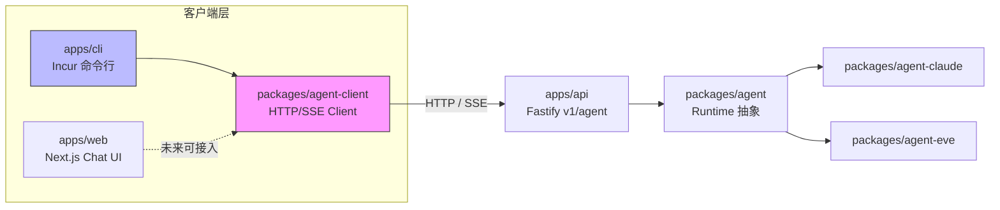
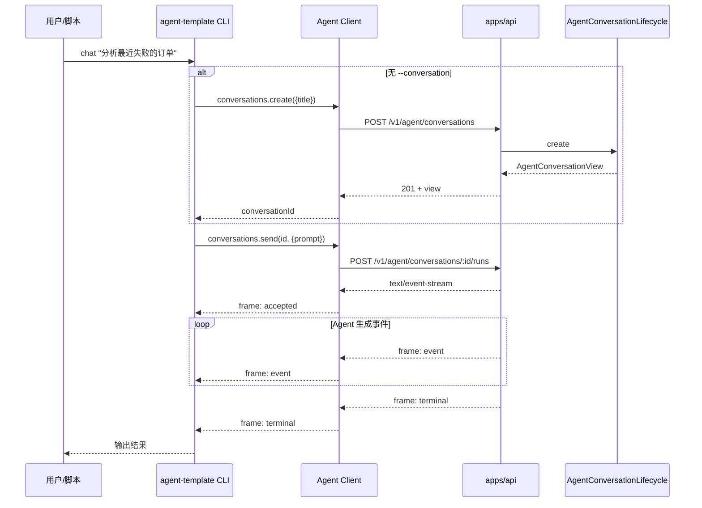
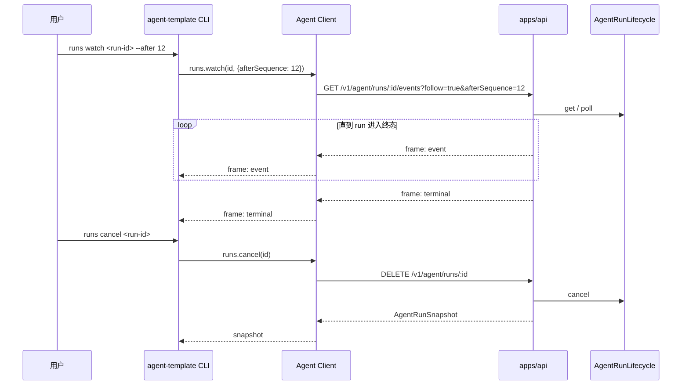

`apps/cli` 与 `packages/agent-client` 共同构成 Agent 平台对外的人机入口与可编程客户端。CLI 是基于 Incur 的可安装命令行进程，面向开发者、运维脚本和其他 Agent 提供会话管理、Run 观测、Job 提交与诊断能力；Agent Client 是 Web、CLI 和其他 Node 调用方共享的 HTTP/SSE 客户端包，把版本化的 `/v1/agent/*` 协议封装成类型稳定的 TypeScript 接口。两者都严格遵循“不直接依赖 Fastify、Prisma、BullMQ、Claude SDK 或 Eve”的边界约定，只通过 API 与平台交互，服务端 continuation state 对客户端完全不可见。

Sources: [AGENTS.md](packages/agent-client/AGENTS.md#L1-L22), [AGENTS.md](apps/cli/AGENTS.md#L1-L33)

## 定位与架构边界

在整个仓库中，Agent Client 是跨进程共享的“瘦客户端”，CLI 则是建立在该客户端之上的第一个消费端。下图展示了它们与 API、Web 前端以及 Runtime 包之间的调用关系：



Agent Client 的核心职责是：对外只暴露 conversation、run、job 和健康检查接口，把 HTTP 路径、Bearer 认证、SSE 解析、断线游标、错误映射和 Zod 校验留在实现内部。CLI 的核心职责是：把远端 API 翻译成人类可读的命令树，通过 `incur` 完成参数解析、命令路由、格式化输出和 shell 补全。因此，CLI 只依赖 `incur` 作为外部运行时依赖，并通过 tsup 将 `agent-client` 与 `shared` 打包进产物。

Sources: [AGENTS.md](packages/agent-client/AGENTS.md#L1-L22), [package.json](apps/cli/package.json#L1-L38), [tsup.config.ts](apps/cli/tsup.config.ts#L1-L11)

## Agent Client 设计与实现

`packages/agent-client` 只导出 `createAgentPlatformClient` 工厂和 `AgentClientError` 错误类型，以及若干配置类型。创建客户端时需要提供 `baseUrl` 和可选的 `token` 与 `fetcher`（便于测试注入），所有 API 调用默认携带 `Authorization: Bearer <token>` 和 `X-Agent-Client-Version: 1` 请求头。

Sources: [index.ts](packages/agent-client/src/index.ts#L25-L33), [index.ts](packages/agent-client/src/index.ts#L409-L416)

### 对外接口

`AgentPlatformClient` 将远端能力分组为 `conversations`、`runs`、`jobs`，并提供 `health` 与 `meta` 两个诊断方法。下表列出每个方法对应的 HTTP 语义和返回类型：

| 分组 | 方法 | HTTP 语义 | 返回类型 |
|------|------|-----------|----------|
| `conversations` | `create` | `POST /v1/agent/conversations` | `AgentConversationView` |
| `conversations` | `list` | `GET /v1/agent/conversations` | `AgentConversationPage` |
| `conversations` | `get` | `GET /v1/agent/conversations/:id` | `AgentConversationView` |
| `conversations` | `send` | `POST /v1/agent/conversations/:id/runs` | `AsyncIterable<AgentRunStreamFrame>` |
| `runs` | `start` | `POST /v1/agent/runs` | `AsyncIterable<AgentRunStreamFrame>` |
| `runs` | `list` | `GET /v1/agent/runs` | `AgentRunPage` |
| `runs` | `get` | `GET /v1/agent/runs/:id` | `AgentRunSnapshot` |
| `runs` | `watch` | `GET /v1/agent/runs/:id/events?follow=true` | `AsyncIterable<AgentRunStreamFrame>` |
| `runs` | `cancel` | `DELETE /v1/agent/runs/:id` | `AgentRunSnapshot` |
| `jobs` | `submit` | `POST /v1/agent/jobs` | `{ runId: string }` |
| — | `health` | `GET /health` | `HealthStatus` |
| — | `meta` | `GET /v1/agent/meta` | `{ protocolVersion, capabilities }` |

这些类型定义全部来自 `@agent-template/shared`，Agent Client 本身不做业务扩展，只负责协议转换与校验。

Sources: [index.ts](packages/agent-client/src/index.ts#L35-L91), [index.ts](packages/agent-client/src/index.ts#L222-L326), [agent-conversation.ts](packages/shared/src/agent-conversation.ts#L1-L53), [agent-run.ts](packages/shared/src/agent-run.ts#L1-L136), [agent-job.ts](packages/shared/src/agent-job.ts#L1-L26), [health.ts](packages/shared/src/health.ts#L1-L37)

### 请求与错误映射

内部通过 `request<T>` 处理普通 JSON 请求，通过 `stream` 处理 SSE 流。两者共享同一套错误映射逻辑：

- 网络层失败（fetch 抛错）统一为 `AgentClientError`，code 为 `UNREACHABLE`（可重试）或 `ABORTED`（已取消）；
- 远端返回非 2xx 时，尝试解析 `{ error: { code, message, retryable } }` 结构；若解析失败则降级为 `REMOTE_ERROR`；
- 返回体无法通过 Zod schema 校验时，抛出 `PROTOCOL_ERROR`；
- SSE 流中若遇到 `event: error` 消息，也会抛出 `AgentClientError`。

`AgentClientError` 携带 `code`、`retryable` 和可选的 `status` 字段，调用方可以据此判断是否需要重试，而不必依赖 HTTP 状态码的字符串解析。

Sources: [index.ts](packages/agent-client/src/index.ts#L92-L180), [index.ts](packages/agent-client/src/index.ts#L391-L407), [index.ts](packages/agent-client/src/index.ts#L327-L328)

### SSE 解析与背压保护

`stream` 函数消费 `text/event-stream` 响应体，并把 `event: frame` 中的 JSON 数据解析为 `AgentRunStreamFrame`。流帧类型由 `AgentRunStreamFrameSchema` 定义，包含 `accepted`、`event`、`terminal` 三种形态。`parseSse` 函数负责把分块到达的字节流还原成消息：

- 以 `\n\n`（兼容 `\r\n`）为消息边界；
- 同一个数据块可能包含多个完整消息，也可能只包含半个消息；
- 缓冲区大小受 `maxAgentSseBufferCharacters`（16 MiB）限制，防止服务端未发送终止帧时无限累积。

这一限制直接对应共享常量 `maxAgentSseBufferCharacters`，测试用例也验证了超大未终止帧会被拒绝，而合法大帧即使超过 16 MiB 也能被边界拆分。

Sources: [index.ts](packages/agent-client/src/index.ts#L181-L219), [index.ts](packages/agent-client/src/index.ts#L331-L363), [index.ts](packages/agent-client/src/index.ts#L365-L371), [agent-run.ts](packages/shared/src/agent-run.ts#L1-L9), [index.test.ts](packages/agent-client/src/index.test.ts#L1-L180)

## CLI 命令体系

`apps/cli` 的入口是 `src/bin.ts`，它调用 `createCli().serve()` 启动命令解析。`createCli` 接受一个可选的 `client` 参数用于测试注入，否则默认根据环境变量创建 Agent Client：

- `AGENT_TEMPLATE_API_URL`：API 基础地址，默认 `http://localhost:14000`；
- `AGENT_TEMPLATE_TOKEN`：Bearer Token，未设置时不发送认证头。

Sources: [bin.ts](apps/cli/src/bin.ts#L1-L4), [cli.ts](apps/cli/src/cli.ts#L1-L22)

### 命令树

CLI 通过 `Cli.create("agent-template")` 构建命令树，顶层命令包括 `chat`、`conversations`、`runs`、`jobs`、`health`、`doctor`。`conversations` 与 `runs` 使用子命令形式组织。下表汇总所有可用命令：

| 命令 | 作用 | 关键参数/选项 |
|------|------|--------------|
| `chat <prompt>` | 创建或继续会话并流式输出 | `--conversation <id>` 继续已有会话 |
| `conversations list` | 列出会话 | `--cursor`、`--limit` |
| `conversations get <id>` | 查看会话详情 | — |
| `conversations send <id> <prompt>` | 在会话中继续发送消息 | — |
| `runs list` | 列出 Agent run | `--conversation`、`--cursor`、`--limit`、`--runtime`、`--status` |
| `runs get <id>` | 查看 Agent run 快照 | — |
| `runs watch <id>` | 订阅 run 的持久化事件流 | `--after <sequence>` 从指定序列号之后开始 |
| `runs output <id>` | 只输出已完成 run 的最终结果 | — |
| `runs cancel <id>` | 请求协作式取消 run | — |
| `jobs submit <prompt>` | 提交后台 Agent job | — |
| `health` | 查看 API 健康状态 | — |
| `doctor` | 检查本地配置、协议兼容性和远端健康 | — |

所有参数和选项都使用 Zod schema 描述，`incur` 负责生成帮助信息、校验和格式化输出（`--format json` 或 `--format jsonl`）。

Sources: [cli.ts](apps/cli/src/cli.ts#L23-L182)

### 关键命令行为

`chat` 是最常用的入口：如果未提供 `--conversation`，则先用 prompt 前 60 个字符作为标题创建会话，再调用 `conversations.send` 流式输出。`runs watch` 通过 `afterSequence` 参数支持从指定事件序列号之后订阅，方便断线重连或只查看增量事件。`runs output` 在 run 未成功完成时会明确报错，避免输出不完整结果。`jobs submit` 把 prompt 包装成 `AgentJobRequest` 并提交到后台队列，返回的 `runId` 可用于后续 `runs get` 或 `runs watch`。

Sources: [cli.ts](apps/cli/src/cli.ts#L136-L182), [cli.ts](apps/cli/src/cli.ts#L91-L130), [cli.ts](apps/cli/src/cli.ts#L165-L172)

## 典型交互流程

### 流式对话



### Run 观测与取消



服务端负责把持久化事件序列号和终态结果写入 PostgreSQL，并通过 SSE 发送给客户端；客户端无需关心 Claude 或 Eve 的 runtime session 或 continuation token。

Sources: [agent-api-v1.ts](apps/api/src/agent-api-v1.ts#L1-L200), [agent-api-v1.ts](apps/api/src/agent-api-v1.ts#L228-L270), [sse.ts](apps/api/src/sse.ts#L1-L24)

## 构建与分发

`apps/cli` 使用 tsup 构建单文件 ESM 产物，入口为 `src/bin.ts`，输出 `dist/bin.js`，并附带 shebang 以支持全局安装。构建配置通过 `noExternal` 将 `@agent-template/agent-client` 和 `@agent-template/shared` 打包进产物，因此发布后的 npm 包只显式依赖 `incur`，安装方只需 Node.js 22+。

```bash
pnpm --filter @agent-template/cli build
pnpm --filter @agent-template/cli pack
npm install --global ./agent-template-cli-0.1.0.tgz
agent-template doctor
```

生产环境建议通过组织私有 Registry 安装，并将 `@agent-template/cli` 替换为组织拥有的 npm scope。服务端必须配置 `AGENT_API_TOKEN`，CLI 通过 `AGENT_TEMPLATE_TOKEN` 提供认证；CLI 不暴露 `--token` 参数，避免 Token 出现在 shell 历史或进程列表中。

Sources: [tsup.config.ts](apps/cli/tsup.config.ts#L1-L11), [README.md](README.md#L95-L147), [AGENTS.md](apps/cli/AGENTS.md#L1-L33)

## 测试与验证

Agent Client 的单元测试覆盖 Bearer 认证发送、JSON 分页校验、CRLF 分块 SSE 解析、远端错误映射和 16 MiB 缓冲区保护。CLI 的单元测试通过 `createFakeClient` 注入假客户端，验证 `conversations list` 和 `chat` 等命令会正确调用 Agent Client 的 seam，并输出预期的 JSON/JSONL 格式。

```bash
# Agent Client
pnpm --filter @agent-template/agent-client lint
pnpm --filter @agent-template/agent-client typecheck
pnpm --filter @agent-template/agent-client test

# CLI
pnpm --filter @agent-template/cli lint
pnpm --filter @agent-template/cli typecheck
pnpm --filter @agent-template/cli test
pnpm --filter @agent-template/cli build
```

测试代码同时也是理解接口契约的入口：`agent-client/src/index.test.ts` 展示了 SSE 帧在真实网络分块下的表现，`cli/src/cli.test.ts` 展示了 `serve` 辅助函数和 `--format` 输出断言。

Sources: [index.test.ts](packages/agent-client/src/index.test.ts#L1-L180), [cli.test.ts](apps/cli/src/cli.test.ts#L1-L114), [AGENTS.md](packages/agent-client/AGENTS.md#L1-L22), [AGENTS.md](apps/cli/AGENTS.md#L1-L33)

## 相关页面与延伸阅读

CLI 与 Agent Client 是“客户端侧”的入口，理解它们之后可以继续深入以下主题：

- 服务端如何暴露这些路由、SSE 与任务队列，参见 [API 路由、SSE 与任务队列](13-api-lu-you-sse-yu-ren-wu-dui-lie)。
- Agent run 的完整生命周期、执行租约与持久化事件，参见 [Agent Run 生命周期与执行租约](8-agent-run-sheng-ming-zhou-qi-yu-zhi-xing-zu-yue)。
- 多轮会话的平台级模型，参见 [数据库模型与持久化边界](12-shu-ju-ku-mo-xing-yu-chi-jiu-hua-bian-jie)。
- Web 前端的 Chat 界面如何与同一套 API 交互，参见 [Web 前端与 Chat 界面](14-web-qian-duan-yu-chat-jie-mian)。
- Claude 与 Eve 两种 Runtime 的适配方式，分别参见 [Claude Agent Runtime 适配](9-claude-agent-runtime-gua-pei) 和 [Eve Agent Runtime 适配](10-eve-agent-runtime-gua-pei)。