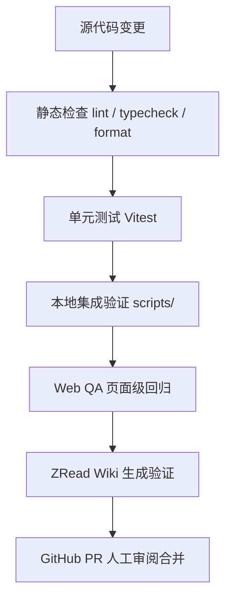

本页介绍本项目的质量验证体系。它并非只有单元测试，而是从静态检查、单元测试、本地集成验证、Web 页面级 QA，到 ZRead Wiki 生成校验的一整套分层门禁。理解这些层级后，开发者可以在修改影响范围内选择最小验证集合，也能在发布前执行完整门禁，避免把隐患带入主线。

整个质量流程可以用以下分层图概括：变更先经过静态检查与单元测试，再进入依赖真实服务的本地集成验证，随后是 Web QA 的页面级回归，最后是 ZRead Wiki 生成产物与 GitHub 合并审阅。

Sources: [AGENTS.md](AGENTS.md#L8-L27)

## 静态检查与单元测试

仓库根目录通过 `pnpm` 脚本聚合所有 workspace 的静态检查与测试。`pnpm lint` 与 `pnpm typecheck` 由 Turbo 的任务图驱动，`pnpm test` 会先执行 `turbo test` 再补充 `.zread/scripts/*.test.ts` 的回归测试。`turbo.json` 中声明了 `build`、`lint`、`typecheck`、`test` 等任务的依赖顺序，`build` 依赖上游 `^build`，而 `lint`、`typecheck`、`test` 也依赖上游对应任务，保证跨包改动时按拓扑顺序验证。每个 app 和 package 的 `package.json` 都保持一致的 `lint`、`typecheck`、`test` 脚本，让根命令可以无差别地调度所有模块。

Sources: [package.json](package.json#L8-L44), [turbo.json](turbo.json#L1-L34)

ESLint 统一使用 `@eslint/js` 与 `typescript-eslint` 的推荐配置，并在每个模块的 `eslint.config.mjs` 中忽略 `dist/`、`.next/` 或 `generated/` 等产物目录。TypeScript 检查没有直接调用 `tsc`，而是使用 `scripts/tsc7.mjs`，它把 `process.argv` 透传给本地安装的 TypeScript 7 原生编译器，这样所有模块在 `typecheck` 时都使用同一份 TS7 实现。单元测试统一使用 Vitest，所有 `vitest.config.ts` 都配置为 `environment: "node"` 并忽略构建产物目录，测试文件与源码同目录放置，便于就近维护。

Sources: [apps/api/eslint.config.mjs](apps/api/eslint.config.mjs#L1-L9), [scripts/tsc7.mjs](scripts/tsc7.mjs#L1-L16), [apps/api/vitest.config.ts](apps/api/vitest.config.ts#L1-L8)

## Web QA 与页面级回归

`apps/web-qa` 是面向 Chat 界面的页面级功能验证模块，定位为“确定性 QA adapter”，不替代生产 API，也不作为无人值守 CI 的 E2E runner。它启动一个轻量的 HTTP fixture server，通过 `POST /__qa/scenario` 切换场景，向 Web 提供确定性的 health、SSE 流和 Agent 运行结果。`README.md` 和 `TEST_PLAN.md` 共同定义了 P0/P1/P2 功能矩阵与执行门禁：每次 Web 或 Chat 交互变更应执行全部 P0，Tool、Artifact、Markdown 或 health 展示变更应执行相关 P1 并回到 `WEB-QA-001`，发布前再执行一轮真实全栈冒烟。

Sources: [apps/web-qa/README.md](apps/web-qa/README.md#L1-L32), [apps/web-qa/TEST_PLAN.md](apps/web-qa/TEST_PLAN.md#L1-L32)

`src/scenarios.ts` 定义了场景目录（如 `health-ok`、`chat-completed`、`chat-tool-events`、`chat-disconnected`），每个场景声明了 health 状态、Chat 行为与可访问路由。`src/server.ts` 基于 Node 原生 `http` 实现，暴露 `/health`、`/v1/agent/conversations/{id}/runs`、`/agent/chat` 和 `/__qa/scenario` 等端点，把场景数据编码成与生产一致的 SSE 帧和 terminal 结果。`src/validate-flows.ts` 则把 `flows/*.md` 的 YAML frontmatter 与 `TEST_PLAN.md` 的表格行进行交叉校验，要求每个 flow 都有 `id`、`priority`、`route`、`scenario`、`mode` 字段，并包含“前置条件、操作、预期、证据”四个章节，从而保证测试计划与落地文件一一对应。

Sources: [apps/web-qa/src/scenarios.ts](apps/web-qa/src/scenarios.ts#L23-L106), [apps/web-qa/src/server.ts](apps/web-qa/src/server.ts#L28-L62), [apps/web-qa/src/validate-flows.ts](apps/web-qa/src/validate-flows.ts#L1-L88), [apps/web-qa/flows/p0-home-smoke.md](apps/web-qa/flows/p0-home-smoke.md#L1-L31)

`apps/web-qa` 的 `check` 脚本把 lint、typecheck、test 和 `validate:flows` 串在一起，作为该模块的本地门禁入口。`pnpm qa:web:check` 会一次性完成这些检查，适合在改动 Web 或 Chat 相关代码后执行。日常调试则可以用 `pnpm qa:web:start` 启动 fixture，再用 `pnpm qa:web:scenario <name>` 切换场景，在 Codex Desktop Browser 中人工执行对应 flow。

Sources: [apps/web-qa/package.json](apps/web-qa/package.json#L5-L14)

## 本地集成验证脚本

除了单元测试，项目还在 `scripts/` 中维护了一组本地集成验证脚本，用于确认架构边界在真实服务环境下仍然成立。这些脚本通常需要 PostgreSQL、Redis、Toolbox 或构建产物，因此不适合作为普通单元测试，而是作为发布前或关键变更后的增强门禁。

| 脚本 | 命令 | 验证目标 |
| --- | --- | --- |
| `scripts/verify-database-boundaries.ts` | `pnpm db:verify:boundaries` | 平台表在 `public` schema，电商 fixture 表在 `ecommerce_fixture`，且 fixture 数据量符合预期 |
| `scripts/verify-agent-run-lifecycle.ts` | `pnpm agent-runs:verify:local` | AgentRun 的排队、完成、取消、租约过期重认领、失效执行器隔离、崩溃运行取消 |
| `scripts/verify-agent-job-redelivery.ts` | `pnpm agent-jobs:verify:local` | BullMQ 仅在执行租约加宽限期后才重新投递任务 |
| `scripts/verify-agent-runtime-readiness.ts` | `pnpm agent-runtime:verify:local` | Claude runtime 能初始化真实 Toolbox MCP 连接并解析 capability profile |
| `scripts/check-runtime-bundle-boundary.ts` | `pnpm agent-runtime:check:bundle` | API 与 Worker 的构建产物把 Claude 和 Eve runtime 拆成独立动态 chunk |
| `scripts/check-toolbox-semantic-layer.ts` | `pnpm toolbox:check:semantic` | `apps/toolbox/tools.yaml` 的工具、toolset、语义描述、授权占位符符合约定 |
| `scripts/generate-toolbox-production-config.ts` | `pnpm toolbox:check:production` | 生产版 Toolbox 配置（含 OIDC authService 与 scope）与源码一致 |
| `scripts/generate-toolbox-business-skills.ts` | `pnpm skills:check:toolbox` | 面向 Claude/Eve 的 business skill 产物与源码 toolset 一致 |

Sources: [package.json](package.json#L21-L41)

`verify-database-boundaries.ts` 直接通过 Prisma 的 `$queryRaw` 查询 `information_schema.tables`，确认 `public` 中保留 `TemplateEvent`、`AgentRun`、`AgentRunEvent` 等平台表，且不存在 `Ecommerce*` 前缀表；同时校验 `ecommerce_fixture` 中 5 张核心表存在，并且 customers、products、orders、order_items、payments 的初始数据量分别等于 96、24、600、1200、540。`verify-agent-run-lifecycle.ts` 利用内存中的 `execute` 函数与真实 Prisma repository，覆盖从 `queued` 到 `completed`、取消、过期租约重认领、失效执行器事件写入被拒，以及崩溃运行取消后状态正确落地等场景。

Sources: [scripts/verify-database-boundaries.ts](scripts/verify-database-boundaries.ts#L1-L82), [scripts/verify-agent-run-lifecycle.ts](scripts/verify-agent-run-lifecycle.ts#L1-L175)

`verify-agent-job-redelivery.ts` 在临时 BullMQ 队列中插入一个会首次崩溃、第二次成功的任务，并断言第二次尝试距离第一次不早于 `leaseDurationMs + graceMs`，从而验证 `apps/api/src/queue.js` 中的 `createAgentJobRetryPolicy` 确实按执行租约+宽限期设置延迟。`verify-agent-runtime-readiness.ts` 启动本地 Toolbox server，然后让 `checkAgentRuntimeReadinessFromEnv` 使用 `ecommerce-sales` capability profile 完成真实 MCP 握手，并断言返回状态为 `ok` 且消息包含“Toolbox 已就绪”。`check-runtime-bundle-boundary.ts` 则在 `apps/api` 和 `apps/worker` 构建完成后读取 `dist/` 中的入口与 chunk，确认 Claude 和 Eve runtime 被拆分为两个独立动态 chunk，入口通过动态 `import()` 分别加载。

Sources: [scripts/verify-agent-job-redelivery.ts](scripts/verify-agent-job-redelivery.ts#L1-L58), [scripts/verify-agent-runtime-readiness.ts](scripts/verify-agent-runtime-readiness.ts#L1-L71), [scripts/check-runtime-bundle-boundary.ts](scripts/check-runtime-bundle-boundary.ts#L1-L44)

`check-toolbox-semantic-layer.ts` 对 `apps/toolbox/tools.yaml` 做结构性校验：source 密码必须是环境变量占位符；工具名称不能落入 legacy 集合；电商相关 toolset 必须包含预期的工具；工具描述必须包含关键业务短语；pageable 工具必须声明分页参数；并且 `BusinessSemanticCatalogSchema` 会校验 `apps/toolbox/semantic/ecommerce.yaml` 与 `ecommerce-evaluation.yaml` 的语义目录。`generate-toolbox-production-config.ts` 在 `--check` 模式下对比 `generated/toolbox-production/tools.yaml`，确认每个工具都已按 `toolboxToolScopes` 分类并附加 OIDC authService 与 scope。`generate-toolbox-business-skills.ts` 在 `--check` 模式下验证生成的 skill markdown、manifest 和 Eve 语义 catalog 与当前源码一致。

Sources: [scripts/check-toolbox-semantic-layer.ts](scripts/check-toolbox-semantic-layer.ts#L1-L194), [scripts/generate-toolbox-production-config.ts](scripts/generate-toolbox-production-config.ts#L1-L91), [scripts/generate-toolbox-business-skills.ts](scripts/generate-toolbox-business-skills.ts#L1-L200)

## ZRead Wiki 生成验证

项目 Wiki 由 `zread_cli` 生成，生成流程本身也有一套回归测试和门禁。`pnpm docs:zread:typecheck` 用 `tsc` 对 `.zread/scripts/*.ts` 做一次严格无产物类型检查；`pnpm docs:zread:test` 使用 Node 原生 test runner 执行 `config.test.ts`、`policy.test.ts`、`publication.test.ts`、`wiki.test.ts`、`zread-cli.test.ts`。这些测试覆盖配置组合、secret 过滤、允许变更路径、原子发布、CLI 版本校验与输出安全。

Sources: [package.json](package.json#L18-L19)

`update.ts` 在临时目录中创建隔离的 git clone 和隔离的 HOME，通过 `composeProjectZReadConfig` 组合 `.zread/config/` 中的多片段配置并注入环境密钥，随后调用本地 `zread` CLI。生成完成后，它先校验日志不含密钥，再收集 git 变更路径并由 `assertAllowedZReadChanges` 限制只允许 `.zread/state.json`、`.zread/wiki/current` 和版本目录内的文件；接着通过 `stageCurrentZReadWiki` 把活跃版本 staged，最后用 `publishDirectoryAtomically` 原子替换 `.zread/wiki`。整个过程失败时会清理临时目录，也可通过 `ZREAD_PRESERVE_FAILED_OUTPUT=1` 保留失败产物用于排查。

Sources: [.zread/scripts/update.ts](.zread/scripts/update.ts#L1-L121), [.zread/scripts/policy.test.ts](.zread/scripts/policy.test.ts#L1-L46), [.zread/scripts/publication.test.ts](.zread/scripts/publication.test.ts#L1-L63), [.zread/scripts/zread-cli.test.ts](.zread/scripts/zread-cli.test.ts#L1-L110)

Wiki 生成的合并门禁是 GitHub 上的手动工作流 `.github/workflows/zread-update.yml`。它仅在 `workflow_dispatch` 时触发，安装依赖后执行 `pnpm docs:zread:update`，然后由 `peter-evans/create-pull-request` 向 `.zread/wiki` 创建 PR，最终需要人工审阅和本地门禁通过后才能合并。该设计把长耗时、依赖外部 LLM 的生成步骤与持续集成解耦，符合 ADR “ZRead-generated project Wiki” 中的决策。

Sources: [.github/workflows/zread-update.yml](.github/workflows/zread-update.yml#L1-L31), [docs/adr/0016-zread-generated-project-wiki.md](docs/adr/0016-zread-generated-project-wiki.md#L1-L12)

## 门禁与合并策略

本项目的工程原则在 `AGENTS.md` 中有明确约束：错误必须显式失败、不得吞掉异常；修复必须定位根因；关键路径必须具备可观测性；大规模改动必须切到独立分支，未验证通过不得合入主线。这些原则落实在质量门禁上，就是“先本地验证，再提交，最后才考虑合并”。

Sources: [AGENTS.md](AGENTS.md#L19-L27)

目前仓库没有针对 `lint/test/typecheck` 的自动 GitHub Actions 门禁，CI 仅包含手动的 ZRead Wiki 更新工作流。因此日常开发的质量责任主要由本地脚本承担：普通模块改动用 `pnpm --filter <pkg> lint|typecheck|test`；跨模块或发布前用 `pnpm lint`、`pnpm typecheck`、`pnpm test` 全量跑；涉及数据库、Agent 生命周期、Toolbox 或 runtime 的变更，需要额外跑对应的 `verify` 或 `check` 脚本；Web/Chat 相关变更则通过 `pnpm qa:web:check` 和真实全栈冒烟完成。

Sources: [AGENTS.md](AGENTS.md#L8-L18), [package.json](package.json#L8-L44)

## 常用命令速查

| 目的 | 命令 | 说明 |
| --- | --- | --- |
| 全仓静态检查 | `pnpm lint` | 执行所有 workspace 的 ESLint |
| 全仓类型检查 | `pnpm typecheck` | Turbo typecheck + ZRead 脚本类型检查 |
| 全仓单元测试 | `pnpm test` | Turbo test + ZRead 脚本回归测试 |
| 全仓构建 | `pnpm build` | 按依赖图构建所有 workspace |
| 格式化 | `pnpm format` | Prettier 写回全仓 |
| 单模块验证 | `pnpm --filter @agent-template/<name> lint\|typecheck\|test` | 仅影响一个模块 |
| Web QA 检查 | `pnpm qa:web:check` | lint + typecheck + test + validate:flows |
| 数据库边界验证 | `pnpm db:verify:boundaries` | 校验 schema 分离与 fixture 数据量 |
| Agent 生命周期验证 | `pnpm agent-runs:verify:local` | 需要 PostgreSQL 已迁移 |
| 任务重投验证 | `pnpm agent-jobs:verify:local` | 需要 Redis |
| 运行时准备验证 | `pnpm agent-runtime:verify:local` | 需要本地 Toolbox |
| Runtime bundle 边界 | `pnpm agent-runtime:check:bundle` | 先构建 api/worker |
| Toolbox 语义检查 | `pnpm toolbox:check:semantic` | 校验 tools.yaml 与语义目录 |
| Toolbox 生产配置检查 | `pnpm toolbox:check:production` | 对比 generated/toolbox-production |
| Business skill 检查 | `pnpm skills:check:toolbox` | 对比 generated/toolbox-skills |
| Wiki 生成测试 | `pnpm docs:zread:test` | 回归 ZRead 生成流程 |
| Wiki 生成 | `pnpm docs:zread:update` | 隔离环境中生成并原子发布 |

Sources: [package.json](package.json#L8-L44)

## 下一步

理解质量门禁后，可以进一步阅读相关主题：想掌握各模块职责与入口，见 [项目目录与模块职责](3-xiang-mu-mu-lu-yu-mo-kuai-zhi-ze)；想了解日常开发命令与 workflow，见 [开发工作流与常用命令](4-kai-fa-gong-zuo-liu-yu-chang-yong-ming-ling)；Agent 运行与租约机制见 [Agent Run 生命周期与执行租约](8-agent-run-sheng-ming-zhou-qi-yu-zhi-xing-zu-yue)；Toolbox 与 MCP 工具供给见 [Toolbox 与 MCP 工具供给](11-toolbox-yu-mcp-gong-ju-gong-gei)；Docker 与生产部署见 [Docker 部署与生产运维](17-docker-bu-shu-yu-sheng-chan-yun-wei)；ZRead Wiki 生成细节见 [ZRead 项目 Wiki 生成](18-zread-xiang-mu-wiki-sheng-cheng)；相关架构决策见 [架构决策记录（ADR）](19-jia-gou-jue-ce-ji-lu-adr)。