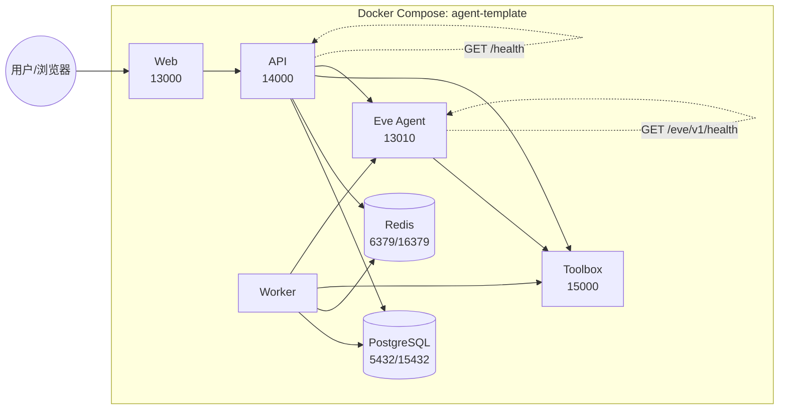
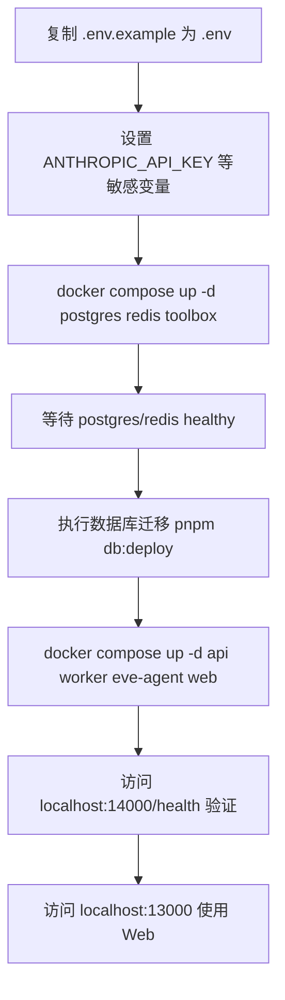

本文聚焦 Agent Template 在 Docker 与 Docker Compose 环境下的部署形态、生产安全加固与日常运维检查。它不会重复讲解本地开发命令或 Agent 运行时实现细节，而是把视角放在“如何把同一套单镜像构建产物交付为 API / Worker / Eve / Web 四个进程”以及“上线后必须检查什么”。

Sources: [Dockerfile](Dockerfile#L1-L26) [docker-compose.yml](docker-compose.yml#L1-L167)

## 1. 部署形态总览

项目采用 pnpm Workspace + Turborepo 的单一仓库结构，所有应用共享同一个根目录构建产物。Docker 策略不是“每个 app 一个 Dockerfile”，而是构建一个包含全部 apps 和 packages 的通用镜像，再通过不同 `command` 启动不同角色。这样可以在本地用 `docker compose` 一键拉起完整链路，也可以把同一镜像推送到生产编排系统（如 Kubernetes、ECS、Fly.io）后通过不同 entrypoint 运行。

下图为 Docker Compose 中各服务的依赖与端口关系：



Sources: [docker-compose.yml](docker-compose.yml#L32-L167) [apps/api/src/app.ts](apps/api/src/app.ts#L68) [packages/agent-eve/package.json](packages/agent-eve/package.json#L11-L16)

## 2. 镜像构建策略

`Dockerfile` 以 `node:24-alpine` 为基础镜像，启用 corepack 安装 pnpm 11.11.0，并分阶段拷贝根与各个子包的 `package.json` 以最大化依赖缓存命中率。构建步骤中先安装 `pnpm install --frozen-lockfile`，再 `pnpm db:generate` 生成 Prisma Client，最后执行 `turbo build` 产出 `.next` 和 `dist`。镜像暴露 `13000`、`13010`、`14000` 三个端口，对应 Web、Eve Agent 和 API；Toolbox 使用独立的官方镜像，不走本镜像。

Sources: [Dockerfile](Dockerfile#L1-L26) [package.json](package.json#L4-L10) [turbo.json](turbo.json#L8-L11)

## 3. 本地一键启动流程

如果只想在本机容器化启动，不需要重新构建多个镜像，使用 `docker compose up` 即可。推荐按“先基础设施、后业务服务、再验证”的顺序执行：



关键说明：容器内 PostgreSQL 通过 `postgres:5432` 访问，Redis 通过 `redis:6379` 访问；但宿主机映射端口分别是 `15432` 和 `16379`，避免与本地开发实例冲突。

Sources: [docker-compose.yml](docker-compose.yml#L33-L62) [README.md](README.md#L23-L33)

## 4. 服务清单与端口映射

| 服务 | 运行命令 | 容器端口 | 宿主机端口 | 关键依赖 | 健康检查 |
|---|---|---|---|---|---|
| postgres | `postgres:17-alpine` | 5432 | 15432 | 无 | `pg_isready` |
| redis | `redis:7-alpine` | 6379 | 16379 | 无 | `redis-cli ping` |
| toolbox | `us-central1-docker.pkg.dev/.../toolbox:1.6.0` | 15000 | 127.0.0.1:15000 | postgres | 无显式，依赖进程启动 |
| api | `pnpm --filter @agent-template/api start` | 14000 | 14000 | postgres, redis, toolbox, eve-agent | `GET /health` |
| worker | `pnpm --filter @agent-template/worker start` | 无 | 无 | postgres, redis, toolbox, eve-agent | 无 |
| eve-agent | `pnpm --filter @agent-template/agent-eve eve:build && eve:start` | 13010 | 127.0.0.1:13010 | postgres, redis, toolbox | `GET /eve/v1/health` |
| web | `pnpm --filter @agent-template/web start` | 13000 | 13000 | api | 无 |

Web 启动脚本已绑定 `0.0.0.0:13000`，因此容器外可以直接访问。Eve Agent 的宿主机映射只绑定 `127.0.0.1`，防止外部网络直接访问；同一 compose 网络内的 api/worker 仍可通过 `http://eve-agent:13010` 访问。

Sources: [docker-compose.yml](docker-compose.yml#L63-L167) [apps/web/package.json](apps/web/package.json#L6-L8) [packages/agent-eve/package.json](packages/agent-eve/package.json#L14-L16)

## 5. 环境变量：开发默认值 vs 生产必填

根 `.env.example` 提供本地开发默认值，而 `docker-compose.yml` 通过 `x-runtime-environment` 锚点覆盖了一部分变量。生产上线前，必须显式替换以下变量：

| 变量 | 生产要求 | 默认值 / 开发值 | 说明 |
|---|---|---|---|
| `AGENT_API_TOKEN` | **必填** | 空 | Fastify 在生产环境启动校验 `AGENT_API_TOKEN` 存在且长度 ≥ 16 |
| `AGENT_LEGACY_ROUTES_ENABLED` | 建议 `false` | 默认非生产开启 | 旧版 `/agent/*` 路由在生产默认关闭 |
| `EVE_AGENT_SERVICE_TOKEN` | Eve 运行时必填 | 空 | 非 loopback 调用 Eve 必须配置 |
| `ANTHROPIC_API_KEY` / `ANTHROPIC_AUTH_TOKEN` | Claude 运行时必填其一 | 空 | 调用 Kimi / Anthropic 兼容端点 |
| `TOOLBOX_AUTH_TOKEN` | 生产建议配置 | 空 | 控制 MCP Toolbox 的访问 |
| `NEXT_PUBLIC_API_BASE_URL` | 需匹配公网地址 | `http://localhost:14000` | 浏览器端直接请求 API，不能填内网地址 |
| `TOOLBOX_OIDC_ISSUER` / `TOOLBOX_OIDC_AUDIENCE` | 若启用 OIDC 必填 | 空 | Toolbox 认证来源 |

`AGENT_RUNTIME` 决定 API 与 Worker 在运行时加载 Claude 还是 Eve 适配器；镜像同时包含两者，但启动时只初始化所选 runtime。

Sources: [.env.example](.env.example#L1-L38) [docker-compose.yml](docker-compose.yml#L3-L18) [apps/api/src/env.ts](apps/api/src/env.ts#L1-L39) [packages/agent/src/index.ts](packages/agent/src/index.ts#L43-L58)

## 6. 数据库迁移：镜像不会自动执行

`Dockerfile` 仅运行 `pnpm db:generate` 生成 Prisma Client 类型，**不会**在镜像构建时运行 `prisma migrate deploy`。首次启动或版本升级时，需要在业务容器启动前完成迁移。推荐做法：

1. 使用独立一次性任务容器：
   ```bash
   docker compose run --rm api pnpm db:deploy
   ```
2. 或在 Kubernetes 中把 `pnpm db:deploy` 作为 Init Container 放在 api/worker 之前。
3. 在 CI/CD 中先对目标数据库执行 `pnpm db:deploy`，再滚动更新应用。

`db:deploy` 脚本会先部署主 `public` schema 的 Prisma migration，再处理 `ecommerce_fixture` schema。

Sources: [package.json](package.json#L14-L17) [Dockerfile](Dockerfile#L23)

## 7. 健康检查与运行时就绪

API 的 `/health` 会检查 PostgreSQL、Redis 以及当前选中的 Agent Runtime 的就绪状态。非生产或测试环境下，可以通过 `checkExternal` 参数跳过外部检查。Eve Agent 的健康检查命中 `/eve/v1/health`。Docker Compose 分别为 api 和 eve-agent 配置了 `wget` 探测，一旦失败会触发 restart 策略 `unless-stopped`。

`getHealth` 内部使用 800ms 超时检测数据库和 Redis，避免健康探针因网络抖动挂起。如果所选 runtime 未配置（如生产环境漏配 API Key），健康状态会返回 `degraded` 但进程仍存活，方便运维区分“依赖未就绪”与“进程崩溃”。

Sources: [apps/api/src/health.ts](apps/api/src/health.ts#L124-L162) [packages/agent/src/index.ts](packages/agent/src/index.ts#L127-L168) [docker-compose.yml](docker-compose.yml#L111-L150)

## 8. 生产加固 checklist

上线前建议逐条确认：

- [ ] 已设置强 `AGENT_API_TOKEN` 并在网关/负载均衡层进行 TLS 终止。
- [ ] 已关闭旧版路由：`AGENT_LEGACY_ROUTES_ENABLED=false`。
- [ ] `EVE_AGENT_SERVICE_TOKEN` 已生成并仅注入 Eve 相关服务；避免 Eve 暴露在公网。
- [ ] `TOOLBOX_AUTH_TOKEN` 或 OIDC 已配置，Toolbox 不再允许匿名访问。
- [ ] 数据库迁移已执行，且 `DATABASE_URL` 指向生产 PostgreSQL。
- [ ] Redis 已启用持久化或仅作为任务队列，不承载不可丢失数据。
- [ ] 日志收集已接入 Pino 输出；可配置 `TOOLBOX_OTLP_ENDPOINT` 与 `TOOLBOX_TELEMETRY_SERVICE_NAME` 实现链路追踪。
- [ ] 不使用 Docker Compose 的默认端口映射暴露内部服务（如把 Redis 端口映射到公网）。

Sources: [README.md](README.md#L82-L93) [README.md](README.md#L106-L116) [.env.example](.env.example#L20-L23)

## 9. 常见故障排查

| 现象 | 可能原因 | 处理建议 |
|---|---|---|
| `api` 反复 unhealthy | PostgreSQL 未迁移或 `DATABASE_URL` 错误 | 执行 `pnpm db:deploy` 后重试；检查容器内能否 `pg_isready` |
| `eve-agent` unhealthy | `EVE_AGENT_SERVICE_TOKEN` 缺失或 `eve:build` 失败 | 查看 eve-agent 日志；确认 `EVE_AGENT_HOST` 与端口一致 |
| `/health` 显示 `degraded` | 所选 runtime 未配置 | 确认 `AGENT_RUNTIME` 与对应 key/token 已填 |
| Web 无法连接 API | `NEXT_PUBLIC_API_BASE_URL` 为内网地址或 API 未健康 | 该变量必须能在浏览器端访问；使用公网 URL 或端口转发 |
| 端口冲突 | 本地已有 13000/14000/15432/16379 监听 | 修改 `docker-compose.yml` 的 ports 映射或停止本地服务 |
| Toolbox 访问被拒 | `TOOLBOX_AUTH_TOKEN` 不匹配或 `allowed-hosts` 未包含容器名 | 检查 `--allowed-hosts` 与调用方来源 |

Sources: [docker-compose.yml](docker-compose.yml#L63-L167) [apps/api/src/env.ts](apps/api/src/env.ts#L17-L24) [apps/api/src/health.ts](apps/api/src/health.ts#L124-L162)

## 10. 与编排系统对接

Docker Compose 主要用于本地验证与演示，生产推荐使用编排系统：

- **Kubernetes**：用同一镜像定义 Deployment（api、worker、web 各一份）、Eve 可单独部署或 Sidecar；Init Container 跑 `pnpm db:deploy`；Service 暴露 api 14000、web 13000。
- **Serverless 容器**：把 API 与 Worker 拆成两个任务，共用镜像但不同命令；Web 可单独部署为 Next.js 托管服务；注意 `NEXT_PUBLIC_API_BASE_URL` 必须指向公网 API。
- **CLI 分发**：`apps/cli` 不进入 Docker 镜像，而是作为 npm package 发布，安装方仅需 Node.js 22+。

Sources: [README.md](README.md#L126-L143) [apps/api/package.json](apps/api/package.json#L5-L12) [apps/worker/package.json](apps/worker/package.json#L5-L12)

## 11. 延伸阅读

- 想了解整体进程边界，请阅读 [整体架构与进程边界](7-zheng-ti-jia-gou-yu-jin-cheng-bian-jie)。
- 需要理解环境变量如何被运行时解析，请阅读 [环境变量与运行时配置](6-huan-jing-bian-liang-yu-yun-xing-shi-pei-zhi)。
- 需要理解 Agent Run 如何被 API 和 Worker 共同处理，请阅读 [Agent Run 生命周期与执行租约](8-agent-run-sheng-ming-zhou-qi-yu-zhi-xing-zu-yue)。
- 需要了解 Claude 与 Eve 的适配差异，请阅读 [Claude Agent Runtime 适配](9-claude-agent-runtime-gua-pei) 和 [Eve Agent Runtime 适配](10-eve-agent-runtime-gua-pei)。