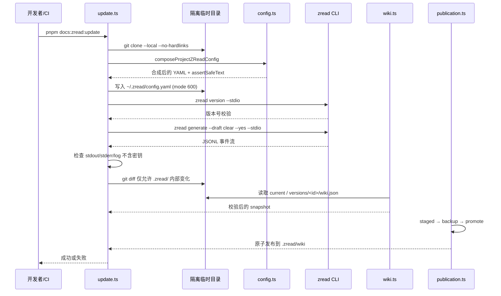
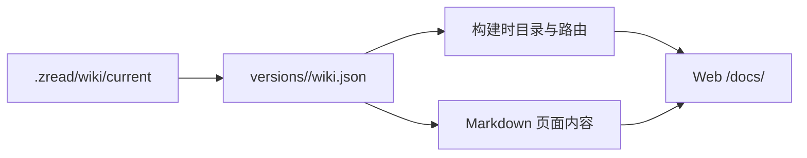

本项目使用项目内安装的 `zread_cli` 将源码与配置转化为可发布的工程 Wiki，并通过 Next.js `/docs` 路由在构建时渲染。整个生成闭环被隔离在 `.zread/` 目录中：`config/` 负责声明式、不含密钥的配置组合；`scripts/` 负责配置合成、CLI 调用、产物校验与原子发布；`wiki/` 负责存放最终提交到仓库并被 Web 读取的 Wiki 产物。ZRead 生成的动机与边界可参阅 [架构决策记录（ADR）](19-jia-gou-jue-ce-ji-lu-adr)。  
Sources: [.zread/README.md](.zread/README.md#L1-L8) · [docs/adr/0016-zread-generated-project-wiki.md](docs/adr/0016-zread-generated-project-wiki.md#L1-L6)

## 目录边界与职责

`.zread/` 是 Wiki 生成流程的唯一边界，子目录职责分离：

| 目录 | 职责 | 关键文件 |
|------|------|----------|
| `config/` | 声明式项目级配置，片段化合并，禁止提交密钥 | `index.yaml`、`language.yaml`、`generation.yaml`、`provider.kimi.yaml` |
| `scripts/` | 配置合成、隔离运行、JSONL 协议交互、产物校验、原子发布 | `update.ts`、`config.ts`、`policy.ts`、`zread-cli.ts`、`wiki.ts`、`publication.ts` |
| `wiki/` | 生成后产物：当前版本指针 `current` 与按版本存放的 `versions/<id>/` | `current`、`versions/<id>/wiki.json`、Markdown 页面 |

`zread_cli` 作为根 `package.json` 的开发依赖被锁定版本，脚本只使用 `node_modules/.bin/zread`，不会回退到全局命令。  
Sources: [.zread/README.md](.zread/README.md#L9-L12) · [package.json](package.json#L64) · [update.ts](.zread/scripts/update.ts#L19-L24)

## 配置组合与密钥注入

`config/index.yaml` 按声明顺序列出多个 YAML 片段，后面的片段对前面的同名字段做深度覆盖，未覆盖的嵌套字段会保留。当前拆分为 `language.yaml`（界面与文档语言）、`generation.yaml`（并发与重试）、`provider.kimi.yaml`（LLM provider、model 与 BaseURL）。  
Sources: [.zread/README.md](.zread/README.md#L14-L20) · [config/index.yaml](.zread/config/index.yaml#L1-L5)

配置合成脚本会严格校验：片段名必须是不含目录穿越的安全文件名；不允许重复；不允许出现 `llm.api_key`；不允许出现 `__proto__`、`constructor`、`prototype` 等原型污染键。合并后的完整配置会注入从环境变量读取的 API Key，最终序列化为 YAML 并写入一个权限为 `600` 的隔离临时 HOME 目录下的 `~/.zread/config.yaml`。  
Sources: [config.ts](.zread/scripts/config.ts#L44-L82) · [config.ts](.zread/scripts/config.ts#L96-L134)

## Provider Profile 选择策略

ZRead 使用 OpenAI 兼容的 provider 接口，但项目通过完整的 provider profile 避免把不同变量族的 Key、model 和 BaseURL 交叉拼接。环境变量解析规则如下：

| Profile | 所需环境变量 | 行为 |
|------|--------------|------|
| `ZREAD_LLM` | 仅 `ZREAD_LLM_API_KEY` 时，复用 `provider.kimi.yaml` 的 model 与 BaseURL；若设置 `ZREAD_LLM_MODEL` 或 `ZREAD_LLM_BASE_URL`，则三个变量必须同时提供 | 默认项目级 profile |
| `OPENAI` | `OPENAI_API_KEY`、`OPENAI_MODEL`、`OPENAI_BASE_URL` 必须同时提供 | 完整 OpenAI 自定义 profile |
| `ANTHROPIC_KIMI` | `ANTHROPIC_API_KEY`、`ANTHROPIC_MODEL`、`ANTHROPIC_BASE_URL` 必须同时提供，且 BaseURL 必须是 `https://api.kimi.com/coding` | 复用现有 Kimi Coding 环境 |
| 多个 profile | 同时出现多个有效 profile | 显式失败 |

无有效 profile 或同时出现多个 profile 时，脚本会抛出错误并终止生成。  
Sources: [config.ts](.zread/scripts/config.ts#L145-L219) · [.zread/README.md](.zread/README.md#L25-L30)

## 生成与发布流程

`update.ts` 是生成流程的入口，它不会在当前工作区直接生成，而是先把当前仓库克隆到临时目录，在隔离的 HOME 中运行 ZRead CLI，完成后再把产物原子发布回 `.zread/wiki`。这样做的好处是：避免污染当前工作区、避免泄露密钥、确保基于已提交状态生成。

关键步骤包括：创建临时目录与隔离 HOME、本地克隆仓库、合成配置并写入隔离配置、运行 ZRead CLI 并消费 JSONL 事件流、校验输出不含密钥、检查 Git 变更范围是否仅限于 `.zread/`、登台当前版本产物、最后通过原子交换发布到仓库路径。  
Sources: [update.ts](.zread/scripts/update.ts#L27-L121)

## CLI 交互与 JSONL 事件协议

`zread-cli.ts` 负责与 ZRead CLI 交互。首先通过 `zread version --stdio` 校验项目本地 CLI 版本与 `pnpm-lock.yaml` 安装的版本一致，然后执行 `zread generate --draft clear --yes --stdio`。CLI 通过 JSONL 逐行输出事件，脚本会解析每行事件，监听 `error`、`vm.state`、`waiting_for` 等字段；当遇到等待 `retry`/`skip_all` 或页面失败时，主动写入 `quit` 命令并在 5 秒后发送 `SIGTERM`，避免长时间挂起。  
Sources: [zread-cli.ts](.zread/scripts/zread-cli.ts#L39-L56) · [zread-cli.ts](.zread/scripts/zread-cli.ts#L72-L135)

CLI 退出后，脚本还会校验 stdout 和 stderr 中不包含 provider credential，然后才视为成功。`assertSafeText` 由 `config.ts` 根据注入的 API Key 提供，用于扫描文本中是否意外包含密钥。  
Sources: [zread-cli.ts](.zread/scripts/zread-cli.ts#L156-L172) · [config.ts](.zread/scripts/config.ts#L73-L78)

## Wiki 产物校验与登台

`wiki.ts` 负责把 ZRead CLI 生成的 `wiki/` 目录转换为我们提交到仓库的标准格式。它读取 `current` 文件得到当前版本 ID，再读取 `versions/<id>/wiki.json` 并验证：

1. `wiki.json` 是合法 JSON 并通过 `ZReadWikiManifestSchema`（至少 2 页、ID 安全、slug 不重复、文件路径安全）；
2. 当前版本 ID 与 manifest 中的 `id` 一致；
3. 每个页面文件存在且是常规文件，路径不能逃逸版本根目录；
4. Markdown 内容中不能包含双重列表标记（如 `- - item`）；
5. 所有文本内容（manifest、页面）都要通过 `assertSafeText` 扫描密钥。

通过校验后，脚本会把 `current` 指针和 `versions/<id>` 复制到登台目录，供后续原子发布。  
Sources: [wiki.ts](.zread/scripts/wiki.ts#L26-L69) · [packages/shared/src/zread-wiki.ts](packages/shared/src/zread-wiki.ts#L22-L44)

## 原子发布

`publication.ts` 使用随机 UUID 作为后缀，将登台目录复制到 `wiki.next-<uuid>`，再把原 `wiki` 目录重命名为 `wiki.previous-<uuid>`，最后将 `wiki.next-<uuid>` 重命名为 `wiki`。如果发布过程中失败，脚本会尝试把 `wiki.previous-<uuid>` 恢复回 `wiki`。无论成功与否，中间的 `staged` 目录都会被清理。这个机制确保 `.zread/wiki` 始终处于可回滚的完整状态。  
Sources: [publication.ts](.zread/scripts/publication.ts#L21-L66)

## 与 Web 前端的集成

Web 的 `/docs` 路由在构建时读取 `.zread/wiki/current` 指针，定位到 `versions/<id>/wiki.json`，用 manifest 中的 `pages` 生成静态路由参数和目录导航。页面内容则读取 `versions/<id>/<file>.md` 并通过 ReactMarkdown 渲染。因此 Wiki 不需要单独部署 `zread browse` 服务，而是复用现有 Next.js 构建流程。详细前端渲染实现可参阅 [Web 前端与 Chat 界面](14-web-qian-duan-yu-chat-jie-mian)。  
Sources: [zread-catalog.ts](apps/web/src/lib/zread-catalog.ts#L27-L96) · [apps/web/app/docs/[[...slug]]/page.tsx](apps/web/app/docs/[[...slug]]/page.tsx#L18-L35)

## 安全与进程策略

`policy.ts` 为 ZRead CLI 子进程构建最小环境：只传递 `PATH`、`LANG`、`LC_ALL`、`TMPDIR`、`CI`、`HTTP_PROXY` 等运行时变量，并设置 `HOME` 为隔离临时目录。数据库连接串、其他 provider 密钥等不会传入子进程。生成完成后，脚本还会检查 Git 变更路径，只有 `.zread/state.json` 和 `.zread/wiki/` 下的变更是允许的，任何其他文件变更都会让发布失败。  
Sources: [policy.ts](.zread/scripts/policy.ts#L4-L42)

## 常用命令与 CI 工作流

| 命令 | 作用 |
|------|------|
| `pnpm docs:zread:test` | 运行 `.zread/scripts/*.test.ts` 回归测试 |
| `pnpm docs:zread:typecheck` | 对 `.zread/scripts/*.ts` 做 TypeScript 严格检查 |
| `pnpm docs:zread:update` | 在隔离环境中生成并发布新的 Wiki 版本 |
| `pnpm --filter @agent-template/web build` | 重新构建 Web 文档站点 |

GitHub Actions 工作流 `zread-update.yml` 通过 `workflow_dispatch` 手动触发，安装依赖后运行 `pnpm docs:zread:update`，并使用 `peter-evans/create-pull-request` 仅提交 `.zread/wiki` 的变更，供门禁和人工审阅后合并。  
Sources: [package.json](package.json#L18-L20) · [zread-update.yml](.github/workflows/zread-update.yml#L1-L48)

## 验证覆盖

Wiki 生成脚本与 Web 读取侧均有回归测试覆盖：

- `config.test.ts`：验证配置片段合并、密钥注入、目录穿越与重复文件名拒绝、多 profile 冲突拒绝；
- `policy.test.ts`：验证子进程环境最小化和变更路径白名单；
- `publication.test.ts`：验证原子发布成功与失败回滚；
- `wiki.test.ts`：验证当前版本指针解析、manifest 校验、路径逃逸拒绝、缺失页面与 Markdown 格式检查；
- `zread-cli.test.ts`：验证版本校验、失败退出、等待重试时 quit、stdout/stderr 密钥扫描。

这些测试会随 `pnpm test` 与 `pnpm typecheck` 一起运行。  
Sources: [config.test.ts](.zread/scripts/config.test.ts#L1-L136) · [policy.test.ts](.zread/scripts/policy.test.ts#L1-L46) · [publication.test.ts](.zread/scripts/publication.test.ts#L1-L63) · [wiki.test.ts](.zread/scripts/wiki.test.ts#L1-L175) · [zread-cli.test.ts](.zread/scripts/zread-cli.test.ts#L1-L158)

## 下一步阅读

- 若想了解 Wiki 中各页面如何被 Web 渲染，继续阅读 [Web 前端与 Chat 界面](14-web-qian-duan-yu-chat-jie-mian)。
- 若想理解本项目的整体架构与模块边界，参阅 [整体架构与进程边界](7-zheng-ti-jia-gou-yu-jin-cheng-bian-jie)。
- 若想查看所有架构决策，返回 [架构决策记录（ADR）](19-jia-gou-jue-ce-ji-lu-adr)。