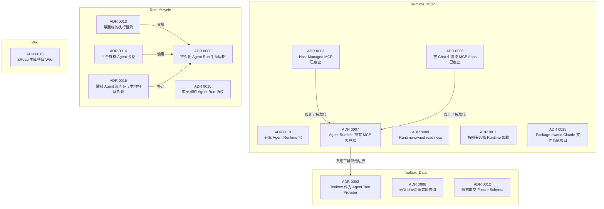

本页记录并索引项目中的 Architecture Decision Records（ADR）。仓库将每个重大架构决策保存为 `docs/adr/NNNN-<slug>.md` 的轻量级 Markdown 文件，内容涵盖运行时选择、MCP 工具供给、Agent Run 生命周期、数据访问治理以及项目 Wiki 生成等主题。ADR 既保留当前“已采纳”的规范，也保留被后续决策“废止/取代”的历史决策，使代码演进时仍能追溯设计初衷与取舍。

Sources: [0002-toolbox-server-as-agent-tool-provider.md](docs/adr/0002-toolbox-server-as-agent-tool-provider.md#L1-L39), [0007-agent-runtime-owned-mcp-clients.md](docs/adr/0007-agent-runtime-owned-mcp-clients.md#L1-L7), [0016-zread-generated-project-wiki.md](docs/adr/0016-zread-generated-project-wiki.md#L1-L11)

## ADR 格式与状态约定

每个 ADR 采用一致的轻量结构：标题、状态（`Accepted` 或 `Superseded`）、上下文、决策、后果与参考。状态为 `Superseded` 的文件会在正文开头显式指向取代它的 ADR，并将被取代方案标记为“历史决策、不再作为当前实现规范”。例如，[ADR 0003](docs/adr/0003-host-managed-mcp.md) 原设想由共享 `packages/mcp-host` 统一托管 MCP，[ADR 0005](docs/adr/0005-render-mcp-apps-in-chat.md) 原设想通过 MCP Apps 在 Chat 中渲染交互 UI，二者均已被 [ADR 0007](docs/adr/0007-agent-runtime-owned-mcp-clients.md) 取代。

Sources: [0003-host-managed-mcp.md](docs/adr/0003-host-managed-mcp.md#L1-L10), [0005-render-mcp-apps-in-chat.md](docs/adr/0005-render-mcp-apps-in-chat.md#L1-L7), [0007-agent-runtime-owned-mcp-clients.md](docs/adr/0007-agent-runtime-owned-mcp-clients.md#L1-L7)

## ADR 目录

| 编号 | 标题 | 状态 | 主题 | 关键影响 |
|---|---|---|---|---|
| 0001 | 分离 Agent Runtime 包 | 已采纳 | 运行时 / 包结构 | Claude 与 Eve 运行时各自独立为 `packages/agent-claude` 与 `packages/agent-eve`，`packages/agent` 只保留共享契约与选择边界。 |
| 0002 | 使用 MCP Toolbox 作为 Agent Tool Provider | 已采纳 | 工具供给 | `apps/toolbox` 作为工具边界，运行时通过框架原生 MCP Client 连接，数据库权限收敛到 `tools.yaml`。 |
| 0003 | 由宿主托管 MCP | 已废止 | 运行时 / MCP | 原拟由共享 `packages/mcp-host` 托管，被 ADR 0007 取代。 |
| 0005 | 在 Chat 中渲染 MCP Apps | 已废止 | 前端 / 交互 | 原拟以 MCP Apps 作为唯一交互 Agent UI，被 ADR 0007 取代。 |
| 0006 | 通过语义目录与认证 Toolbox Tools 治理智能查询 | 已采纳 | 数据 / 智能查询 | 以业务语义目录映射认证工具，禁止任意 NL2SQL，确保指标定义单一可信。 |
| 0007 | 由 Agent Runtime 持有 MCP 客户端 | 已采纳 | 运行时 / MCP | 各框架原生 MCP Client 归各自运行时所有，API / Web 不再代理 MCP 调用。 |
| 0008 | 持久化的 Agent Run 生命周期 | 已采纳 | 生命周期 | PostgreSQL 是运行状态、事件、终态与取消请求的唯一真相源，BullMQ 只负责投递。 |
| 0009 | 由 Runtime 负责的就绪性检查 | 已采纳 | 运维 / 就绪 | `/health` 按部署所选运行时分别报告配置与就绪状态，不发送模型提示。 |
| 0010 | 带关联的 Agent Run 协议 | 已采纳 | 生命周期 / 协议 | `tool-call` / `tool-result` 携带 `callId` 与 `toolName`，结果按状态做联合类型区分。 |
| 0011 | 按部署选择 Runtime 加载 | 已采纳 | 运行时 / 加载 | `@agent-template/agent` 只负责选择，动态导入 `AGENT_RUNTIME` 指定的适配器。 |
| 0012 | 隔离的电商 Fixture 模型 | 已采纳 | 数据 / Schema | 平台 `public` schema 与 `ecommerce_fixture` schema 分离，各自拥有 Prisma 与迁移。 |
| 0013 | 带围栏的 Agent Run 执行租约 | 已采纳 | 生命周期 / 租约 | `queued -> running` 转换使用 PostgreSQL fencing token，过期后允许重新认领。 |
| 0014 | 平台持有 Agent 会话 | 已采纳 | 会话 / 平台 | `conversationId` 由平台生成，运行时延续状态对 API / CLI 不透明。 |
| 0015 | 由包持有 Claude 文件系统项目 | 已采纳 | 运行时 / Claude | `packages/agent-claude` 作为 Claude Code 项目根，`.claude/CLAUDE.md` 与 Skills 归包所有。 |
| 0016 | 限制 Agent 流内存与本地构建负载 | 已采纳 | 运行时 / 流控制 | 累积文本快照压缩、SSE 帧上限 16 MiB、Web 使用 Webpack 与受限 worker。 |
| 0016 | ZRead 生成的项目 Wiki | 已采纳 | 文档 / Wiki | `.zread/` 负责生成与验证，Next.js `/docs` 读取 `wiki.json` 渲染文档。 |

当前目录中不存在 `0004` 编号，构成历史编号空缺。所有编号为 `0016` 的 ADR 是两个独立主题，分别使用 `-bound-agent-stream-memory-and-local-build-load` 与 `-zread-generated-project-wiki` 后缀区分。

Sources: [0001-separate-agent-runtime-packages.md](docs/adr/0001-separate-agent-runtime-packages.md#L1-L8), [0002-toolbox-server-as-agent-tool-provider.md](docs/adr/0002-toolbox-server-as-agent-tool-provider.md#L1-L39), [0003-host-managed-mcp.md](docs/adr/0003-host-managed-mcp.md#L1-L10), [0005-render-mcp-apps-in-chat.md](docs/adr/0005-render-mcp-apps-in-chat.md#L1-L39), [0006-governed-intelligent-querying.md](docs/adr/0006-governed-intelligent-querying.md#L1-L33), [0007-agent-runtime-owned-mcp-clients.md](docs/adr/0007-agent-runtime-owned-mcp-clients.md#L1-L7), [0008-durable-agent-run-lifecycle.md](docs/adr/0008-durable-agent-run-lifecycle.md#L1-L15), [0009-runtime-owned-readiness.md](docs/adr/0009-runtime-owned-readiness.md#L1-L17), [0010-correlated-agent-run-protocol.md](docs/adr/0010-correlated-agent-run-protocol.md#L1-L13), [0011-deployment-selected-runtime-loading.md](docs/adr/0011-deployment-selected-runtime-loading.md#L1-L13), [0012-isolated-ecommerce-fixture-schema.md](docs/adr/0012-isolated-ecommerce-fixture-schema.md#L1-L21), [0013-fenced-agent-run-execution-leases.md](docs/adr/0013-fenced-agent-run-execution-leases.md#L1-L30), [0014-platform-owned-agent-conversations.md](docs/adr/0014-platform-owned-agent-conversations.md#L1-L33), [0015-package-owned-claude-filesystem-project.md](docs/adr/0015-package-owned-claude-filesystem-project.md#L1-L6), [0016-bound-agent-stream-memory-and-local-build-load.md](docs/adr/0016-bound-agent-stream-memory-and-local-build-load.md#L1-L46), [0016-zread-generated-project-wiki.md](docs/adr/0016-zread-generated-project-wiki.md#L1-L11)

## 决策主题与演进关系

按主题可将 ADR 划分为四组：**运行时与 MCP**（0001、0003、0005、0007、0009、0011、0015）、**工具与数据治理**（0002、0006、0012）、**Agent Run 生命周期与会话**（0008、0010、0013、0014、0016-bound）以及**项目文档**（0016-zread）。演进上，0003 与 0005 的失败路径共同推动了 0007 的“运行时自治 MCP Client”决策；0007 反过来决定 0002 中 Toolbox 仅作为工具供给边界；0013 的围栏租约是 0008 持久化生命周期的安全前提；0014 的平台会话与 0016-bound 的流控制则是在生命周期之上补充的会话与资源治理。

Sources: [0007-agent-runtime-owned-mcp-clients.md](docs/adr/0007-agent-runtime-owned-mcp-clients.md#L1-L7), [0008-durable-agent-run-lifecycle.md](docs/adr/0008-durable-agent-run-lifecycle.md#L7-L13), [0013-fenced-agent-run-execution-leases.md](docs/adr/0013-fenced-agent-run-execution-leases.md#L1-L30), [0014-platform-owned-agent-conversations.md](docs/adr/0014-platform-owned-agent-conversations.md#L1-L33)

## 阅读建议

对于高级开发者，建议按主题链式阅读而非严格按编号顺序。若想理解多运行时如何共存与加载，应优先阅读 [ADR 0001](docs/adr/0001-separate-agent-runtime-packages.md)、[ADR 0011](docs/adr/0011-deployment-selected-runtime-loading.md) 与 [ADR 0009](docs/adr/0009-runtime-owned-readiness.md)；理解 MCP 与工具供给，应阅读 [ADR 0007](docs/adr/0007-agent-runtime-owned-mcp-clients.md)、[ADR 0002](docs/adr/0002-toolbox-server-as-agent-tool-provider.md)、[ADR 0006](docs/adr/0006-governed-intelligent-querying.md) 与 [ADR 0012](docs/adr/0012-isolated-ecommerce-fixture-schema.md)；理解 Agent Run 生命周期，应阅读 [ADR 0008](docs/adr/0008-durable-agent-run-lifecycle.md)、[ADR 0013](docs/adr/0013-fenced-agent-run-execution-leases.md)、[ADR 0010](docs/adr/0010-correlated-agent-run-protocol.md) 与 [ADR 0014](docs/adr/0014-platform-owned-agent-conversations.md)；Web 与流控制相关细节见 [ADR 0016-bound](docs/adr/0016-bound-agent-stream-memory-and-local-build-load.md)；项目文档生成流程见 [ADR 0016-zread](docs/adr/0016-zread-generated-project-wiki.md)。历史 ADR 0003 与 0005 仅用于理解曾被废弃的“中央 MCP Host”路径。

Sources: [0001-separate-agent-runtime-packages.md](docs/adr/0001-separate-agent-runtime-packages.md#L1-L8), [0007-agent-runtime-owned-mcp-clients.md](docs/adr/0007-agent-runtime-owned-mcp-clients.md#L1-L7), [0008-durable-agent-run-lifecycle.md](docs/adr/0008-durable-agent-run-lifecycle.md#L1-L15), [0013-fenced-agent-run-execution-leases.md](docs/adr/0013-fenced-agent-run-execution-leases.md#L1-L30), [0016-bound-agent-stream-memory-and-local-build-load.md](docs/adr/0016-bound-agent-stream-memory-and-local-build-load.md#L1-L46), [0016-zread-generated-project-wiki.md](docs/adr/0016-zread-generated-project-wiki.md#L1-L11)

## 维护与新增 ADR

新增 ADR 时应遵循现有命名与结构约定：使用四位编号（在 `docs/adr` 中按顺序递增），标题以动作/对象命名，显式声明状态，并在“决策”段落中说明选择的方案与拒绝的替代方案。若新 ADR 取代旧决策，必须在旧 ADR 的状态行与正文中添加 superseded 链接，并将旧方案标记为历史记录。建议同时更新本页索引表格与关系图，使决策之间的依赖与替代关系保持可读。

Sources: [0002-toolbox-server-as-agent-tool-provider.md](docs/adr/0002-toolbox-server-as-agent-tool-provider.md#L1-L39), [0003-host-managed-mcp.md](docs/adr/0003-host-managed-mcp.md#L1-L10), [0007-agent-runtime-owned-mcp-clients.md](docs/adr/0007-agent-runtime-owned-mcp-clients.md#L1-L7)

## 下一步

- 若要查看代码实现，可阅读 [整体架构与进程边界](7-zheng-ti-jia-gou-yu-jin-cheng-bian-jie)、[Claude Agent Runtime 适配](9-claude-agent-runtime-gua-pei) 与 [Eve Agent Runtime 适配](10-eve-agent-runtime-gua-pei)。
- 工具与数据供给的落地细节见 [Toolbox 与 MCP 工具供给](11-toolbox-yu-mcp-gong-ju-gong-gei) 与 [数据库模型与持久化边界](12-shu-ju-ku-mo-xing-yu-chi-jiu-hua-bian-jie)。
- Agent Run 生命周期、SSE 与队列的完整流程见 [Agent Run 生命周期与执行租约](8-agent-run-sheng-ming-zhou-qi-yu-zhi-xing-zu-yue)、[API 路由、SSE 与任务队列](13-api-lu-you-sse-yu-ren-wu-dui-lie) 与 [Web 前端与 Chat 界面](14-web-qian-duan-yu-chat-jie-mian)。
- 项目 Wiki 生成与配置细节见 [ZRead 项目 Wiki 生成](18-zread-xiang-mu-wiki-sheng-cheng)。
- 协作与 Skills 相关约定见 [Agent Skills 与协作工作流](20-agent-skills-yu-xie-zuo-gong-zuo-liu)。