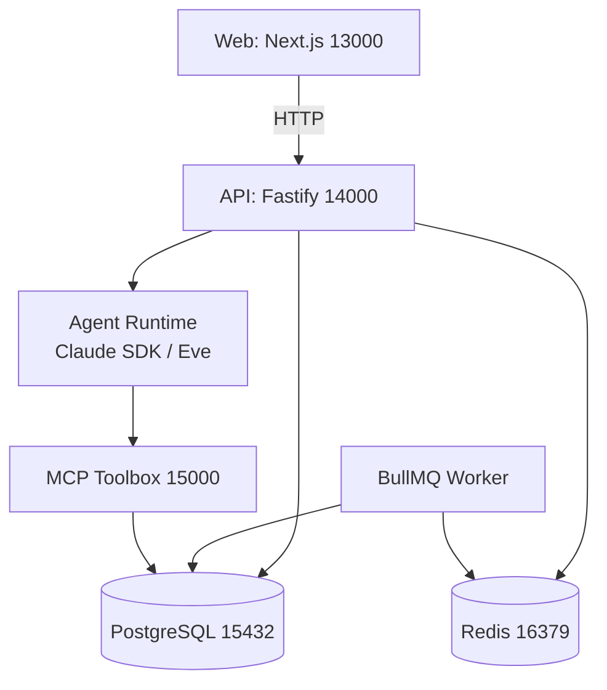

本页面向初次接触本项目的开发者，介绍如何在本地把 Agent 平台模板运行起来。我们会按“准备环境 → 初始化项目 → 启动基础设施 → 初始化数据库 → 启动开发服务 → 验证与首次对话”的顺序展开，并在每一步给出可直接复制的命令。阅读完本页后，你将能在本地看到 Web 控制台、调用 API 健康检查，并与 Agent 进行第一次对话。

Sources: [README.md](README.md#L11-L21)

## 前置条件

开始之前，请确保本机已安装以下依赖：

- **Node.js 24**（项目通过 `.nvmrc` 锁定版本，Docker 镜像也基于 `node:24-alpine`）
- **pnpm 11.11.0**（`package.json` 使用 `packageManager` 字段锁定，可通过 corepack 自动安装）
- **PostgreSQL 17**（开发端口为 `15432`）
- **Redis 7**（开发端口为 `16379`）

如果你希望 Agent 能真正调用大模型，还需要准备一个兼容 Anthropic API 协议的 Key；项目默认使用 Kimi Code 的 Anthropic-compatible 端点（`https://api.kimi.com/coding/`），但也可以替换为其他兼容服务。不配置 Key 时，服务仍可启动，`/health` 会显示 `configured: false`，此时可以查看页面和 API 状态，但无法完成 Agent 对话。

Sources: [.nvmrc](.nvmrc#L1-L2) [package.json](package.json#L4-L7) [.env.example](.env.example#L28-L32)

## 项目架构速览

本项目是一个 pnpm Workspace + Turborepo 的 TypeScript monorepo：`apps/` 存放运行进程（Web、API、Worker、CLI 等），`packages/` 存放可复用能力（Agent runtime 抽象、数据库、共享组件等）。开发模式下，核心进程会同时启动并通过本地端口对外暴露。



这张图中，**Web** 面向用户提供 Chat 界面；**API** 处理 Agent job、SSE 会话和 run 查询；**Worker** 消费 BullMQ 队列执行后台 Agent run；**Agent Runtime** 根据环境变量选择 Claude 或 Eve；**Toolbox** 通过预定义 SQL 工具向 Agent 暴露数据库只读能力。新手第一次启动时，重点是让 Web、API、Worker 和数据库连通，Toolbox 与模型 Key 可以后续按需配置。

Sources: [AGENTS.md](AGENTS.md#L5-L6) [README.md](README.md#L54-L74)

## 第一步：初始化项目

打开终端，进入仓库根目录，完成以下三步：

1. 复制示例环境变量文件：
   ```bash
   cp .env.example .env
   ```
2. 启用 corepack 并安装 pnpm 依赖：
   ```bash
   corepack enable
   corepack install
   pnpm install
   ```

`corepack install` 会按照 `packageManager` 字段自动安装 `pnpm@11.11.0`；`pnpm install` 会拉取所有 workspace 的依赖，并触发必要的 postinstall 脚本。整个安装完成后，`node_modules` 和 workspace 软链都会就位。

Sources: [package.json](package.json#L4-L4) [README.md](README.md#L14-L15)

## 第二步：准备 PostgreSQL 与 Redis

开发模式默认连接本机的非标准端口，避免与系统已有服务冲突：

| 服务 | 开发地址 | 用途 |
|------|----------|------|
| PostgreSQL | `localhost:15432` | 持久化 Agent run、事件、会话等业务数据 |
| Redis | `localhost:16379` | BullMQ 队列、Worker 任务分发 |

你可以选择任意方式启动这两个服务。如果本机已经通过 Homebrew、Docker 或 asdf 安装，直接启动即可。如果希望一键拉起完整基础设施（包括 Toolbox、PostgreSQL、Redis、Eve Agent 等），可以使用 `docker compose up -d postgres redis toolbox eve-agent`，但需要注意：Docker Compose 是项目显式可选的容器启动方式，不是默认开发路径。

Sources: [.env.example](.env.example#L3-L5) [README.md](README.md#L23-L23) [docker-compose.yml](docker-compose.yml#L32-L62)

## 第三步：初始化数据库

在基础设施就绪后，依次运行三条命令生成 Prisma Client、应用迁移并写入种子数据：

```bash
pnpm db:generate
pnpm db:migrate
pnpm db:seed
```

这三条命令分别完成：

- `db:generate`：为 `@agent-template/db` 和 `@agent-template/ecommerce-fixture` 生成 Prisma Client 类型。
- `db:migrate`：对主数据库运行 `prisma migrate dev`，对 `ecommerce_fixture` schema 运行自定义迁移脚本。
- `db:seed`：写入平台所需初始数据，以及合成电商 fixture 数据（96 位客户、24 个商品、600 张订单、1200 个订单项、540 条支付记录）。

`ecommerce_fixture` 是独立的 schema，只用于本地验证和 Toolbox 工具演示，不会污染平台业务数据。

Sources: [package.json](package.json#L14-L17) [packages/db/package.json](packages/db/package.json#L9-L13) [packages/ecommerce-fixture/package.json](packages/ecommerce-fixture/package.json#L8-L13)

## 第四步：启动开发服务

执行：

```bash
pnpm dev
```

`turbo dev` 会并行启动所有定义了 `dev` 脚本的 workspace。默认情况下，你会看到以下服务同时运行：

| 服务 | 本地地址 | 说明 |
|------|----------|------|
| Web 前端 | http://localhost:13000 | Next.js 15，默认入口页 |
| API 服务 | http://localhost:14000 | Fastify 5，SSE 与 REST 接口 |
| Worker 进程 | 无对外端口 | BullMQ 队列消费 |
| Eve Agent Runtime | http://localhost:13010 | 当 `AGENT_RUNTIME=eve` 时由前端/API 调用 |

`turbo.json` 把 `dev` 标记为 `persistent` 和 `cache: false`，因此终端会保持在前台并实时输出所有子进程的日志。首次启动时建议先打开 `http://localhost:13000` 确认页面正常，再访问 `http://localhost:14000/health` 查看数据库、Redis 和 Agent runtime 状态。

Sources: [package.json](package.json#L8-L9) [turbo.json](turbo.json#L4-L7) [apps/web/package.json](apps/web/package.json#L5-L7) [apps/api/package.json](apps/api/package.json#L5-L7) [apps/worker/package.json](apps/worker/package.json#L5-L7) [packages/agent-eve/package.json](packages/agent-eve/package.json#L14-L15)

## 第五步：验证启动状态

打开浏览器访问 `http://localhost:13000`，你会看到“项目模板已就绪”页面，并显示 API、PostgreSQL、Redis/BullMQ 的实时状态。点击页面上的“打开 Agent 控制台”即可进入 Chat 界面。

同时建议直接调用 API 健康检查：

```bash
curl http://localhost:14000/health
```

返回示例中包含 `database`、`redis`、`queue` 和 `agent` 四个维度。如果看到 `status: "degraded"`，请重点检查 `database` 和 `redis` 的消息；Agent 维度显示 `configured: false` 仅表示当前未配置模型 Key，不影响页面和 API 本身。

Sources: [apps/web/app/page.tsx](apps/web/app/page.tsx#L5-L72) [apps/api/src/health.ts](apps/api/src/health.ts#L124-L162)

## 第六步：配置模型 Key（可选但推荐）

要让 Agent 真正工作，在 `.env` 中填写 Anthropic-compatible API Key：

```bash
ANTHROPIC_API_KEY=<your-kimi-api-key>
ANTHROPIC_BASE_URL=https://api.kimi.com/coding/
ANTHROPIC_MODEL=kimi-for-coding
CLAUDE_AGENT_MODEL=kimi-for-coding
```

默认 `AGENT_RUNTIME=claude`，API 会通过 Claude Agent SDK 直连模型。如果你希望使用 Eve runtime，请改为：

```bash
AGENT_RUNTIME=eve
EVE_AGENT_MODEL=kimi-for-coding
EVE_AGENT_HOST=http://localhost:13010
EVE_AGENT_SERVICE_TOKEN=<至少 16 位 Token>
```

`EVE_AGENT_SERVICE_TOKEN` 用于非 loopback 调用；纯本地开发时 Eve 提供 `localDev()` 入口，但生产环境会关闭该入口。修改 `.env` 后需要重新运行 `pnpm dev` 让新环境变量生效。

Sources: [.env.example](.env.example#L28-L37) [README.md](README.md#L82-L93)

## 第七步：首次对话

配置模型 Key 后，你可以通过 Web 控制台发送第一条消息。如果更喜欢命令行，也可以构建并使用 CLI：

```bash
pnpm --filter @agent-template/cli build
pnpm --filter @agent-template/cli dev -- doctor
```

常用 CLI 命令示例：

```bash
# 检查远端健康
pnpm --filter @agent-template/cli dev -- doctor

# 创建会话并发送消息
pnpm --filter @agent-template/cli dev -- chat "分析最近失败的订单"

# 列出会话
pnpm --filter @agent-template/cli dev -- conversations list

# 查看某个 run 的事件流
pnpm --filter @agent-template/cli dev -- runs watch <run-id>
```

CLI 只调用版本化的 Agent API，不加载 Fastify、Prisma 或具体 Agent runtime，因此适合作为外部客户端测试入口。

Sources: [apps/cli/src/cli.ts](apps/cli/src/cli.ts#L128-L180) [README.md](README.md#L101-L123)

## 常用命令速查

| 命令 | 作用 |
|------|------|
| `pnpm dev` | 启动所有开发服务 |
| `pnpm build` | 构建所有 workspace |
| `pnpm lint` | 运行全仓 lint |
| `pnpm typecheck` | 全仓类型检查 |
| `pnpm test` | 运行全仓测试 |
| `pnpm db:generate` | 生成 Prisma Client |
| `pnpm db:migrate` | 应用数据库迁移 |
| `pnpm db:seed` | 写入种子数据 |
| `pnpm agent-runs:verify:local` | 本地验证 Agent run 生命周期 |
| `pnpm agent-runtime:verify:local` | 本地验证 Agent runtime 健康 |
| `pnpm toolbox:verify:local` | 本地验证 Toolbox 电商工具 |

Sources: [package.json](package.json#L8-L44)

## 故障排查

| 现象 | 可能原因 | 处理建议 |
|------|----------|----------|
| `pnpm install` 失败 | Node 版本或 corepack 未启用 | 确认 Node 为 24.x，执行 `corepack enable` |
| 数据库连接失败 | PostgreSQL 未监听 `15432` | 检查服务是否启动，确认 `.env` 中 `DATABASE_URL` 端口正确 |
| Redis 连接失败 | Redis 未监听 `16379` | 检查 Redis 服务，确认 `REDIS_URL` 配置 |
| `/health` 显示 `degraded` | 数据库/Redis/Agent 任一异常 | 查看具体字段的 `message` 定位 |
| Agent 对话无响应 | 未配置模型 Key 或 Toolbox 不可达 | 检查 `.env` 中 `ANTHROPIC_API_KEY` 与 `TOOLBOX_URL` |
| 页面 404 | Web 未启动或端口冲突 | 检查 `pnpm dev` 日志中 Next.js 是否正常监听 `13000` |

Sources: [apps/api/src/health.ts](apps/api/src/health.ts#L124-L162) [apps/api/src/env.ts](apps/api/src/env.ts#L5-L25)

## 下一步

完成本地启动后，建议按以下顺序继续阅读：

- 如果你想了解整个项目有哪些模块、它们分别负责什么，请阅读 [项目目录与模块职责](3-xiang-mu-mu-lu-yu-mo-kuai-zhi-ze)。
- 如果你想掌握日常开发、测试、提交的标准流程，请阅读 [开发工作流与常用命令](4-kai-fa-gong-zuo-liu-yu-chang-yong-ming-ling)。
- 如果你想理解 Agent run、conversation、runtime、Toolbox 等核心概念，请阅读 [核心概念与领域语言](5-he-xin-gai-nian-yu-ling-yu-yu-yan)。
- 如果你准备配置生产环境变量或排查运行时配置问题，请阅读 [环境变量与运行时配置](6-huan-jing-bian-liang-yu-yun-xing-shi-pei-zhi)。