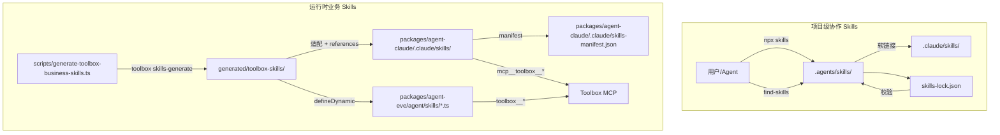
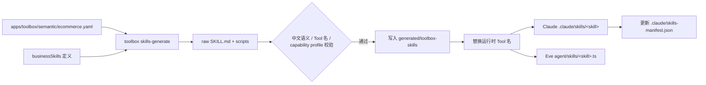
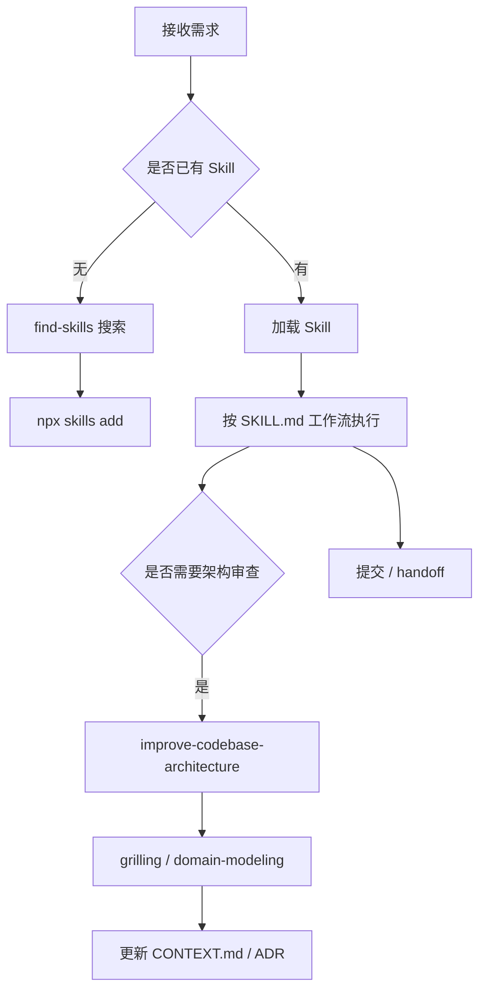

Agent Skills 是把项目约定、工程流程与业务知识封装成结构化指令的载体，决定 Agent 在何时、以何种方式调用工具、写出产物并与人类协作。本页聚焦本项目 Skill 的分层设计、单一真实来源、管理命令以及 Skill 驱动的任务协作流程，帮助高级开发者在扩展能力时保持仓库一致与可审计。

## 1. Skill 分层与单一真实来源

本项目的 Skill 明确分为三层：**项目级协作 Skills**、**运行时业务 Skills** 与 **UI 设计 Skills**。协作 Skills 放在 `.agents/skills/`，由 `npx skills` 统一维护，是项目 Agent 约定（如如何写 AGENTS.md、如何提交、如何审代码）的唯一真实来源；根目录 `.claude/skills/` 只保存指向 `.agents/skills/` 的软链接，不额外维护副本。运行时业务 Skills 则服务于 Claude 与 Eve 两个 Agent Runtime，用于指导 Agent 如何调用 Toolbox MCP 工具完成电商分析、订单排查等业务任务，由 `scripts/generate-toolbox-business-skills.ts` 从 Toolbox 配置生成并同步到两个 Runtime。UI 设计 Skills 不常驻安装，而是在需要时通过固定版本的 `ui-skills` CLI 动态加载。

Sources: [AGENTS.md](AGENTS.md#L28-L36); [AGENTS.md](AGENTS.md#L38-L42); [packages/agent-claude/AGENTS.md](packages/agent-claude/AGENTS.md#L13-L15); [packages/agent-claude/AGENTS.md](packages/agent-claude/AGENTS.md#L21-L22); [packages/agent-eve/AGENTS.md](packages/agent-eve/AGENTS.md#L24-L26); [generated/toolbox-skills/README.md](generated/toolbox-skills/README.md#L1-L17)

## 2. 项目级协作 Skills：.agents/skills

### 2.1 目录结构与内容约定

每个协作 Skill 是一个目录，入口文件为 `SKILL.md`，顶部使用 YAML frontmatter 声明 `name`、`description`、`risk` 与 `source` 等元信息；复杂 Skill 还会附带 `references/`、`scripts/` 或补充 Markdown。`.agents/skills/agents-md/SKILL.md` 甚至把 AGENTS.md 的编写规则本身也当成一个 Skill，约束其应小于 60 行、使用 bullets 与代码块、不重复 linter 规则。这种“把项目约定写成 Skill”的做法，是仓库内所有 Agent 行为一致的前提。

Sources: [.agents/skills/agents-md/SKILL.md](.agents/skills/agents-md/SKILL.md#L1-L7); [.agents/skills/agents-md/SKILL.md](.agents/skills/agents-md/SKILL.md#L32-L41); [.agents/skills/find-skills/SKILL.md](.agents/skills/find-skills/SKILL.md#L1-L5)

### 2.2 安装、发现与锁文件

Skill 的增删改全部通过 `npx skills` 完成，不允许手工维护 `.agents/skills/` 或 `.claude/skills/` 目录。常用命令包括 `npx skills find <query>`、`npx skills add <source>`、`npx skills list`、`npx skills update [skills...] -p` 与 `npx skills remove [skills]`，默认同时面向 Codex 与 Claude Code。每次变更后，必须验证 `.agents/skills/*` 与 `skills-lock.json` 双向一致：锁文件记录每个 Skill 的 `source`、`sourceType`、`skillPath` 与 `computedHash`，确保克隆仓库或 CI 中复现完全相同的 Skill 内容。

Sources: [docs/agents/skills.md](docs/agents/skills.md#L1-L15); [skills-lock.json](skills-lock.json#L1-L10)

### 2.3 已知缺陷与处理

当前 `skills@1.5.16` 存在两个需要人工干预的缺陷：一是 `remove` 可能删除目录但残留同名锁项；二是把 `SKILL.md` 放在仓库根且带 `references/`、`scripts/` 等附属文件时，可能只安装 `SKILL.md` 而丢失引用。处理原则是“不把可发现当作安装完整”——安装或更新后必须检查 `SKILL.md` 的相对引用是否完整；已确认缺陷时，可先把同一上游 commit 克隆到临时目录，再通过 `npx skills add <local-clone>` 完整复制，并仅把锁项来源恢复为原 GitHub 来源、保留完整目录的 `computedHash`。

Sources: [docs/agents/skills.md](docs/agents/skills.md#L17-L28)

## 3. Toolbox 业务 Skills：从配置到双运行时

### 3.1 生成管线

运行时业务 Skills 不是手写，而是从 `apps/toolbox/semantic/ecommerce.yaml` 与 `apps/toolbox/tools.yaml` 推导而来。`scripts/generate-toolbox-business-skills.ts` 在 `businessSkills` 数组中定义了四个业务 Skill（销售分析、商品分析、订单运营、履约运营），每个 Skill 指定 `toolset`、`description` 与中文 `workflow`，然后调用 `toolbox skills-generate` 生成官方原始产物：一个 `SKILL.md`、一份 `assets/tools.yaml` 与若干 `scripts/*.js`。脚本随后对生成产物做三重校验：中文描述必须存在、所有 Tool 名必须在 `@agent-template/toolbox-config` 的 `toolboxToolNames` 中、所有 Tool 必须有对应的 capability profile。

Sources: [scripts/generate-toolbox-business-skills.ts](scripts/generate-toolbox-business-skills.ts#L35-L78); [scripts/generate-toolbox-business-skills.ts](scripts/generate-toolbox-business-skills.ts#L137-L160); [scripts/generate-toolbox-business-skills.ts](scripts/generate-toolbox-business-skills.ts#L506-L612); [generated/toolbox-skills/README.md](generated/toolbox-skills/README.md#L1-L17)

### 3.2 运行时适配

Claude 与 Eve 对 MCP Tool 的命名与加载方式不同，因此同一份 Markdown 会经过 `useRuntimeToolNames` 替换：Claude 端使用 `mcp__toolbox__<tool>`，Eve 端使用 `toolbox__<tool>`。对于 Claude，生成产物被写入 `packages/agent-claude/.claude/skills/<skill>/`，并附带 `references/ecommerce-semantic-catalog.yaml`；对于 Eve，生成产物被编译成 `packages/agent-eve/agent/skills/<skill>.ts`，使用 `defineSkill` 包装 Markdown 与引用文件，再通过 `defineDynamic` 在 `session.started` 时根据 `hasToolboxCapabilities(requiredTools)` 动态注册。

Sources: [scripts/generate-toolbox-business-skills.ts](scripts/generate-toolbox-business-skills.ts#L178-L208); [scripts/generate-toolbox-business-skills.ts](scripts/generate-toolbox-business-skills.ts#L275-L305); [scripts/generate-toolbox-business-skills.ts](scripts/generate-toolbox-business-skills.ts#L307-L342); [scripts/generate-toolbox-business-skills.ts](scripts/generate-toolbox-business-skills.ts#L682-L693)

### 3.3 Capability Profile 与语义目录

业务 Skill 不是无差别暴露所有 Tool，而是受 `AGENT_CAPABILITY_PROFILE` 收窄。生成脚本会验证 Eve 的 `toolbox.ts` connection 必须包含 `defineMcpClientConnection` 与 `tools: { allow: toolbox.allowedTools }`，确保运行时只暴露 profile 允许的 Tool；同时所有生成 Skill 涉及的 Tool 必须出现在 `toolboxCapabilityProfiles` 中。每个业务 Skill 还会把 `apps/toolbox/semantic/ecommerce.yaml` 作为 `references/ecommerce-semantic-catalog.yaml` 复制到 Claude Skill 目录，并以内联字符串形式写入 Eve 的 `ecommerce-semantic-catalog.ts`，保证 Agent 在解释业务术语、指标与维度时只使用认证语义。

Sources: [scripts/generate-toolbox-business-skills.ts](scripts/generate-toolbox-business-skills.ts#L17-L21); [scripts/generate-toolbox-business-skills.ts](scripts/generate-toolbox-business-skills.ts#L579-L612); [packages/agent-claude/.claude/skills/ecommerce-sales-analysis/SKILL.md](packages/agent-claude/.claude/skills/ecommerce-sales-analysis/SKILL.md#L19-L22); [packages/agent-eve/agent/skills/ecommerce-sales-analysis.ts](packages/agent-eve/agent/skills/ecommerce-sales-analysis.ts#L1-L26)

### 3.4 产物清单与清理

`generated/toolbox-skills/` 保存原始产物，用于检查官方生成器的标准结构；`packages/agent-claude/.claude/skills-manifest.json` 记录生成器管理的 Skill 与工具列表，用于安全清理已删除或重命名的产物。`--check` 模式会逐字比较原始产物、Claude 目录与 Eve TypeScript 文件，任何不一致都会报出 `staleOutputs` 并失败。这种设计保证业务 Skill 的变更必须回归脚本生成，不能手工修改某一份 Runtime 产物。

Sources: [scripts/generate-toolbox-business-skills.ts](scripts/generate-toolbox-business-skills.ts#L384-L440); [scripts/generate-toolbox-business-skills.ts](scripts/generate-toolbox-business-skills.ts#L468-L491); [scripts/generate-toolbox-business-skills.ts](scripts/generate-toolbox-business-skills.ts#L614-L680); [packages/agent-claude/.claude/skills-manifest.json](packages/agent-claude/.claude/skills-manifest.json#L1-L35); [generated/toolbox-skills/manifest.json](generated/toolbox-skills/manifest.json#L1-L35)

## 4. Skill 驱动的协作工作流

### 4.1 任务启动与发现

当接到需求时，Agent 首先判断是否有现成 Skill 可用。如果存在，直接按 `SKILL.md` 的 `When to Use` 与 `Process` 执行；如果不确定，先运行 `find-skills` 工作流，通过 `npx skills find <query>` 或查阅 `skills.sh` leaderboard 搜索并评估 Skill 质量。对于首次使用项目工程 Skill 的仓库，还应先运行 `setup-matt-pocock-skills` 建立 `docs/agents/issue-tracker.md`、`docs/agents/domain.md` 与 `docs/agents/triage-labels.md` 等共享上下文。

Sources: [.agents/skills/find-skills/SKILL.md](.agents/skills/find-skills/SKILL.md#L34-L95); [.agents/skills/setup-matt-pocock-skills/SKILL.md](.agents/skills/setup-matt-pocock-skills/SKILL.md#L1-L5); [.agents/skills/setup-matt-pocock-skills/SKILL.md](.agents/skills/setup-matt-pocock-skills/SKILL.md#L11-L14)

### 4.2 架构审查与深化

涉及代码改动时，根目录 `AGENTS.md` 强制要求使用 `improve-codebase-architecture` Skill 审查本次变更及直接影响模块。该 Skill 先读取 `CONTEXT.md` 与相关 ADR，再使用 `subagent_type=Explore` 遍历代码，输出 HTML 报告，列出“深模块”改造候选；随后用 `grilling` 与用户一起细化设计，并用 `domain-modeling` 维护领域模型。如果命名了新概念或拒绝了某个候选的深层原因，则更新 `CONTEXT.md` 或提出 ADR。

Sources: [.agents/skills/improve-codebase-architecture/SKILL.md](.agents/skills/improve-codebase-architecture/SKILL.md#L1-L5); [.agents/skills/improve-codebase-architecture/SKILL.md](.agents/skills/improve-codebase-architecture/SKILL.md#L17-L53); [.agents/skills/improve-codebase-architecture/SKILL.md](.agents/skills/improve-codebase-architecture/SKILL.md#L57-L61); [AGENTS.md](AGENTS.md#L44-L48)

### 4.3 提交与交接

任务完成并有文件改动时，涉及 Git 提交、提交信息或 changelog 必须使用 `chinese-commit-conventions` Skill；随后按项目约定创建原子提交，提交信息包含 `Co-Authored-By` trailer。如果任务需要跨会话继续，使用 `handoff` Skill 记录当前状态、已做决定与下一步行动；不创建空提交，也不把无关改动混进同一提交。

Sources: [AGENTS.md](AGENTS.md#L54-L62); [.agents/skills/handoff/SKILL.md](.agents/skills/handoff/SKILL.md)  
<!-- 注：若 handoff SKILL.md 内容较短，可直接引用其全部内容；此处保持文件级引用。 -->

## 5. 维护与门禁

| 检查项 | 命令/文件 | 说明 |
| --- | --- | --- |
| 协作 Skills 与锁文件一致 | `npx skills list` 后比对 `skills-lock.json` | 增删改后必须双向一致 |
| 中文业务 Skill 生成 | `pnpm skills:generate:toolbox` | 从 Toolbox 配置重新生成并适配 Claude/Eve |
| 产物是否过期 | `pnpm skills:check:toolbox` | `--check` 模式逐字比较所有产物 |
| Claude 是否发现 Skill | `scripts/generate-toolbox-business-skills.ts` 内 `validateClaudeDiscovery` | 检查 `skills-manifest.json` 与 `SKILL.md` 存在性 |
| Eve 是否发现 Skill | `scripts/generate-toolbox-business-skills.ts` 内 `validateEveDiscovery` | 检查 `eve info --json` 的 skills/connections/dynamicSkills |

不要手工编辑 `.claude/skills/` 或 `packages/agent-claude/.claude/skills/` 下的业务 Skill；任何变更都应回到 `apps/toolbox/semantic/` 或 `scripts/generate-toolbox-business-skills.ts` 的 `businessSkills` 定义，然后重新生成。CI 中可通过 `pnpm skills:check:toolbox` 与 `npx skills` 的校验能力保证 Skill 层不会与代码层脱节。

Sources: [package.json](package.json#L40-L42); [scripts/generate-toolbox-business-skills.ts](scripts/generate-toolbox-business-skills.ts#L614-L680); [AGENTS.md](AGENTS.md#L28-L36)

## 6. 延伸阅读

- 若需理解 Agent Run 的完整生命周期与执行租约，请继续阅读 [Agent Run 生命周期与执行租约](8-agent-run-sheng-ming-zhou-qi-yu-zhi-xing-zu-yue)。
- 若需深入 Toolbox 与 MCP 工具供给机制，请继续阅读 [Toolbox 与 MCP 工具供给](11-toolbox-yu-mcp-gong-ju-gong-gei)。
- 若需了解 CLI 与 Agent Client 如何调度 Runtime，请继续阅读 [CLI 与 Agent Client](15-cli-yu-agent-client)。
- 若需了解 Web Chat 界面如何展示 Skill 执行结果，请继续阅读 [Web 前端与 Chat 界面](14-web-qian-duan-yu-chat-jie-mian)。
- 本项目 Wiki 的生成规则见 [ZRead 项目 Wiki 生成](18-zread-xiang-mu-wiki-sheng-cheng)。