本文档面向刚接触本仓库的开发者，目标是在不深入具体实现的前提下，帮助你建立“代码放在哪里、模块之间如何分工”的全局地图。阅读后，你应该能够快速判断一个新功能该放进 `apps/` 还是 `packages/`，知道默认的入口和端口，并理解支撑目录（如 `.zread/`、`docs/`、`scripts/`）的职责。

Sources: [package.json](package.json#L1-L7), [pnpm-workspace.yaml](pnpm-workspace.yaml#L1-L4), [AGENTS.md](AGENTS.md#L1-L7)

## 顶层组织：pnpm Workspace + Turborepo

仓库根目录是一个 monorepo，使用 pnpm Workspace 管理 `apps/*` 和 `packages/*` 两个目录。`apps/` 存放可以独立启动的进程，例如 Web 前端、HTTP API、Worker 和 CLI；`packages/` 存放被多个应用共享的库，例如数据库客户端、Agent runtime 抽象、共享组件和类型定义。Turborepo 通过 `turbo.json` 定义任务的依赖顺序与缓存策略，例如 `build` 会先执行上游依赖的 `build`，`dev` 则是长期运行的持久化任务。根 `package.json` 提供统一脚本入口，如 `pnpm dev`、`pnpm build`、`pnpm typecheck`、`pnpm test`，并通过 `pnpm --filter <package>` 支持单个模块的独立验证。

Sources: [pnpm-workspace.yaml](pnpm-workspace.yaml#L1-L4), [turbo.json](turbo.json#L1-L31), [package.json](package.json#L8-L44), [packages/AGENTS.md](packages/AGENTS.md#L1-L4)

## 目录全景图

下图用分层方式展示仓库主要目录及其关系：顶层被划分为“可运行进程”与“共享能力”，其余目录负责文档、脚本、容器与 Wiki 生成。

```mermaid
graph TD
    Root[仓库根] --> Apps[apps/ 可运行进程]
    Root --> Packages[packages/ 共享能力]
    Root --> Docs[docs/ 架构与领域文档]
    Root --> Scripts[scripts/ 根级自动化脚本]
    Root --> ZRead[.zread/ 项目 Wiki 生成]
    Root --> Docker[Docker 与 CI 配置]
    Apps --> Web[web Next.js 前端]
    Apps --> Api[api Fastify HTTP API]
    Apps --> Worker[worker BullMQ 后台任务]
    Apps --> Cli[cli 可安装命令行]
    Apps --> Toolbox[toolbox MCP Toolbox 配置]
    Apps --> WebQa[web-qa 前端 QA 环境]
    Packages --> Agent[agent Agent runtime 公共边界]
    Packages --> AgentClaude[agent-claude Claude 适配]
    Packages --> AgentEve[agent-eve Eve 适配]
    Packages --> AgentClient[agent-client HTTP/SSE 客户端]
    Packages --> Db[db Prisma/PostgreSQL]
    Packages --> Ecommerce[ecommerce-fixture 合成零售验证数据]
    Packages --> Shared[shared Zod schema 与类型]
    Packages --> Logger[logger Pino 日志]
    Packages --> ToolboxConfig[toolbox-config 工具配置]
    Packages --> Ui[ui React 共享组件]
```



一个更紧凑的文本视图如下：

```text
apps/
  web/          Next.js 前端（端口 13000）
  api/          Fastify HTTP API（端口 14000）
  worker/       BullMQ 后台任务进程
  cli/          Incur 可安装命令行客户端
  toolbox/      MCP Toolbox 工具配置
  web-qa/       浏览器 QA fixture 与测试流
packages/
  ui/           shadcn/ui 风格共享组件
  db/           平台 public schema、Prisma Client
  ecommerce-fixture/  独立 schema 的合成零售数据
  logger/       Pino 日志封装
  agent/        Agent runtime 公共边界
  agent-client/ Web、CLI 共用的远程 Agent Client
  agent-claude/ Claude Agent SDK 适配
  agent-eve/    Eve runtime 适配
  toolbox-config/ Claude/Eve 共用 Toolbox 配置
  shared/       共享 Zod schema 和 TypeScript 类型
```

Sources: [README.md](README.md#L54-L74), [packages/AGENTS.md](packages/AGENTS.md#L5-L17)

## apps：可运行进程

`apps/` 中的每个目录都可以被理解为一个独立的进程或部署单元。它们依赖 `packages/` 提供的共享能力，但彼此之间通常不直接依赖，而是通过共享 schema 和 API 契约进行协作。

Sources: [apps/api/AGENTS.md](apps/api/AGENTS.md#L1-L5), [apps/worker/AGENTS.md](apps/worker/AGENTS.md#L1-L5), [apps/web/AGENTS.md](apps/web/AGENTS.md#L1-L5)

| 目录 | package 名 | 进程类型 | 主要职责 | 关键依赖 | 默认入口/端口 |
|---|---|---|---|---|---|
| `apps/api` | `@agent-template/api` | Fastify HTTP 服务 | 请求入口、健康检查、Chat SSE、Agent job 入队、运行时依赖检查 | `agent`, `db`, `logger`, `shared` | `src/server.ts` / 14000 |
| `apps/web` | `@agent-template/web` | Next.js 前端 | 用户界面、页面组合、浏览器交互、调用 API 的展示逻辑 | `agent-client`, `shared`, `ui` | 13000 |
| `apps/worker` | `@agent-template/worker` | BullMQ Worker | 消费 `agent-jobs` 队列，执行后台 Agent 任务 | `agent`, `db`, `logger`, `shared` | `src/worker.ts` |
| `apps/cli` | `@agent-template/cli` | Incur CLI | 可安装命令行，暴露 conversation、run、job 接口 | `agent-client`, `shared` | `agent-template` |
| `apps/toolbox` | 无独立 package | MCP Toolbox 配置 | 定义 Agent 可加载的数据库工具、Toolset、语义层与生产授权规则 | `toolbox-config`（被 runtime 读取） | 15000（Docker） |
| `apps/web-qa` | `@agent-template/web-qa` | QA fixture | 为 Codex Desktop Browser 提供确定性 HTTP/SSE fixture 和测试流 | `shared` | 本地开发专用 |

Sources: [apps/api/package.json](apps/api/package.json#L1-L27), [apps/web/package.json](apps/web/package.json#L1-L24), [apps/worker/package.json](apps/worker/package.json#L1-L21), [apps/cli/package.json](apps/cli/package.json#L1-L30), [apps/toolbox/AGENTS.md](apps/toolbox/AGENTS.md#L1-L5), [apps/web-qa/AGENTS.md](apps/web-qa/AGENTS.md#L1-L5)

## packages：共享能力

`packages/` 中的每个模块负责一项清晰、可复用的能力，并通过稳定的 `exports` 字段暴露入口。应用层不应把运行逻辑下沉到这些包中，也不应直接依赖具体的 runtime 实现。

Sources: [packages/AGENTS.md](packages/AGENTS.md#L1-L4), [packages/agent/AGENTS.md](packages/agent/AGENTS.md#L1-L5)

| 目录 | package 名 | 类型 | 主要职责 | 主要使用者 |
|---|---|---|---|---|
| `packages/agent` | `@agent-template/agent` | Runtime 抽象 | 解析 `AGENT_RUNTIME`、选择 Claude/Eve 适配、维护 Agent run lifecycle | `api`, `worker` |
| `packages/agent-claude` | `@agent-template/agent-claude` | Runtime 适配 | Claude Agent SDK 适配、`.claude/` 配置面、MCP Client 直连 | `agent`（动态加载） |
| `packages/agent-eve` | `@agent-template/agent-eve` | Runtime 适配 | Eve 官方 runtime 适配、`agent/` 作者面、HTTP 执行通道 | `agent`（动态加载） |
| `packages/agent-client` | `@agent-template/agent-client` | 客户端 | Web、CLI 和其他 Node 调用方共用的 HTTP/SSE Client | `web`, `cli` |
| `packages/db` | `@agent-template/db` | 数据持久化 | 平台 `public` schema、Prisma 7 配置、PostgreSQL adapter、Agent run repository | `api`, `worker` |
| `packages/ecommerce-fixture` | `@agent-template/ecommerce-fixture` | 验证数据 | 独立 `ecommerce_fixture` schema 的合成零售数据，用于 Toolbox 功能验证 | 仅用于验证与 fixture |
| `packages/logger` | `@agent-template/logger` | 日志 | 统一 Pino logger 配置，供 API 和 Worker 共享 | `api`, `worker` |
| `packages/shared` | `@agent-template/shared` | 协议与类型 | 跨 Web/API/Worker 的 Zod schema、TypeScript 类型、BullMQ 队列与 payload | 所有 apps 与 packages |
| `packages/toolbox-config` | `@agent-template/toolbox-config` | 工具配置 | Claude/Eve 共用的 Toolbox URL、Bearer token、能力 Profile 与语义目录 schema | `agent-claude`, `agent-eve` |
| `packages/ui` | `@agent-template/ui` | UI 组件 | 跨页面复用的 React 组件和样式工具（如 Button、`cn`） | `web` |

Sources: [packages/agent/AGENTS.md](packages/agent/AGENTS.md#L1-L5), [packages/agent-claude/AGENTS.md](packages/agent-claude/AGENTS.md#L1-L5), [packages/agent-eve/AGENTS.md](packages/agent-eve/AGENTS.md#L1-L5), [packages/agent-client/AGENTS.md](packages/agent-client/AGENTS.md#L1-L5), [packages/db/AGENTS.md](packages/db/AGENTS.md#L1-L5), [packages/ecommerce-fixture/AGENTS.md](packages/ecommerce-fixture/AGENTS.md#L1-L5), [packages/logger/AGENTS.md](packages/logger/AGENTS.md#L1-L5), [packages/shared/AGENTS.md](packages/shared/AGENTS.md#L1-L5), [packages/toolbox-config/AGENTS.md](packages/toolbox-config/AGENTS.md#L1-L5), [packages/ui/AGENTS.md](packages/ui/AGENTS.md#L1-L5)

## 关键依赖边界

应用层只通过 `@agent-template/agent` 使用 Agent runtime，而不是直接依赖 `@agent-template/agent-claude` 或 `@agent-template/agent-eve`。具体运行时由部署环境变量 `AGENT_RUNTIME=claude|eve` 决定，并在构建时通过动态导入和分块验证保证未选中的 runtime 不会被静态加载到进程。共享的 Zod schema、BullMQ 队列名、payload 类型统一放在 `@agent-template/shared`，避免 API 和 Worker 各自定义同一结构。数据库访问和 Agent run repository 由 `@agent-template/db` 负责，电商平台验证数据则由独立的 `@agent-template/ecommerce-fixture` 维护，平台应用不应依赖它。

Sources: [packages/AGENTS.md](packages/AGENTS.md#L18-L25), [packages/agent/AGENTS.md](packages/agent/AGENTS.md#L7-L19), [packages/shared/AGENTS.md](packages/shared/AGENTS.md#L7-L16), [packages/db/AGENTS.md](packages/db/AGENTS.md#L7-L18), [packages/ecommerce-fixture/AGENTS.md](packages/ecommerce-fixture/AGENTS.md#L7-L14)

## 支撑目录

除了 `apps/` 和 `packages/`，仓库还有一些至关重要的支撑目录：

- `docs/`：存放架构决策记录（`docs/adr/`）和 Agent 协作规则（`docs/agents/`）。ADR 是长期架构决策的唯一来源，新增重大决策时应写入新的 ADR 文件。
- `scripts/`：根级自动化脚本，例如生成 Toolbox 生产配置、验证数据库边界、检查 runtime 分块等。这些脚本通常跨多个模块执行，不适合放在单个 app 或 package 中。
- `.zread/`：项目 Wiki 生成闭环的唯一入口，包括 `config/`、`scripts/` 和 `wiki/`。`pnpm docs:zread:update` 会基于当前已提交版本生成 Wiki，Web 的 `/docs` 只消费其产物。
- `.agents/` 与 `.claude/`：Agent Skills 的来源与发现路径。`.agents/skills/` 是项目协作 Skills 的真实来源；`.claude/skills/` 中的软链接由项目级工具统一管理，不应手工编辑。
- `.github/workflows/`：CI 工作流，例如 `zread-update.yml` 负责 Wiki 更新。
- `docker-compose.yml` 与 `Dockerfile`：显式容器部署方案，定义 postgres、redis、toolbox、api、worker、web、eve-agent 等服务的组合关系，但不是默认开发路径。

Sources: [AGENTS.md](AGENTS.md#L28-L33), [.zread/README.md](.zread/README.md#L1-L8), [docker-compose.yml](docker-compose.yml#L1-L4), [docker-compose.yml](docker-compose.yml#L32-L92)

## 下一步阅读

如果你已经熟悉了目录划分，可以按以下顺序继续深入：

1. [快速启动](2-kuai-su-qi-dong) — 在本地把 Web、API、Worker、数据库和 Toolbox 跑起来。
2. [开发工作流与常用命令](4-kai-fa-gong-zuo-liu-yu-chang-yong-ming-ling) — 掌握日常开发、测试和验证命令。
3. [核心概念与领域语言](5-he-xin-gai-nian-yu-ling-yu-yu-yan) — 理解 Agent run、Agent job、Toolbox 等领域术语。
4. [整体架构与进程边界](7-zheng-ti-jia-gou-yu-jin-cheng-bian-jie) — 查看各进程如何交互以及数据如何流动。