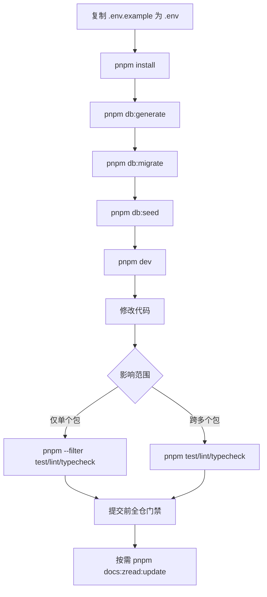

本页面向初次接触本仓库的开发者，梳理从环境准备、日常开发、质量验证到文档生成的完整命令集。仓库以 pnpm Workspace + Turborepo 组织多包，因此理解“根命令”与“单包命令”之间的分工是上手的关键。建议先对 `apps/` 与 `packages/` 的模块划分有基本印象，再回到本页按场景查找命令。

Sources: [package.json](package.json#L8-L43) [AGENTS.md](AGENTS.md#L13-L17) [README.md](README.md#L35-L52)

## 前置准备

开始使用前，请确认本地环境与配置文件就绪。本仓库使用 Node.js 24.x 与 pnpm 11.11.0（由 `packageManager` 锁定），并通过 `.env` 向各进程注入连接字符串、Runtime 选择及模型相关配置。最低准备步骤是：复制 `.env.example` 为 `.env`、安装依赖，并确保本地 PostgreSQL 15432 与 Redis 16379 已启动（Docker Compose 是可选路径，不是默认验证路径）。

Sources: [.nvmrc](.nvmrc#L1-L2) [package.json](package.json#L4-L7) [.env.example](.env.example#L1-L38) [README.md](README.md#L13-L24)

| 项目 | 要求 | 说明 |
|---|---|---|
| Node.js | `24.x` | `.nvmrc` 指定 24 |
| 包管理器 | `pnpm@11.11.0` | 由 `package.json#packageManager` 锁定，Corepack 会自动处理 |
| 环境文件 | `.env` | 从 `.env.example` 复制 |
| 本地数据库 | PostgreSQL `:15432`、Redis `:16379` | 避免与本机默认端口冲突 |

Sources: [.nvmrc](.nvmrc#L1-L2) [package.json](package.json#L4-L7) [.env.example](.env.example#L1-L38)

## 仓库结构速查

`apps/` 存放运行进程，`packages/` 存放可复用能力。下面这幅结构图可以帮助你快速定位某个模块对应的命令入口。

```mermaid
graph TD
  Root[agent-template monorepo]
  Root --> Apps[apps]
  Root --> Pkgs[packages]
  Apps --> Web[@agent-template/web]
  Apps --> API[@agent-template/api]
  Apps --> Worker[@agent-template/worker]
  Apps --> CLI[@agent-template/cli]
  Apps --> Toolbox[@agent-template/toolbox]
  Apps --> WebQA[@agent-template/web-qa]
  Pkgs --> DB[@agent-template/db]
  Pkgs --> Fixture[@agent-template/ecommerce-fixture]
  Pkgs --> Agent[@agent-template/agent]
  Pkgs --> AgentClaude[@agent-template/agent-claude]
  Pkgs --> AgentEve[@agent-template/agent-eve]
  Pkgs --> AgentClient[@agent-template/agent-client]
  Pkgs --> UI[@agent-template/ui]
  Pkgs --> Logger[@agent-template/logger]
  Pkgs --> Shared[@agent-template/shared]
  Pkgs --> ToolboxConfig[@agent-template/toolbox-config]
```

Sources: [pnpm-workspace.yaml](pnpm-workspace.yaml#L1-L3) [README.md](README.md#L54-L74)

### 模块与包名对照

| 本地路径 | npm 包名 | 主要命令场景 |
|---|---|---|
| `apps/web` | `@agent-template/web` | `dev`、`build`、`test` |
| `apps/api` | `@agent-template/api` | `dev`、`start`、`build` |
| `apps/worker` | `@agent-template/worker` | `dev`、`start`、`build` |
| `apps/cli` | `@agent-template/cli` | `dev`、`build`、`pack` |
| `apps/web-qa` | `@agent-template/web-qa` | `start`、`scenario`、`check` |
| `apps/toolbox` | 配置目录 | `toolbox:*` |
| `packages/db` | `@agent-template/db` | `db:generate`、`db:migrate`、`db:seed` |
| `packages/ecommerce-fixture` | `@agent-template/ecommerce-fixture` |  fixture 迁移与种子 |
| `packages/agent` | `@agent-template/agent` | 运行时选择器 |
| `packages/agent-claude` | `@agent-template/agent-claude` | Claude 适配 |
| `packages/agent-eve` | `@agent-template/agent-eve` | `eve:dev`、`eve:build`、`eve:start` |
| `packages/agent-client` | `@agent-template/agent-client` | CLI 与 Web 共用 HTTP/SSE 客户端 |
| `packages/ui` | `@agent-template/ui` | 共享 React 组件 |
| `packages/shared` | `@agent-template/shared` | 共享 Zod schema 与类型 |
| `packages/logger` | `@agent-template/logger` | 日志封装 |
| `packages/toolbox-config` | `@agent-template/toolbox-config` | Toolbox 配置与 schema |

Sources: [apps/web/package.json](apps/web/package.json#L1-L12) [apps/api/package.json](apps/api/package.json#L1-L12) [apps/worker/package.json](apps/worker/package.json#L1-L12) [apps/cli/package.json](apps/cli/package.json#L1-L19) [apps/web-qa/package.json](apps/web-qa/package.json#L1-L14) [packages/db/package.json](packages/db/package.json#L1-L17) [packages/ecommerce-fixture/package.json](packages/ecommerce-fixture/package.json#L1-L17) [packages/agent-eve/package.json](packages/agent-eve/package.json#L11-L19)

## 日常开发主流程

下图展示了一名开发者从 clone 仓库到提交代码的最常见路径。后续各节会展开每个分支的命令。



Sources: [README.md](README.md#L13-L21) [AGENTS.md](AGENTS.md#L13-L17)

## 根目录常用命令速查

仓库根目录维护了一套统一脚本，绝大多数开发任务都应从根目录调用。Turborepo 负责按依赖顺序调度各子任务，例如 `build` 会先等待被依赖的 `packages/*` 构建完成。

Sources: [package.json](package.json#L8-L43) [turbo.json](turbo.json#L1-L31)

### 初始化与依赖

| 命令 | 作用 |
|---|---|
| `cp .env.example .env` | 创建本地环境文件 |
| `corepack enable && corepack install` | 启用并安装指定版本 pnpm |
| `pnpm install` | 安装全部 workspace 依赖 |

Sources: [README.md](README.md#L13-L15) [package.json](package.json#L4-L5)

### 开发、构建与质量

| 命令 | 作用 |
|---|---|
| `pnpm dev` | 启动所有 `dev` 任务（Web、API、Worker 等），默认持续监听 |
| `pnpm build` | 全仓构建；Turborepo 按依赖拓扑执行 |
| `pnpm lint` | 全仓 ESLint 检查 |
| `pnpm typecheck` | 全仓 TypeScript 检查，并包含 `.zread` 脚本 |
| `pnpm test` | 全仓 Vitest 测试，并包含 `.zread` 脚本 |
| `pnpm format` | 使用 Prettier 格式化整个仓库 |

Sources: [package.json](package.json#L8-L43) [turbo.json](turbo.json#L1-L31)

### 数据库与数据验证

| 命令 | 作用 |
|---|---|
| `pnpm db:generate` | 为主库与 ecommerce-fixture 生成 Prisma Client |
| `pnpm db:migrate` | 开发环境下应用主库与 fixture 迁移 |
| `pnpm db:seed` | 执行主库与 fixture 种子 |
| `pnpm db:deploy` | 生产/CI 部署迁移 |
| `pnpm db:verify:boundaries` | 验证数据库边界 |
| `pnpm db:verify:fixture:empty` | 验证 fixture 空库状态 |
| `pnpm db:verify:migrations:empty` | 验证 migrations 空库状态 |

Sources: [package.json](package.json#L14-L25) [packages/db/package.json](packages/db/package.json#L9-L17) [packages/ecommerce-fixture/package.json](packages/ecommerce-fixture/package.json#L9-L17)

### Agent 运行时验证

| 命令 | 作用 |
|---|---|
| `pnpm agent-runs:verify:local` | 本地验证 Agent run 生命周期 |
| `pnpm agent-jobs:verify:local` | 验证 Agent job 重投递 |
| `pnpm agent-runtime:verify:local` | 验证所选 runtime 的就绪状态 |
| `pnpm agent-runtime:check:bundle` | 检查运行时 bundle 边界，未选择的 runtime 不会被初始化 |

Sources: [package.json](package.json#L25-L28) [AGENTS.md](AGENTS.md#L49-L52)

### Toolbox 与业务 Skills

| 命令 | 作用 |
|---|---|
| `pnpm toolbox:check` | 检查 Toolbox 语义层与生产配置 |
| `pnpm toolbox:generate:production` | 生成生产版 `tools.yaml` |
| `pnpm toolbox:check:production` | 校验生产配置是否与生成逻辑一致 |
| `pnpm toolbox:verify:local` | 本地验证 ecommerce toolbox |
| `pnpm toolbox:verify:docker` | 容器集成验证 |
| `pnpm skills:generate:toolbox` | 生成并同步业务 Skills |
| `pnpm skills:check:toolbox` | 校验 Skills 产物 |

Sources: [package.json](package.json#L32-L42) [apps/toolbox/AGENTS.md](apps/toolbox/AGENTS.md#L47-L51)

### 文档生成

| 命令 | 作用 |
|---|---|
| `pnpm docs:zread:test` | 运行 ZRead 生成脚本测试 |
| `pnpm docs:zread:typecheck` | ZRead 生成脚本类型检查 |
| `pnpm docs:zread:update` | 生成项目 Wiki，并校验产物与凭证安全 |

Sources: [package.json](package.json#L18-L20) [.zread/README.md](.zread/README.md#L32-L42)

## 单包开发

当改动只影响某个包或应用时，推荐使用 `pnpm --filter <package-name>` 在单包内运行命令，以减少反馈时间。例如 `pnpm --filter @agent-template/api test` 只会执行 API 的测试；跨模块改动再回退到全仓门禁。

Sources: [AGENTS.md](AGENTS.md#L13-L15) [apps/api/AGENTS.md](apps/api/AGENTS.md#L34-L42) [apps/web/AGENTS.md](apps/web/AGENTS.md#L32-L42)

## 数据库工作流

数据库操作分为开发、验证与生产部署三个环节。主库（`public` schema）与电商验证数据（`ecommerce_fixture` schema）各自有独立的 Prisma schema 与迁移脚本。

Sources: [packages/db/AGENTS.md](packages/db/AGENTS.md#L35-L50) [packages/db/package.json](packages/db/package.json#L9-L17) [packages/ecommerce-fixture/package.json](packages/ecommerce-fixture/package.json#L9-L17)

### 开发与本地初始化

1. `pnpm db:generate` — 为两个 schema 生成 Prisma Client。
2. `pnpm db:migrate` — 应用主库与 fixture 的开发迁移。
3. `pnpm db:seed` — 写入确定性种子数据。

Sources: [package.json](package.json#L14-L17) [README.md](README.md#L17-L19)

### 生产/CI 部署

使用 `pnpm db:deploy` 按顺序部署主库迁移与 fixture baseline。部署时不需要本地开发迁移的交互式提示。

Sources: [package.json](package.json#L16) [packages/db/AGENTS.md](packages/db/AGENTS.md#L49-L50)

### 验证与边界检查

修改 schema 或索引后，应运行 `pnpm db:verify:boundaries` 以及相关的 fixture 验证脚本。如果涉及 Toolbox 只读模型索引，还需执行 `pnpm toolbox:verify:plans`。

Sources: [package.json](package.json#L21-L24) [packages/db/AGENTS.md](packages/db/AGENTS.md#L16-L17) [packages/db/AGENTS.md](packages/db/AGENTS.md#L38-L40)

## Agent 运行时与本地验证

运行时由环境变量 `AGENT_RUNTIME=claude|eve` 选择，API 与 Worker 不会同时静态加载两套 runtime。开发时通常先确认环境变量已写入 `.env`，再运行对应验证脚本。

Sources: [.env.example](.env.example#L28-L36) [AGENTS.md](AGENTS.md#L49-L52)

### 关键本地验证脚本

- `pnpm agent-runs:verify:local`：先部署主库迁移，再端到端验证 Agent run 生命周期。
- `pnpm agent-jobs:verify:local`：验证 BullMQ job 的 redelivery 行为。
- `pnpm agent-runtime:verify:local`：检查所选 runtime（Claude 或 Eve）的健康状态。
- `pnpm agent-runtime:check:bundle`：构建 API 与 Worker 后检查未选择 runtime 是否被排除在启动 chunk 之外。

Sources: [package.json](package.json#L25-L28) [apps/api/AGENTS.md](apps/api/AGENTS.md#L34-L42)

## Toolbox 与业务 Skills

Toolbox 工具定义在 `apps/toolbox/tools.yaml`，由 root 脚本负责语义层校验、生产配置生成以及业务 Skill 生成。修改 Tool 或 Skill 后，应顺序执行校验与生成命令。

Sources: [apps/toolbox/AGENTS.md](apps/toolbox/AGENTS.md#L1-L22) [package.json](package.json#L32-L42)

```bash
# 本地校验
pnpm toolbox:check

# 生成并同步业务 Skills
pnpm skills:generate:toolbox
```

Sources: [apps/toolbox/AGENTS.md](apps/toolbox/AGENTS.md#L47-L51) [docs/agents/skills.md](docs/agents/skills.md#L5-L11)

## 项目 Wiki 生成

项目 Wiki 由 ZRead CLI 生成，产物位于 `.zread/wiki`，Web 的 `/docs` 直接消费这些产物。生成流程必须保证配置片段、LLM 凭证和生成内容都不泄露到仓库中。

Sources: [.zread/README.md](.zread/README.md#L1-L42) [AGENTS.md](AGENTS.md#L17-L18)

### 本地三步验证

1. `pnpm docs:zread:test` — 运行 ZRead 脚本测试。
2. `pnpm docs:zread:typecheck` — 类型检查 ZRead 脚本。
3. `pnpm docs:zread:update` — 在隔离 clone 中生成 Wiki，并校验边界、manifest 与凭证安全。

Sources: [package.json](package.json#L18-L20) [.zread/README.md](.zread/README.md#L32-L42)

### CI 流程

仓库的 GitHub Actions 提供了手动触发的 Wiki 更新工作流，它会运行 `pnpm docs:zread:update`，并将产物提交到一个待合并的 PR。

Sources: [.github/workflows/zread-update.yml](.github/workflows/zread-update.yml#L1-L48)

## Docker 工作流

Docker Compose 用于显式选择的容器启动，不是默认构建或回归路径。当需要完整验证服务间依赖时，可以运行 `docker compose up`。

Sources: [README.md](README.md#L23-L24) [Dockerfile](Dockerfile#L1-L26) [docker-compose.yml](docker-compose.yml#L1-L167)

### 容器构建要点

`Dockerfile` 会先复制各个 `package.json` 与锁文件安装依赖，再全量复制源码并执行 `pnpm db:generate && pnpm build`。`docker-compose.yml` 定义了 postgres、redis、toolbox、api、worker、eve-agent、web 七个服务，并统一映射了本地端口。

Sources: [Dockerfile](Dockerfile#L1-L26) [docker-compose.yml](docker-compose.yml#L32-L163)

### 本地服务端口

| 服务 | 容器名 | 本地端口 |
|---|---|---|
| Web | `web` | 13000 |
| API | `api` | 14000 |
| Eve Agent | `eve-agent` | 13010 |
| Toolbox | `toolbox` | 15000 |
| PostgreSQL | `postgres` | 15432 |
| Redis | `redis` | 16379 |

Sources: [docker-compose.yml](docker-compose.yml#L32-L163) [README.md](README.md#L25-L33)

## 质量门禁与提交建议

仓库强调“不破坏主线”和“可观测性”。提交前，建议按以下顺序执行：单包测试 → 全仓 `lint`/`typecheck`/`test` → 相关 verifier → 必要时的 Wiki 更新。每个有文件改动的任务完成后，应使用 `improve-codebase-architecture` 审查本次变更及直接影响模块。

Sources: [AGENTS.md](AGENTS.md#L19-L27) [AGENTS.md](AGENTS.md#L44-L48)

### 最小提交前检查清单

```bash
git status --short --branch
pnpm lint
pnpm typecheck
pnpm test
# 若有 Agent/DB/Toolbox 改动，补充对应 verify 脚本
```

涉及 Git 提交、提交信息或 changelog 时，应使用 `chinese-commit-conventions` Skill；AI 提交需包含 `Co-Authored-By` 信息。

Sources: [AGENTS.md](AGENTS.md#L54-L63) [CLAUDE.md](CLAUDE.md#L54-L63)

## 下一步阅读

如果你已经能按本页完成日常开发，建议继续阅读：

- 需要了解每个模块的职责与边界：[项目目录与模块职责](3-xiang-mu-mu-lu-yu-mo-kuai-zhi-ze)
- 需要一次完整的本地启动：[快速启动](2-kuai-su-qi-dong)
- 想了解 Agent 运行时的选择与差异：[Claude Agent Runtime 适配](9-claude-agent-runtime-gua-pei)、[Eve Agent Runtime 适配](10-eve-agent-runtime-gua-pei)
- 需要深入数据库模型与迁移：[数据库模型与持久化边界](12-shu-ju-ku-mo-xing-yu-chi-jiu-hua-bian-jie)
- 需要理解 Toolbox 与 MCP 工具供给：[Toolbox 与 MCP 工具供给](11-toolbox-yu-mcp-gong-ju-gong-gei)
- 需要查阅 Wiki 生成机制：[ZRead 项目 Wiki 生成](18-zread-xiang-mu-wiki-sheng-cheng)