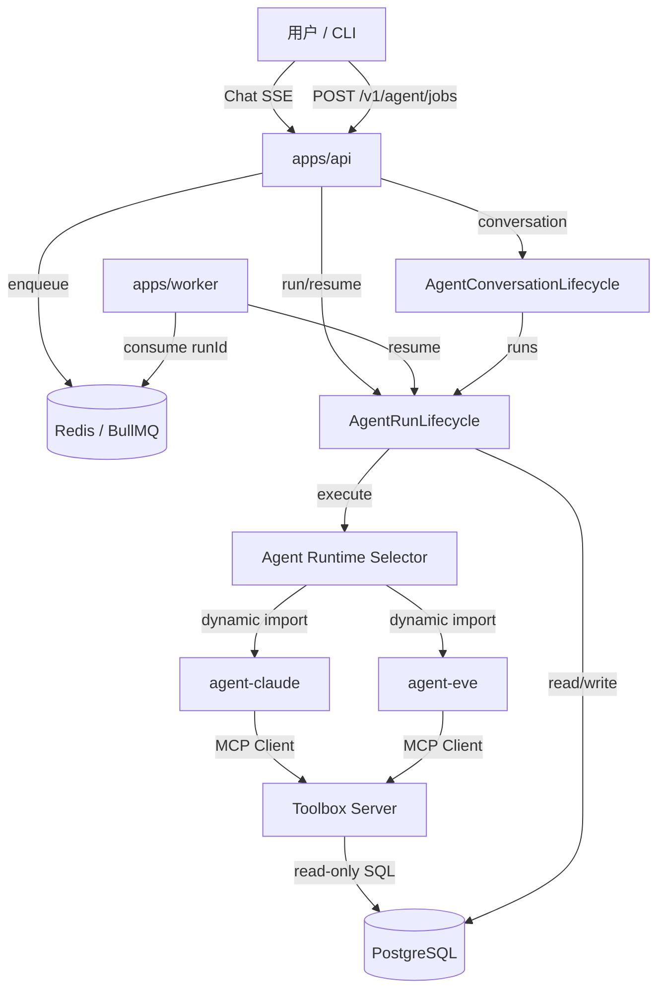
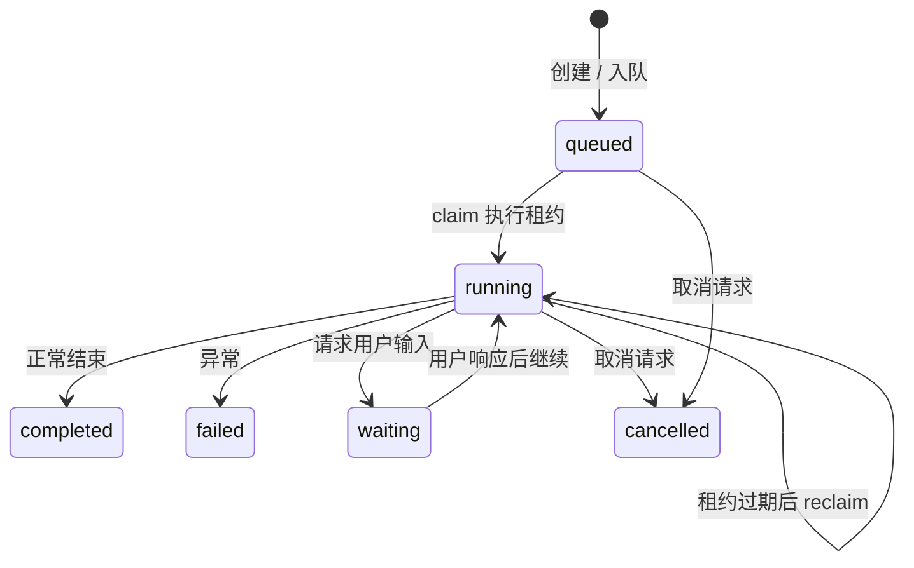

本文面向刚接触本项目的开发者，系统梳理 Agent 平台模板中的核心概念、领域术语以及它们之间的关系。理解这些词汇是阅读代码、参与开发和排查问题的前提；项目把这套词汇统一维护在 `CONTEXT.md` 中，所有代码、接口、测试和文档都应优先使用这些术语，避免同一事物出现多个名字。阅读完本文后，你可以继续查看 [Agent Run 生命周期与执行租约](8-agent-run-sheng-ming-zhou-qi-yu-zhi-xing-zu-yue)、[整体架构与进程边界](7-zheng-ti-jia-gou-yu-jin-cheng-bian-jie) 以及 [Toolbox 与 MCP 工具供给](11-toolbox-yu-mcp-gong-ju-gong-gei) 等页面，把概念映射到具体实现上。

Sources: [CONTEXT.md](CONTEXT.md#L1-L110)

## 为什么需要统一的领域语言

在 LLM Agent 平台里，一次用户请求会经过前端 Chat、HTTP API、任务队列、Worker、数据库和外部模型 Runtime 多个环节，每个环节都可能产生不同的叫法：有人叫它“任务”，有人叫它“job”，还有人叫它“run”。如果代码和文档各自用词，初学者很难判断它们是否指同一件事。因此项目用 `CONTEXT.md` 作为产品术语的唯一来源，明确定义“这是什么”“不要叫什么”，例如一个从 prompt 出发的执行单元叫 **Agent run**，而不是“任务”或“队列项”；一个排队等待执行的请求叫 **Agent job**，而不是“任务”或“队列项”。这种区分看起来细微，却直接决定了数据库表、API 路径、事件名和日志字段的设计。当你写 issue 标题、重构建议、测试名或诊断假设时，应优先使用 `CONTEXT.md` 里定义的术语；如果术语与已有架构决策记录（ADR）冲突，必须显式指出冲突而不是静默覆盖。

Sources: [CONTEXT.md](CONTEXT.md#L1-L28), [docs/agents/domain.md](docs/agents/domain.md#L1-L28)

## 核心概念全景

下图展示了平台中最重要的几个领域概念及其关系。用户通过 Chat SSE 或提交 Agent job 触发一次 Agent run；Agent run 由部署选中的 **Agent runtime**（如 Claude 或 Eve）执行；执行过程中 runtime 会使用 **MCP Client** 连接 **Toolbox server** 提供的工具；多轮对话由平台拥有的 **Agent conversation** 串联，而 runtime 私有的 continuation 状态只保存在服务端。

图中的关键边界是：API 和 Worker 都依赖公共包 `@agent-template/agent` 中的 lifecycle，而不是各自实现一套状态机；具体的 Claude 或 Eve runtime 只由环境变量 `AGENT_RUNTIME` 在运行时被选择，并动态加载成独立 chunk。

Sources: [packages/agent/AGENTS.md](packages/agent/AGENTS.md#L1-L40), [docs/adr/0011-deployment-selected-runtime-loading.md](docs/adr/0011-deployment-selected-runtime-loading.md#L1-L19)

## Agent Runtime 与 Runtime Adapter

**Agent runtime** 是 Agent 行为的可替换实现。本项目目前包含 Claude 和 Eve 两种 runtime，但一次部署只选择其中一种，通过环境变量 `AGENT_RUNTIME=claude|eve` 决定。不要把 runtime 称为“Agent type”或“Agent mode”，它不是 Agent 的类别，而是执行 Agent 的引擎。**Agent runtime adapter** 是某一具体 runtime 的执行与就绪适配器，比如 `@agent-template/agent-claude` 和 `@agent-template/agent-eve`。公共包 `@agent-template/agent` 持有运行时选择器，但只在需要执行或健康检查时通过动态 import 加载被选中的 adapter，因此启动 API 或 Worker 时不会初始化未被选中的 runtime 及其框架。`AgentRuntimeEnvSchema` 统一解析与 runtime 相关的环境变量，包括模型名、API key、Eve host、Toolbox 连接和能力 Profile。

Sources: [CONTEXT.md](CONTEXT.md#L15-L26), [packages/agent/src/index.ts](packages/agent/src/index.ts#L40-L62), [docs/adr/0011-deployment-selected-runtime-loading.md](docs/adr/0011-deployment-selected-runtime-loading.md#L7-L19)

## 配置状态与就绪状态

**Agent runtime readiness** 是一个“有界、非计费”的检查，用来确认当前部署选中的 runtime 能够接收工作并发现其必需能力。它与“环境变量是否已配置”是两个不同概念：配置状态（configured）只说明关键参数存在，而就绪状态（ready）还要验证 Claude 凭据或 Eve 服务是否可达。健康检查 `GET /health` 会分别显示 `configured` 和 `readiness`，readiness 失败会让 API 进入 `degraded`。注意 readiness 检查不会发送任何模型 prompt，因此不会产生计费；Claude 的 readiness 在启用时还会打开一个临时 MCP 连接验证 Toolbox 工具是否可被 discovery。

Sources: [CONTEXT.md](CONTEXT.md#L23-L26), [packages/agent/src/index.ts](packages/agent/src/index.ts#L106-L168), [docs/adr/0009-runtime-owned-readiness.md](docs/adr/0009-runtime-owned-readiness.md#L1-L19)

## Agent Run 与生命周期

**Agent run** 是从一个 prompt 开始、经过所选 Agent runtime 执行、直到产生最终结果的一次完整执行。它可以由 Chat SSE 直接启动，也可以由排队后的 Agent job 触发。一个 Agent run 有明确的状态机：`queued`（已入队）、`running`（执行中）、`waiting`（等待用户输入）、`completed`（完成）、`failed`（失败）、`skipped`（跳过，通常因未配置）和 `cancelled`（已取消）。`AgentRunStatusSchema` 在共享包中定义了这些状态，确保前后端、数据库、API 返回值使用同一套枚举。

Sources: [CONTEXT.md](CONTEXT.md#L27-L30), [packages/shared/src/agent-run.ts](packages/shared/src/agent-run.ts#L14-L22)

`AgentRunRecord`（Agent run record）是单次 Agent run 的持久化真相来源，记录状态、有序事件、最终结果和取消请求。`packages/agent` 中的 `createAgentRunLifecycle` 负责 create / claim / heartbeat / event / terminal / cancel 的完整状态机；API 和 Worker 共用同一个 lifecycle，通过实现 `AgentRunRepository` 接口的 Prisma adapter 把状态写入 PostgreSQL。不要把 SSE 连接状态或 BullMQ job 状态当成 Agent run 的权威状态。

Sources: [CONTEXT.md](CONTEXT.md#L43-L46), [packages/agent/src/lifecycle.ts](packages/agent/src/lifecycle.ts#L150-L158), [docs/adr/0008-durable-agent-run-lifecycle.md](docs/adr/0008-durable-agent-run-lifecycle.md#L1-L22)

## Agent Job 与任务入队

**Agent job** 是一个排队请求，它从 prompt 和时间戳开始，最终触发一次 Agent run。**Agent job intake** 是系统接受该请求并返回受理元数据的行为。在 `apps/api/src/agent-job-intake.ts` 中，intake 先调用 `AgentRunLifecycle.queue()` 创建一个 durable run record，然后把只包含 `runId` 的 payload 推入 BullMQ 队列 `agent-jobs`，任务名固定为 `agent.run`。如果入队失败，会立即把刚创建的 run 标记为失败，避免“记录存在但永远不会执行”的悬挂状态。Worker 消费到 job 后，只根据 payload 里的 `runId` 调用 `AgentRunLifecycle.resume(runId, env)`，不会重新创建 run record。

Sources: [CONTEXT.md](CONTEXT.md#L7-L14), [packages/shared/src/agent-job.ts](packages/shared/src/agent-job.ts#L1-L25), [apps/api/src/agent-job-intake.ts](apps/api/src/agent-job-intake.ts#L31-L62), [apps/worker/src/worker.ts](apps/worker/src/worker.ts#L1-L14)

## 执行租约与并发安全

**Agent run execution lease** 是一个有时间限制、可续期的执行权声明，防止 Worker 崩溃或网络分区导致 run 永久卡在 `running` 状态。每次 `queued -> running` 转换时，数据库会递增 `executionAttempt`、分配一个不透明 fencing token（即 `executionToken`），并记录 `heartbeatAt` 和 `leaseExpiresAt`。执行期间 Worker 会周期性调用 `heartbeat` 续租；如果租约过期，BullMQ 的重投可以在过期后 reclaim 该 run。所有事件写入和最终状态写入都以当前 fencing token 为条件，因此旧 executor 即使延迟返回，也无法覆盖新 attempt 的结果。默认租约时长为 60 秒，API 的队列 backoff 会从该时长派生并加上 grace period，避免在租约未到期时快速重试。

Sources: [CONTEXT.md](CONTEXT.md#L51-L54), [packages/agent/src/lifecycle.ts](packages/agent/src/lifecycle.ts#L148-L232), [packages/db/src/agent-run-repository.ts](packages/db/src/agent-run-repository.ts#L111-L150), [docs/adr/0013-fenced-agent-run-execution-leases.md](docs/adr/0013-fenced-agent-run-execution-leases.md#L1-L31)

## Agent Run Event 与消息

**Agent run event** 是 Agent run 执行过程中按顺序发出的 runtime 中性事件。`AgentRunEventSchema` 定义了多种 kind：`text`（文本增量）、`tool-call`（工具调用）、`tool-result`（工具结果）、`done`（完成提示）、`error`（错误）、`cancelled`（取消）、`input-request`（请求用户输入）、`artifacts`（产物）和 `unknown`（未知）。持久化事件会带上 `executionAttempt` 以区分不同执行尝试；生命周期类事件（如取消）的 `executionAttempt` 为 `null`。`Agent message part` 则是助手消息的一个有序片段，比如一段文本或一个折叠的工具事件。Chat SSE 向客户端发送的是裸 runtime 事件，而 `GET /agent/runs/:runId` 返回的是带 `sequence`、`executionAttempt` 和 `createdAt` 的持久化 envelope。

Sources: [CONTEXT.md](CONTEXT.md#L55-L62), [packages/shared/src/agent-run-events.ts](packages/shared/src/agent-run-events.ts#L38-L70), [packages/shared/src/agent-run.ts](packages/shared/src/agent-run.ts#L24-L29)

## Agent Conversation 与多轮对话

**Agent conversation** 是平台拥有的多轮对话，它保存一个有序的 Agent run 序列，独立于任何 runtime 私有的 session id。用户每次发送新消息都会在该 conversation 下创建一个新的 Agent run；平台把 conversation 的 continuation 状态交给当前选中的 runtime adapter，下一回合再由同一个 adapter 读取。`conversationId` 是公开标识符，而 `runtimeSessionId` 或 continuation token 只作为服务端私有状态存储，不会暴露给 API、CLI 或前端。一个 conversation 在创建时就被“钉”到当前部署选中的 runtime；如果后续切换 `AGENT_RUNTIME`，已有 conversation 仍可读，但在有迁移机制之前不能再发新消息。同时，一个 conversation 同一时刻只能有一个非终态 run，并发发送会返回冲突。

Sources: [CONTEXT.md](CONTEXT.md#L31-L42), [packages/agent/src/conversation.ts](packages/agent/src/conversation.ts#L21-L62), [packages/db/prisma/schema.prisma](packages/db/prisma/schema.prisma#L63-L74), [docs/adr/0014-platform-owned-agent-conversations.md](docs/adr/0014-platform-owned-agent-conversations.md#L1-L47)

## 工具供给与能力收窄

**Tool provider** 是向 Agent run 暴露工具的外部能力来源；**Toolbox server** 是基于 MCP Toolbox for Databases 的工具提供者。Claude 和 Eve 各自通过框架原生的 **MCP Client** 直连 Toolbox，不经过 API 代理，也不共享 client 生命周期。**Toolbox toolset** 是按业务任务分组的有名工具集合，例如 `ecommerce-sales-analytics` 用于销售趋势分析。**Agent capability profile** 是部署选中的、面向某个业务角色的工具子集，它只收窄模型“可见”的工具范围，并不替代 Toolbox 认证或数据库授权。`AGENT_CAPABILITY_PROFILE` 通过 `toolboxCapabilityProfiles` 映射成 `allowedTools`，最终传递给 Claude SDK 的 `allowedTools` 或 Eve 的 connection 配置。

Sources: [CONTEXT.md](CONTEXT.md#L83-L98), [packages/toolbox-config/src/index.ts](packages/toolbox-config/src/index.ts#L47-L95), [docs/adr/0007-agent-runtime-owned-mcp-clients.md](docs/adr/0007-agent-runtime-owned-mcp-clients.md#L1-L8)

## 业务语义与智能问数

**Business semantic catalog** 是版本化的业务术语映射，把业务指标、维度、值映射和受控查询路径显式化，避免把原始表结构暴露给模型。**Semantic query** 是从该目录中选取 metric、dimensions、filters 和 time window 的结构化分析请求，它不是“让模型任意写 SQL”。项目当前通过 `apps/toolbox/semantic/ecommerce.yaml` 维护合成电商业务的语义目录，并配有 `ecommerce-evaluation.yaml` golden cases。每个认证业务 Tool 必须对应一个 `queryContracts` 条目，生成门禁会验证它与指标、维度和 Tool 的引用关系。智能问数的生产路径是：自然语言问题 → 业务 Skill → 业务语义目录 → 认证 Toolbox Tool → PostgreSQL 只读查询 → 带指标/维度/时间窗说明的答案。

Sources: [CONTEXT.md](CONTEXT.md#L75-L82), [apps/toolbox/semantic/ecommerce.yaml](apps/toolbox/semantic/ecommerce.yaml#L1-L8), [docs/adr/0006-governed-intelligent-querying.md](docs/adr/0006-governed-intelligent-querying.md#L1-L34), [apps/toolbox/INTELLIGENT_QUERY.md](apps/toolbox/INTELLIGENT_QUERY.md#L1-L18)

## Ecommerce Fixture 与 Template Event

**Ecommerce fixture** 是隔离在 PostgreSQL `ecommerce_fixture` schema 中的确定性合成零售数据集，用于 Toolbox 功能验证，不含真实客户或交易数据，也不是平台持久化。**Ecommerce order** 是带有客户分群、渠道、支付、履约状态和订单行的合成订单。平台持久化的是 `public` schema 下的 `TemplateEvent`，用来记录 Agent 平台活动样本，可用于 demo、本地验证和 Toolbox 检查。两者在数据库中严格分离：平台运行数据在 `public`，合成业务数据在 `ecommerce_fixture`，SQL 中显式限定 schema，不依赖 session `search_path`。

Sources: [CONTEXT.md](CONTEXT.md#L63-L74), [packages/db/prisma/schema.prisma](packages/db/prisma/schema.prisma#L11-L20), [apps/toolbox/SEMANTIC_LAYER.md](apps/toolbox/SEMANTIC_LAYER.md#L17-L30)

## 常用术语速查

| 术语 | 含义 | 不要把这叫成 |
| --- | --- | --- |
| Agent run | 从一个 prompt 开始的一次完整执行 | 任务、job result |
| Agent job | 排队启动 Agent run 的请求 | 队列项、任务 |
| Agent runtime | Agent 行为的可替换实现（Claude/Eve） | Agent type、Agent mode |
| Agent runtime adapter | 具体 runtime 的执行与就绪适配器 | runtime mode branch |
| Agent runtime readiness | 有界、非计费的就绪检查 | model ping、configured flag |
| Agent conversation | 平台拥有的多轮对话序列 | runtime session |
| Agent runtime continuation | 服务端私有的续聊状态 | conversation ID |
| Agent run execution lease | 有时间限制的执行权与 fencing token | BullMQ lock、worker heartbeat |
| Agent run event | runtime 中性的有序执行事件 | UI timeline item、log line |
| Agent capability profile | 部署选中的模型可见工具子集 | user-selected mode、授权策略 |
| Business semantic catalog | 业务术语到认证 Tool 的映射 | prompt glossary、表字典 |
| Semantic query | 从目录选取指标/维度的结构化请求 | raw SQL、NL2SQL |

Sources: [CONTEXT.md](CONTEXT.md#L1-L110)

## 下一步读什么

概念是骨架，实现是血肉。建议按以下顺序继续阅读：

1. 想理解运行状态如何转换、租约如何保护并发，阅读 [Agent Run 生命周期与执行租约](8-agent-run-sheng-ming-zhou-qi-yu-zhi-xing-zu-yue)。
2. 想看 API、Worker、Web、CLI 如何分工，阅读 [整体架构与进程边界](7-zheng-ti-jia-gou-yu-jin-cheng-bian-jie)。
3. 想了解 Claude 或 Eve 如何接入 Toolbox，分别阅读 [Claude Agent Runtime 适配](9-claude-agent-runtime-gua-pei) 和 [Eve Agent Runtime 适配](10-eve-agent-runtime-gua-pei)。
4. 想了解工具配置、Profile 和语义目录，阅读 [Toolbox 与 MCP 工具供给](11-toolbox-yu-mcp-gong-ju-gong-gei)。
5. 想从数据库表和持久化边界印证本文，阅读 [数据库模型与持久化边界](12-shu-ju-ku-mo-xing-yu-chi-jiu-hua-bian-jie)。