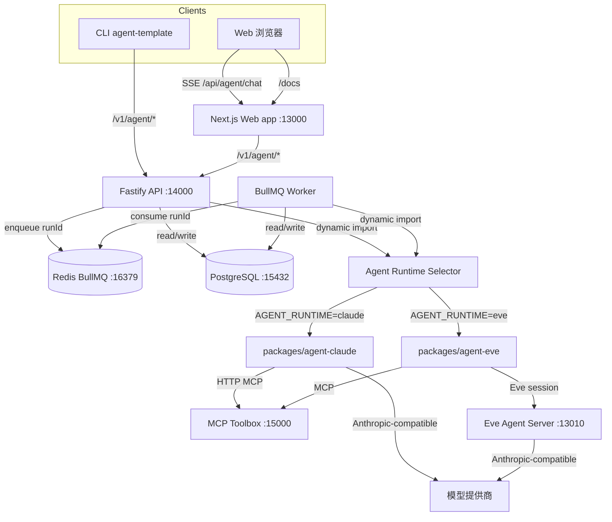

本页从宏观到边界说明项目的整体架构：它是一个基于 pnpm Workspace + Turborepo 的 TypeScript monorepo，部署时拆分为多个可独立扩缩的进程，每个进程有明确的代码边界、状态边界与通信边界。理解这些边界有助于判断新功能应该放在哪个进程、哪种包里，以及它们之间如何协作。

Sources: [README.md](README.md#L1-L147) [AGENTS.md](AGENTS.md#L1-L63)

## 架构全景

上图展示了整个系统的进程交互。Web 浏览器通过 Next.js 的 Route Handler 访问 Fastify API；CLI 直接使用共享的 `agent-client` 访问版本化 API；API 负责任务入队和实时 SSE 聊天，Worker 负责从 BullMQ 消费并执行实际 Agent 计算；Agent Runtime 选择器根据环境变量动态加载 Claude 或 Eve 实现；两者都通过 MCP 访问 Toolbox，通过 Anthropic-compatible 协议访问模型。

Sources: [docker-compose.yml](docker-compose.yml#L1-L167) [packages/agent/src/index.ts](packages/agent/src/index.ts#L1-L321) [apps/api/src/app.ts](apps/api/src/app.ts#L1-L85)

## 进程与部署边界

下面的表格列出了生产环境中实际运行的进程及其边界。每个进程在 `docker-compose.yml` 中都有独立服务定义，除了 `worker` 不暴露端口，其余均通过端口或队列对外提供服务。

| 进程 | 代码入口 | 默认端口 | 主要职责 | 关键边界 |
|------|----------|----------|----------|----------|
| Web | `apps/web/src` | 13000 | Next.js 前端、Chat UI、项目 Wiki 渲染 | 不直接连接数据库/Redis，只调用 API |
| API | `apps/api/src/server.ts` | 14000 | Fastify HTTP 服务、SSE、任务入队、健康检查 | 不执行耗时任务，只把 `runId` 入队 |
| Worker | `apps/worker/src/worker.ts` | 无 | BullMQ Worker，执行 Agent run | 与 API 共享数据库，通过 Redis 接收任务 |
| Eve Agent | `packages/agent-eve/agent/` | 13010 | Eve 框架的运行时服务进程 | 由 API/Worker 通过 HTTP 调用，绑定本地 |
| Toolbox | `apps/toolbox/tools.yaml` | 15000 | MCP Toolbox for Databases | 只暴露预定义 SQL Tool，只读 |
| PostgreSQL | 外部镜像 | 15432 | 持久化 Agent run、conversation、事件 | 平台表在 `public`，fixture 在独立 schema |
| Redis | 外部镜像 | 16379 | BullMQ 任务队列与运行期缓存 | 不作为 Agent run 状态权威来源 |

Docker Compose 使用 `depends_on` 保证启动顺序：API 和 Worker 等待 PostgreSQL、Redis、Toolbox 和 Eve Agent 健康后再启动；Web 等待 API 健康后再启动。生产镜像使用同一个 Dockerfile 构建，再通过 `command` 选择不同入口，因此各进程共享构建产物但运行时隔离。

Sources: [docker-compose.yml](docker-compose.yml#L1-L167) [Dockerfile](Dockerfile#L1-L26) [README.md](README.md#L1-L147)

## Monorepo 分层

仓库的代码边界由 `apps/` 和 `packages/` 的目录约定决定。`apps/` 只放运行进程，不包含可复用业务逻辑；`packages/` 放跨进程共享的 schema、类型、适配器和公共领域逻辑。Turborepo 的 `turbo.json` 定义了任务依赖：`build` 依赖上游 `^build`，`test`/`typecheck`/`lint` 也依赖上游同类任务，确保修改一处时按依赖顺序验证。

| 类型 | 代表目录 | 说明 |
|------|----------|------|
| 前端应用 | `apps/web` | Next.js + React + Tailwind，依赖 `agent-client` 和 `ui` |
| 后端应用 | `apps/api`, `apps/worker` | Fastify 和 BullMQ Worker，依赖 `agent`、`db`、`logger` |
| 命令行应用 | `apps/cli` | 使用 `incur` 构建，只依赖 `agent-client`，可发布到私有 registry |
| 工具配置 | `apps/toolbox` | `tools.yaml` 是 Toolbox 的事实源，不是运行代码 |
| 共享运行时 | `packages/agent` | 公共 Agent Runtime 选择器、Agent run lifecycle、conversation lifecycle |
| 具体运行时 | `packages/agent-claude`, `packages/agent-eve` | Claude Agent SDK / Eve 的实现，被 `agent` 动态加载 |
| 共享基础设施 | `packages/shared`, `packages/db`, `packages/logger`, `packages/ui`, `packages/toolbox-config` | schema、Prisma、日志、UI 组件、Toolbox 配置 |

pnpm workspace 的 `pnpm-workspace.yaml` 用 `apps/*` 和 `packages/*` 通配，这意味着新增一个进程或共享包只需放到对应目录即可被 workspace 识别。

Sources: [pnpm-workspace.yaml](pnpm-workspace.yaml#L1-L16) [turbo.json](turbo.json#L1-L32) [apps/api/package.json](apps/api/package.json#L1-L32) [apps/worker/package.json](apps/worker/package.json#L1-L26) [apps/web/package.json](apps/web/package.json#L1-L33) [apps/cli/package.json](apps/cli/package.json#L1-L38)

## 运行时选择与加载边界

`AGENT_RUNTIME=claude|eve` 是唯一的运行时选择开关。`packages/agent` 负责解析环境变量，并**动态导入**具体运行时包：当环境为 `claude` 时调用 `import("@agent-template/agent-claude")`，为 `eve` 时调用 `import("@agent-template/agent-eve")`。API 和 Worker 只依赖 `@agent-template/agent`，不直接 import 具体运行时，因此启动时不会初始化未选中的运行时及其框架。

Sources: [packages/agent/src/index.ts](packages/agent/src/index.ts#L100-L225) [docs/adr/0011-deployment-selected-runtime-loading.md](docs/adr/0011-deployment-selected-runtime-loading.md#L1-L19)

构建门禁进一步保证这一边界。`apps/api` 和 `apps/worker` 的 `tsup.config.ts` 将 `@agent-template/*` 包全部内联，同时通过动态导入把 Claude 和 Eve 拆成独立 chunk。`scripts/check-runtime-bundle-boundary.ts` 会验证：API 和 Worker 入口不包含运行时实现文本，且必须分别存在独立的 Claude 和 Eve chunk，并通过 `import("./chunk-xxx.js")` 加载。

Sources: [apps/api/tsup.config.ts](apps/api/tsup.config.ts#L1-L19) [apps/worker/tsup.config.ts](apps/worker/tsup.config.ts#L1-L10) [scripts/check-runtime-bundle-boundary.ts](scripts/check-runtime-bundle-boundary.ts#L1-L44)

## 状态所有权与持久化边界

Agent run 的完整状态由 PostgreSQL 持有，包括状态、有序事件、终止结果、取消请求、执行租约和执行尝试次数。Redis 和 BullMQ 只负责**投递** `runId`，SSE 连接只负责**推送**事件流，它们都不是权威状态。API 和 Worker 在启动时各自创建同样的 `AgentRunLifecycle`，并注入 `PrismaAgentRunRepository`，因此两者都能安全地读写持久化状态。

Sources: [docs/adr/0008-durable-agent-run-lifecycle.md](docs/adr/0008-durable-agent-run-lifecycle.md#L1-L22) [packages/db/src/index.ts](packages/db/src/index.ts#L1-L21) [apps/api/src/app.ts](apps/api/src/app.ts#L42-L58) [apps/worker/src/worker.ts](apps/worker/src/worker.ts#L1-L15)

执行租约是进程边界的重要保护机制。每次 `queued -> running` 转换都会通过 `UPDATE ... WHERE` 在数据库中原子地获取一个带 fencing token 的租约；Worker 在执行期间定时发送 heartbeat，并检查是否被取消；如果租约到期或 token 失效，旧执行进程会被拒绝写入事件或终止状态。这防止了 Worker 崩溃、重启或重复投递导致的状态混乱。

Sources: [docs/adr/0013-fenced-agent-run-execution-leases.md](docs/adr/0013-fenced-agent-run-execution-leases.md#L1-L31) [packages/agent/src/lifecycle.ts](packages/agent/src/lifecycle.ts#L560-L594) [packages/db/src/agent-run-repository.ts](packages/db/src/agent-run-repository.ts#L111-L156)

## 通信模式与协议边界

系统在不同边界使用不同的通信机制，下表对比了它们的用途和约束：

| 通信机制 | 使用场景 | 边界说明 |
|----------|----------|----------|
| HTTP + SSE | Web 与 API 的实时 Chat、CLI 与 API 的流式接口 | API 通过 `PassThrough` 流推送事件，连接关闭不丢失状态 |
| BullMQ | API 入队，Worker 消费 | 队列只传 `runId`，不携带 prompt 或执行上下文 |
| Anthropic-compatible HTTP | Claude SDK / Eve 访问模型 | 由运行时包各自维护，API 不直接调用 |
| MCP over HTTP | Claude 和 Eve 访问 Toolbox | 每个运行时持有自己的 MCP Client，不共享 Host |
| Eve 私有协议 | API/Worker 与 Eve Agent Server | Eve 运行时通过 HTTP 会话来驱动，服务 Token 控制访问 |

API 的 `agent-api-v1.ts` 定义了版本化路由 `/v1/agent/*`，包括会话、run 流、run 列表、任务入队等；旧版 `/agent/*` 在非生产环境默认开启，可通过 `AGENT_LEGACY_ROUTES_ENABLED` 显式启用。`agent-client` 和 Web 的 `agent-client.ts` 分别封装了这些协议，确保客户端不直接解析 SSE 细节。

Sources: [apps/api/src/agent-api-v1.ts](apps/api/src/agent-api-v1.ts#L1-L200) [apps/api/src/agent-job-intake.ts](apps/api/src/agent-job-intake.ts#L1-L63) [apps/worker/src/process.ts](apps/worker/src/process.ts#L1-L91) [packages/agent-client/src/index.ts](packages/agent-client/src/index.ts#L1-L200) [apps/web/src/lib/agent-client.ts](apps/web/src/lib/agent-client.ts#L1-L200) [apps/web/app/api/agent/chat/route.ts](apps/web/app/api/agent/chat/route.ts#L1-L119)

## 安全与授权边界

进程之间的访问控制由三类 Token 组成：

- `AGENT_API_TOKEN`：保护 Fastify `/v1/agent/*` 路由，生产环境强制要求。CLI 和 Web Route Handler 通过 `Authorization: Bearer` 携带。
- `EVE_AGENT_SERVICE_TOKEN`：保护 Eve Agent Server 的服务间通道，生产部署必须配置；本地开发未配置时允许 loopback。
- `TOOLBOX_AUTH_TOKEN` / `TOOLBOX_URL`：Claude 和 Eve 各自的 MCP Client 连接 Toolbox 时使用，Toolbox 生产认证通过 OIDC 与 Tool scope 强制。

`AGENT_CAPABILITY_PROFILE` 只收窄模型可见的 Tool 列表，不替代授权。真正的生产边界由 Toolbox OIDC、数据库角色和权限控制。Eve Agent 的 `channels/eve.ts` 通过 `x-agent-template-eve-token` 校验服务 Token，而 `localDev()` 仅在非生产环境未配置 Token 时开放。

Sources: [apps/api/src/agent-api-v1.ts](apps/api/src/agent-api-v1.ts#L299-L315) [packages/agent-eve/agent/channels/eve.ts](packages/agent-eve/agent/channels/eve.ts#L1-L47) [apps/toolbox/README.md](apps/toolbox/README.md#L1-L176) [README.md](README.md#L1-L147)

## 健康检查与进程生命周期

`GET /health` 是 API 的入口健康检查，由 `apps/api/src/health.ts` 实现。它分别检查 PostgreSQL、Redis、所选 Agent runtime 的就绪状态，并返回 `ok` 或 `degraded`。当外部检查关闭（如测试）时返回 `skipped`。Agent runtime readiness 由 `packages/agent` 的 selector 委派：Claude 检查凭据和 Toolbox MCP 工具列表，Eve 调用 `Client.health()`，API 本身不实现协议细节。

Sources: [apps/api/src/health.ts](apps/api/src/health.ts#L1-L163) [docs/adr/0009-runtime-owned-readiness.md](docs/adr/0009-runtime-owned-readiness.md#L1-L19) [packages/agent/src/index.ts](packages/agent/src/index.ts#L127-L168)

Docker Compose 为每个服务配置了 `healthcheck` 和 `depends_on`：API 和 Worker 等待 PostgreSQL、Redis、Toolbox 和 Eve Agent 健康；Web 等待 API 健康。`restart: unless-stopped` 保证进程在异常退出后自动重启，而 Worker 的 `SIGTERM` 处理器会优雅关闭 BullMQ Worker。

Sources: [docker-compose.yml](docker-compose.yml#L1-L167) [apps/worker/src/process.ts](apps/worker/src/process.ts#L83-L91)

## 下一步阅读

整体架构是后续深入理解的基础。如果你希望跟踪一次 Agent 请求从入队到结束的完整流程，可以阅读 [Agent Run 生命周期与执行租约](8-agent-run-sheng-ming-zhou-qi-yu-zhi-xing-zu-yue)；如果关心 Claude 或 Eve 如何被加载和适配，请分别阅读 [Claude Agent Runtime 适配](9-claude-agent-runtime-gua-pei) 和 [Eve Agent Runtime 适配](10-eve-agent-runtime-gua-pei)；Toolbox 的 MCP 工具供给机制在 [Toolbox 与 MCP 工具供给](11-toolbox-yu-mcp-gong-ju-gong-gei) 中详细说明。