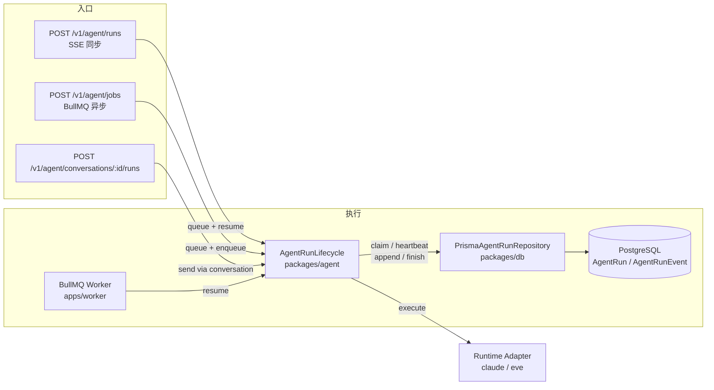
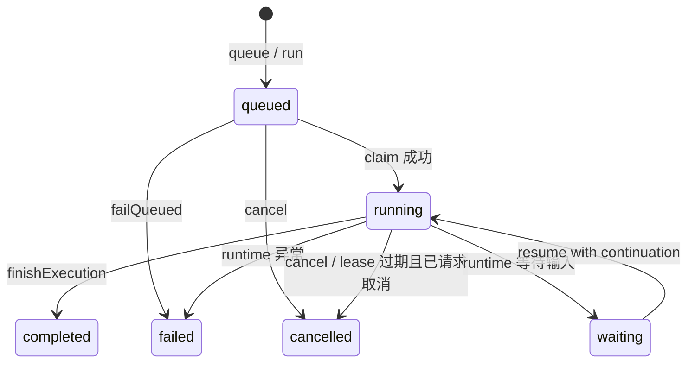
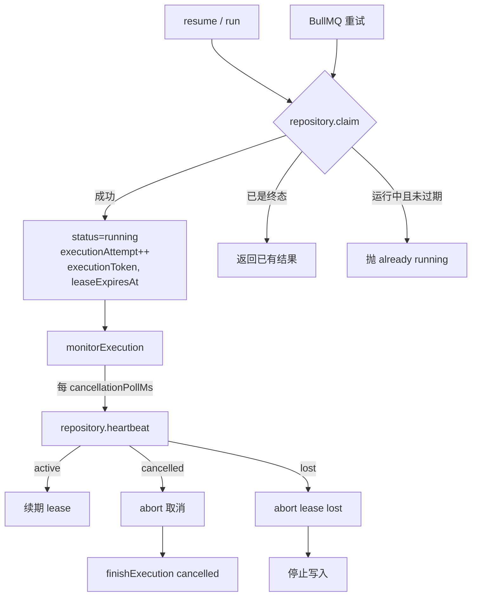

本文档聚焦 `packages/agent` 中的 **AgentRunLifecycle**、持久化仓库 `packages/db` 中的 Prisma 实现，以及 `apps/api` 与 `apps/worker` 如何通过同一生命周期接口协调同步 SSE 与异步任务队列两种执行模式。核心设计准则是：**PostgreSQL 是 Agent Run 状态、事件顺序与终态的唯一权威来源；BullMQ 只负责投递 `runId`，Redis 不持有运行状态**。执行租约通过数据库级别的 fencing token、心跳续期与 `clock_timestamp()` 过期判定，保证崩溃、取消或重复投递不会导致旧执行器覆盖新执行器的状态。

Sources: [0008-durable-agent-run-lifecycle.md](docs/adr/0008-durable-agent-run-lifecycle.md#L1-L22), [0013-fenced-agent-run-execution-leases.md](docs/adr/0013-fenced-agent-run-execution-leases.md#L1-L31)

## 核心概念与数据模型

一个 **Agent Run** 由 `AgentRun` 表记录，由 `AgentRunEvent` 表按 `sequence` 顺序保存运行时产生的事件。状态机包含 `queued`、`running`、`waiting`、`completed`、`failed`、`skipped`、`cancelled` 七种状态；持久化事件除了 `event` 本体，还记录 `sequence`、`executionAttempt`（执行尝试次，生命周期事件为 `null`）与 `createdAt`。运行租约字段包括 `executionToken`、`executionAttempt`、`leaseExpiresAt` 和 `heartbeatAt`，其中 `executionToken` 不会暴露给外部客户端。

Sources: [schema.prisma](packages/db/prisma/schema.prisma#L22-L61), [schema.prisma](packages/db/prisma/schema.prisma#L76-L89), [agent-run.ts](packages/shared/src/agent-run.ts#L14-L28), [lifecycle.ts](packages/agent/src/lifecycle.ts#L21-L50)

Sources: [worker.ts](apps/worker/src/worker.ts#L6-L13), [agent-api-v1.ts](apps/api/src/agent-api-v1.ts#L123-L133), [agent-job-intake.ts](apps/api/src/agent-job-intake.ts#L31-L62)

## 生命周期接口与状态流转

`createAgentRunLifecycle` 接收 `repository`、`execute` 回调以及可选的 `leaseDurationMs`（默认 60 秒）和 `cancellationPollMs`（默认 250 毫秒），对外暴露 `queue`、`run`、`resume`、`get`、`list`、`cancel`、`failQueued` 七个方法。`run` 等价于先 `queue` 再 `resume`；`resume` 是执行核心：尝试 claim 租约、启动心跳监控、执行 runtime、写入事件、完成终态。如果目标 run 已经是非终态，`resume` 会抛出“already running/queued”；如果 claim 时 run 已经是终态，则直接返回当前结果。

Sources: [lifecycle.ts](packages/agent/src/lifecycle.ts#L115-L156), [lifecycle.ts](packages/agent/src/lifecycle.ts#L179-L218)

Sources: [lifecycle.ts](packages/agent/src/lifecycle.ts#L381-L390), [lifecycle.ts](packages/agent/src/lifecycle.ts#L270-L378), [agent-run-repository.ts](packages/db/src/agent-run-repository.ts#L294-L326)

## 执行租约：claim、heartbeat 与 fencing

执行租约是生命周期正确性的核心。`claim` 分两步原子执行：

1. 若记录为 `running`、已请求取消且租约已过期，则先将其终态为 `cancelled`；
2. 若记录为 `queued` 或 `running` 且租约已过期、且未请求取消，则将其更新为 `running`，`executionAttempt` 加 1，生成新的 `executionToken`，并设置 `leaseExpiresAt = clock_timestamp() + leaseDurationMs`。

`heartbeat` 仅在当前 token 有效、`status = running`、未请求取消且租约未过期时才会续期；否则返回 `cancelled` 或 `lost`。所有事件写入与终态写入都带 token 条件：`appendExecutionEvent` 只接受当前 token 且 `leaseExpiresAt > clock_timestamp()`；`finishExecution` 同样以 token 与租约为前提。这意味着旧执行器即使延迟返回，也无法覆盖新执行器的记录。

Sources: [agent-run-repository.ts](packages/db/src/agent-run-repository.ts#L111-L157), [agent-run-repository.ts](packages/db/src/agent-run-repository.ts#L158-L188), [agent-run-repository.ts](packages/db/src/agent-run-repository.ts#L189-L217), [agent-run-repository.ts](packages/db/src/agent-run-repository.ts#L244-L293)

Sources: [lifecycle.ts](packages/agent/src/lifecycle.ts#L560-L605), [lifecycle.ts](packages/agent/src/lifecycle.ts#L439-L523)

## 事件写入、合并与背压保护

运行时通过 `onEvent` 回调产生事件，生命周期在两条路径上维护事件：

- 内存中的 `emittedEvents` 使用 `appendCompactedAgentRunEvent` 合并相邻的 `text` 快照，保证终态结果不会随流式输出长度平方增长；
- 持久化写入由 `createExecutionEventWriter` 管理，内部是串行 drain、同样合并相邻 `text` 事件、采用 O(1) 的 pending 队列，当待写事件超过 `maxPendingAgentRunEvents = 1000` 时直接失败当前 run。

这一机制对应 [ADR 0016](docs/adr/0016-bound-agent-stream-memory-and-local-build-load.md) 的内存边界决策：持久化结果只保留连续文本快照的最新一个，浏览器事件历史另有 500 条上限。

Sources: [lifecycle.ts](packages/agent/src/lifecycle.ts#L233-L258), [lifecycle.ts](packages/agent/src/lifecycle.ts#L439-L523), [agent-run-events.ts](packages/shared/src/agent-run-events.ts#L71-L81), [ADR 0016](docs/adr/0016-bound-agent-stream-memory-and-local-build-load.md#L18-L37)

## 取消机制

取消分两种场景：

- ** queued 阶段取消**：`requestCancellation` 直接把状态改为 `cancelled`，并写入 `reason = "Agent run was cancelled before execution"`；后续 `resume` 发现已是终态，直接返回，不会调用 `execute`。
- ** running 阶段取消**：`requestCancellation` 仅设置 `cancelRequestedAt`；执行器通过 `monitorExecution` 的 `heartbeat` 轮询感知 `cancelled` 状态，随后通过 `AbortController` 通知 runtime，并在 `finishCancelled` 中写入 `cancelled` 事件与终态。

如果执行器崩溃导致租约过期且已请求取消，`claim` 会在重试时直接将其终态为 `cancelled`，而不是重新执行。

Sources: [lifecycle.ts](packages/agent/src/lifecycle.ts#L404-L426), [agent-run-repository.ts](packages/db/src/agent-run-repository.ts#L307-L326), [lifecycle.ts](packages/agent/src/lifecycle.ts#L350-L378)

## API 与 Worker 的集成方式

| 入口 | 调用方式 | 关键行为 |
|------|----------|----------|
| `POST /v1/agent/runs` | SSE 同步 | `queue` 后立刻 `resume`，通过 `onEvent` 向 SSE 流写 `event` 帧，终态写 `terminal` 帧 |
| `POST /v1/agent/jobs` | BullMQ 异步 | `queue` 后调用 `createAgentQueue.add`，`jobId = runId`，失败时调用 `failQueued` |
| `GET /v1/agent/runs/:runId/events?follow=true` | SSE 长轮询 | 每 250ms 从 DB 读取事件，追赶后推送新事件 |
| `DELETE /v1/agent/runs/:runId` | 取消 | 调用 `lifecycle.cancel` |

`createAgentJobRetryPolicy` 将 BullMQ 的固定重试间隔与数据库租约对齐：默认 `delay = leaseDurationMs + 5_000` 毫秒，尝试 3 次。这样即使 Worker 崩溃，BullMQ 也不会在上一次租约仍然有效时反复重试，避免旧执行器尚未过期就产生并发执行。

Sources: [agent-api-v1.ts](apps/api/src/agent-api-v1.ts#L123-L192), [agent-job-intake.ts](apps/api/src/agent-job-intake.ts#L31-L62), [queue.ts](apps/api/src/queue.ts#L17-L49), [process.ts](apps/worker/src/process.ts#L42-L55)

## 本地验证与测试覆盖

项目提供了两类验证脚本：

- `scripts/verify-agent-run-lifecycle.ts` 直接操作 `createAgentRunLifecycle` 与 `createPrismaAgentRunRepository`，覆盖：持久化 `queued -> completed`、queued 取消、过期租约回收、旧执行器事件/终态被拒绝、事件 `executionAttempt` 来源、崩溃后取消的最终化。
- `scripts/verify-agent-job-redelivery.ts` 使用真实 BullMQ，验证重试间隔至少为 `leaseDurationMs + graceMs`，证明队列层面的重试与租约对齐。

单元测试 `packages/agent/src/lifecycle.test.ts` 包含内存仓库实现，模拟了租约过期、竞争 claim、背压合并等边界。

Sources: [verify-agent-run-lifecycle.ts](scripts/verify-agent-run-lifecycle.ts#L7-L164), [verify-agent-job-redelivery.ts](scripts/verify-agent-job-redelivery.ts#L11-L35), [lifecycle.test.ts](packages/agent/src/lifecycle.test.ts#L9-L65), [lifecycle.test.ts](packages/agent/src/lifecycle.test.ts#L214-L335)

## 关键参数与默认配置

| 参数 | 默认值 | 位置 | 说明 |
|------|--------|------|------|
| `leaseDurationMs` | 60 000 ms | `lifecycle.ts` | 单次执行租约时长 |
| `cancellationPollMs` | 250 ms | `lifecycle.ts` | 心跳/取消检测间隔 |
| `maxPendingAgentRunEvents` | 1000 | `lifecycle.ts` | 持久化事件队列上限，超过则失败 |
| BullMQ 重试间隔 | 65 000 ms | `queue.ts` | `leaseDurationMs + 5_000` |
| BullMQ 重试次数 | 3 | `queue.ts` | — |
| SSE 单帧上限 | 16 MiB | `agent-run.ts` | 防止未终止帧导致内存泄漏 |

Sources: [lifecycle.ts](packages/agent/src/lifecycle.ts#L148-L156), [lifecycle.ts](packages/agent/src/lifecycle.ts#L28-L29), [queue.ts](apps/api/src/queue.ts#L38-L49), [agent-run.ts](packages/shared/src/agent-run.ts#L7)

## 常见边界与错误行为

- **重复 resume**：若 run 处于 `running` 或 `queued` 且租约未过期，`resume` 会抛出“already running/queued”。
- **Lease Lost**：`heartbeat` 返回 `lost` 或事件写入失败时，生命周期会抛出 `AgentRunExecutionLeaseLostError`，执行器立即中止，不会继续写事件。
- **Stale executor**：旧执行器用失效 token 调用 `appendExecutionEvent` 返回 `false`，`finishExecution` 返回 `undefined`，数据库状态不会被覆盖。
- **取消前执行**：`queued` 状态下直接取消不会进入 `execute`；`running` 取消通过 `AbortController` 协作式终止。
- **入队失败**：若 BullMQ 连接异常，`agent-job-intake` 会调用 `failQueued` 将 run 标记为失败。

Sources: [lifecycle.ts](packages/agent/src/lifecycle.ts#L197-L218), [lifecycle.ts](packages/agent/src/lifecycle.ts#L305-L344), [agent-run-repository.ts](packages/db/src/agent-run-repository.ts#L120-L156), [agent-job-intake.ts](apps/api/src/agent-job-intake.ts#L53-L58)

## 延伸阅读

- 想了解 Claude 与 Eve 运行时如何与生命周期交互，可继续阅读 [Claude Agent Runtime 适配](9-claude-agent-runtime-gua-pei) 与 [Eve Agent Runtime 适配](10-eve-agent-runtime-gua-pei)。
- API 路由、SSE 协议与 BullMQ 队列细节见 [API 路由、SSE 与任务队列](13-api-lu-you-sse-yu-ren-wu-dui-lie)。
- 数据库模型、Prisma schema 与仓库边界见 [数据库模型与持久化边界](12-shu-ju-ku-mo-xing-yu-chi-jiu-hua-bian-jie)。
- 架构决策背景可查阅 [架构决策记录（ADR）](19-jia-gou-jue-ce-ji-lu-adr)。