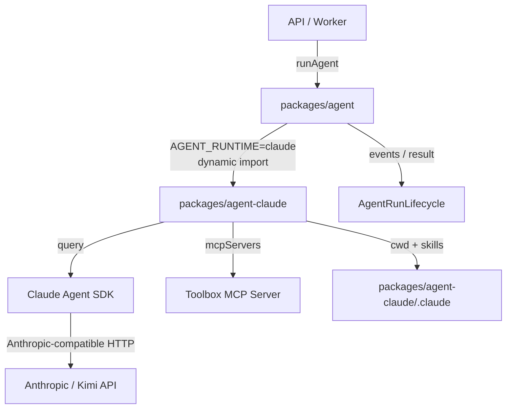
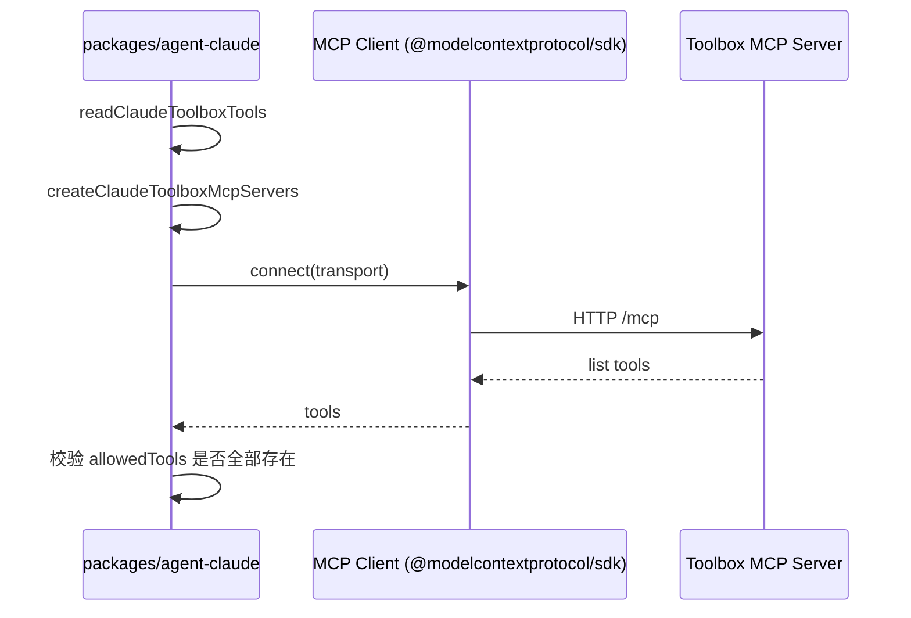
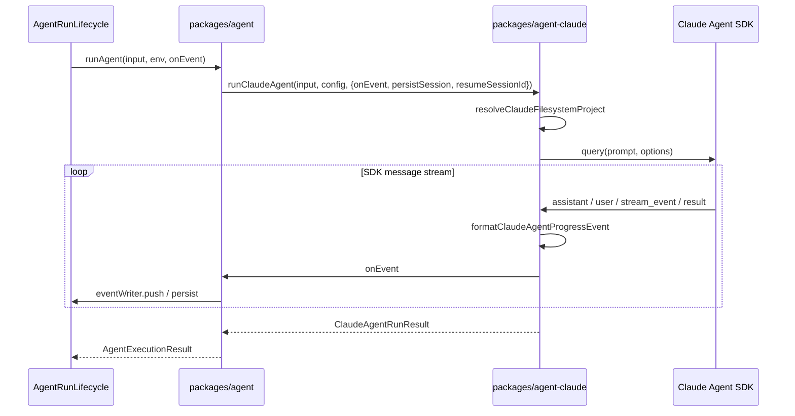

本页聚焦 `packages/agent-claude`：它在 `AGENT_RUNTIME=claude` 时被部署选中，作为 Claude Agent SDK 的 runtime adapter，负责把平台统一的 `AgentRunInput`、Toolbox MCP 能力、对话续跑状态以及运行事件协议转换为 Claude Agent SDK 的原生调用。它与 `packages/agent`（公共 runtime seam）和 `packages/agent-eve`（Eve 适配）相互独立，API 与 Worker 进程只依赖公共 seam，启动时不会加载未选中的 runtime。Sources: [0001-separate-agent-runtime-packages.md](docs/adr/0001-separate-agent-runtime-packages.md#L1-L4), [0011-deployment-selected-runtime-loading.md](docs/adr/0011-deployment-selected-runtime-loading.md#L7-L12), [packages/agent-claude/package.json](packages/agent-claude/package.json#L1-L25)

## 定位与架构边界

仓库把 runtime 实现拆成独立的 workspace package：`packages/agent-claude` 包内包含 Claude SDK 依赖、MCP Client 连接、文件系统项目（`.claude/CLAUDE.md` 与 `.claude/skills/`）以及所有 Claude 特有的行为。`packages/agent` 则只负责解析环境变量、按 `AGENT_RUNTIME` 分派、维护统一的 Agent run lifecycle 和事件协议。API 与 Worker 在 `createAgentRunLifecycle` 中把 `execute` 设为 `runAgent`，而 `runAgent` 通过动态 `import("@agent-template/agent-claude")` 仅在执行时刻加载 Claude 适配。Sources: [packages/agent/src/index.ts](packages/agent/src/index.ts#L40-L48), [packages/agent/src/index.ts](packages/agent/src/index.ts#L170-L225), [packages/agent/AGENTS.md](packages/agent/AGENTS.md#L5-L13)



## 配置模型与环境变量

`packages/agent` 的 `AgentRuntimeEnvSchema` 统一声明了所有 runtime 相关的环境变量，包括 `AGENT_RUNTIME`、`ANTHROPIC_API_KEY` / `ANTHROPIC_AUTH_TOKEN` / `ANTHROPIC_BASE_URL`、`CLAUDE_AGENT_MODEL`、`CLAUDE_PROJECT_DIR` 以及 Toolbox 相关的 `TOOLBOX_URL`、`TOOLBOX_AUTH_TOKEN`、`AGENT_CAPABILITY_PROFILE`。`apps/api` 和 `apps/worker` 的环境 schemas 都通过 `AgentRuntimeEnvSchema.extend(...)` 复用这些定义。Claude 适配层再用 `ClaudeAgentConfigSchema` 把这些变量收敛成 `apiKey`、`authToken`、`baseUrl`、`model`、`projectDir` 和 `toolbox` 配置。Sources: [packages/agent/src/index.ts](packages/agent/src/index.ts#L43-L58), [apps/api/src/env.ts](apps/api/src/env.ts#L5-L25), [apps/worker/src/env.ts](apps/worker/src/env.ts#L1-L6), [packages/agent-claude/src/index.ts](packages/agent-claude/src/index.ts#L31-L40)

| 环境变量 | 作用 | 默认值 / 说明 |
|---|---|---|
| `AGENT_RUNTIME` | 选择当前部署的 runtime | `claude` |
| `ANTHROPIC_API_KEY` | Claude 官方 API Key | 与 `ANTHROPIC_AUTH_TOKEN` 二选一 |
| `ANTHROPIC_AUTH_TOKEN` | Anthropic-compatible auth token | 常用于 Kimi 等兼容端点 |
| `ANTHROPIC_BASE_URL` | Anthropic-compatible 基础 URL | 未设置时使用官方端点；项目默认示例为 `https://api.kimi.com/coding/` |
| `CLAUDE_AGENT_MODEL` | Claude 模型标识 | `kimi-for-coding` |
| `ANTHROPIC_MODEL` | 向后兼容的模型标识 | `CLAUDE_AGENT_MODEL` 优先 |
| `CLAUDE_PROJECT_DIR` | 显式指定 Claude 项目根目录 | 通常自动发现 |
| `TOOLBOX_URL` | Toolbox MCP 服务器地址 | 自动补全 `/mcp` 后缀 |
| `TOOLBOX_AUTH_TOKEN` | Toolbox 认证 token | 只出现在 MCP 连接 headers，不会传给模型 env |
| `AGENT_CAPABILITY_PROFILE` | 启用的 Toolbox 工具集 | `development-all` |

当 `ANTHROPIC_BASE_URL` 被设置时，适配层不会注入 `ANTHROPIC_DEFAULT_*_MODEL` 和 `ANTHROPIC_MODEL`，而是让 SDK 完全使用兼容端点；未设置时则把 `model` 写入这些环境变量，保证本地 Claude Code 行为一致。Sources: [packages/agent-claude/src/index.ts](packages/agent-claude/src/index.ts#L27-L28), [packages/agent-claude/src/index.ts](packages/agent-claude/src/index.ts#L86-L107), [packages/agent-claude/src/index.ts](packages/agent-claude/src/index.ts#L677-L711)

## 包级文件系统项目

按照 [ADR 0015](docs/adr/0015-package-owned-claude-filesystem-project.md)，Claude 的持久化指令和 runtime Skills 全部放在 `packages/agent-claude/.claude/` 下，而不是仓库根目录。`resolveClaudeFilesystemProject` 会按启动目录向上查找 `package.json` 的 `name` 为 `@agent-template/agent-claude` 的目录，确认 `.claude/CLAUDE.md` 存在，并读取 `.claude/skills-manifest.json`。Skills 只有在所需 Tool 全部出现在当前 `allowedTools` 中才会被启用；随后再验证每个启用 Skill 的 `SKILL.md` 文件存在。最终返回的 `cwd` 和 `skills` 被传入 SDK 的 `cwd` 与 `skills` 选项，使 Claude Agent SDK 以该包为项目根目录并加载对应 Skill。Sources: [docs/adr/0015-package-owned-claude-filesystem-project.md](docs/adr/0015-package-owned-claude-filesystem-project.md#L1-L7), [packages/agent-claude/src/filesystem-project.ts](packages/agent-claude/src/filesystem-project.ts#L20-L32), [packages/agent-claude/src/filesystem-project.ts](packages/agent-claude/src/filesystem-project.ts#L34-L60), [packages/agent-claude/src/filesystem-project.ts](packages/agent-claude/src/filesystem-project.ts#L125-L135)

```mermaid
flowchart LR
    A[启动目录：src / api dist / worker dist] --> B{找到 package.json name = @agent-template/agent-claude?}
    B -->|否| C[向上级目录搜索]
    C --> A
    B -->|是| D[验证 .claude/CLAUDE.md 存在]
    D --> E[读取 .claude/skills-manifest.json]
    E --> F[按 allowedTools 过滤 skills]
    F --> G[验证每个启用 Skill 的 SKILL.md]
    G --> H[返回 {cwd, skills}]
```

`skills-manifest.json` 由 `scripts/generate-toolbox-business-skills.ts` 生成，记录了每个 Skill 依赖的 Toolbox Tool；运行时通过这一映射把 `AGENT_CAPABILITY_PROFILE` 转换成实际要加载的 Skill 列表。例如 `ecommerce-sales` profile 只暴露 4 个销售分析 Tool，因此只启用 `ecommerce-sales-analysis` 一个 Skill。Sources: [packages/agent-claude/.claude/skills-manifest.json](packages/agent-claude/.claude/skills-manifest.json#L1-L36), [packages/agent-claude/src/filesystem-project.test.ts](packages/agent-claude/src/filesystem-project.test.ts#L32-L68)

## Toolbox MCP 适配

Claude 适配层直接拥有 Toolbox MCP Client。它通过 SDK 的 `mcpServers` 选项声明一个 `http` 类型 MCP 服务器，而不是让平台公共层建立连接。`readClaudeToolboxTools` 把 `toolbox.allowedTools` 映射成 `mcp__toolbox__<toolName>`，并始终加上内置的 `AskUserQuestion`；`createClaudeToolboxMcpServers` 则为每个 Toolbox Tool 配置 `permission_policy`：profile 内 Tool 设为 `always_allow`，其余 Tool 设为 `always_deny`，从而以最小权限方式向模型暴露能力。Toolbox 的 Bearer Token 放在 MCP 服务器 headers 中，同时从传给 SDK 子进程的环境变量里显式删除 `TOOLBOX_AUTH_TOKEN` 和 `TOOLBOX_URL`，避免泄漏给模型。Sources: [docs/adr/0007-agent-runtime-owned-mcp-clients.md](docs/adr/0007-agent-runtime-owned-mcp-clients.md#L7-L8), [packages/agent-claude/src/index.ts](packages/agent-claude/src/index.ts#L713-L720), [packages/agent-claude/src/index.ts](packages/agent-claude/src/index.ts#L722-L756), [packages/agent-claude/src/index.ts](packages/agent-claude/src/index.ts#L705-L708)



健康检查 `checkClaudeAgentReadiness` 会打开一个临时 MCP 连接，调用 `listTools()`，并检查 `AGENT_CAPABILITY_PROFILE` 要求的每个 Tool 都在服务端存在；完成后再关闭该客户端。如果缺失任何 Tool，则返回 `error` 状态，使 API `/health` 进入 degraded。Sources: [packages/agent-claude/src/index.ts](packages/agent-claude/src/index.ts#L115-L174), [apps/api/src/health.ts](apps/api/src/health.ts#L94-L100)

## 执行与事件流

`runClaudeAgent` 是 Claude 适配层的执行入口。它首先检查 `apiKey` 或 `authToken`，未配置则直接返回 `status: "skipped"`；然后解析文件系统项目，异步加载 Claude Agent SDK，并调用 `sdk.query({ prompt, options })`。`options` 中携带 `cwd`、环境变量、`allowedTools`、`mcpServers`、`maxTurns`（默认 100）、`permissionMode: "dontAsk"`、`persistSession`、`resume`、用于处理 `AskUserQuestion` 的 `hooks` 以及 `skills` 列表。Sources: [packages/agent-claude/src/index.ts](packages/agent-claude/src/index.ts#L207-L259)

SDK 以异步可迭代对象返回消息流。适配层按消息类型做如下转换：

- `stream_event` 的 `content_block_delta` / `text_delta` 被提取为增量文本，并累积成 `partialText`；当增量达到 200 字符或结果到达时，产生 `kind: "text"` 事件。
- `assistant` 消息中的 `text` 内容块产生 `text` 事件；`tool_use` 块产生 `kind: "tool-call"`，并记录 `callId` 与 `toolName` 的映射。
- `user` 消息中的 `tool_result` 块产生 `kind: "tool-result"`，并移除映射。
- `result` 消息代表一次 turn 结束；若其 `subtype` 为 `success` 且 `is_error` 为假，则产生 `kind: "done"`。

连续的 `text` 事件通过 `appendCompactedAgentRunEvent` 合并，只保留最新一份累积文本，避免运行内存随流式输出二次增长。Sources: [packages/agent-claude/src/index.ts](packages/agent-claude/src/index.ts#L264-L409), [packages/agent-claude/src/index.ts](packages/agent-claude/src/index.ts#L595-L624), [packages/agent-claude/src/index.ts](packages/agent-claude/src/index.ts#L626-L658), [packages/shared/src/agent-run-events.ts](packages/shared/src/agent-run-events.ts#L71-L81)



### 用户输入与续跑

当 Claude Agent SDK 把 `AskUserQuestion` 标记为 `tool_deferred` 时，适配层通过 `readClaudePendingInput` 把 `deferred_tool_use` 转换成 `ClaudePendingInput`，并产生 `kind: "input-request"` 事件，返回 `status: "waiting"` 和 `sessionId`。`packages/agent` 的 `readRuntimeContinuation` 会把 `{runtime: "claude", sessionId, pendingInput}` 存进 `AgentConversation` 的 `runtimeContinuation`。下一轮换入时，公共 seam 把 `resumeSessionId` 和 `pendingInput` 传回 `runClaudeAgent`；`createClaudeInputHooks` 在 `PreToolUse` 阶段把用户响应 `answers` 注入原 Tool 输入，从而恢复执行。Sources: [packages/agent-claude/src/index.ts](packages/agent-claude/src/index.ts#L455-L477), [packages/agent-claude/src/index.ts](packages/agent-claude/src/index.ts#L411-L453), [packages/agent-claude/src/index.ts](packages/agent-claude/src/index.ts#L544-L568), [packages/agent/src/runtime-continuation.ts](packages/agent/src/runtime-continuation.ts#L7-L19), [packages/agent/src/index.ts](packages/agent/src/index.ts#L275-L300)

### 执行结果

`ClaudeAgentRunResult` 是一个 status-discriminated union，包含 `skipped`、`completed`、`waiting`、`failed` 四种状态。`completed` 时返回 `output` 与事件序列；`failed` 时返回 `reason`；`waiting` 时返回 `pendingInput` 与可续跑的 `sessionId`。`packages/agent` 的 `runAgent` 把这些结果统一封装成 `AgentExecutionResult`，并可选地附加 `runtimeContinuation` 与 `runtimeSessionId`，再交给 lifecycle 持久化。Sources: [packages/agent-claude/src/index.ts](packages/agent-claude/src/index.ts#L61-L84), [packages/agent-claude/src/index.ts](packages/agent-claude/src/index.ts#L323-L377), [packages/agent/src/index.ts](packages/agent/src/index.ts#L227-L273)

## 与平台生命周期集成

API 和 Worker 共享同一个 `AgentRunLifecycle`：两者都调用 `createAgentRunLifecycle({ repository: createPrismaAgentRunRepository(prisma), execute: runAgent })`。当 Chat SSE 或 BullMQ job 触发一次运行时，lifecycle 先 `claim` 执行租约，然后通过 `runAgent` 进入 Claude 适配层；适配层产生的每个事件经 `onEvent` 回调被 `eventWriter` 持久化到 PostgreSQL，并可能通过 SSE 推送给 Web 前端。执行过程中 `monitorExecution` 会周期性地 `heartbeat` 数据库，检查是否有取消请求或租约丢失。Sources: [apps/api/src/app.ts](apps/api/src/app.ts#L46-L57), [apps/worker/src/worker.ts](apps/worker/src/worker.ts#L6-L13), [packages/agent/src/lifecycle.ts](packages/agent/src/lifecycle.ts#L150-L157), [packages/agent/src/lifecycle.ts](packages/agent/src/lifecycle.ts#L220-L232), [packages/agent/src/lifecycle.ts](packages/agent/src/lifecycle.ts#L560-L594)

平台还负责 Agent conversation 的持久化与 runtime 绑定。`AgentConversation` 在创建时记录当前 `AGENT_RUNTIME`；后续每一轮发送时都会检查 `AGENT_RUNTIME` 是否与 conversation 的 runtime 一致，不一致则抛出 `AgentConversationRuntimeConflictError`。Claude 的 continuation 数据（`sessionId` 和 `pendingInput`）只保存在服务端，不会暴露给客户端。Sources: [packages/agent/src/conversation.ts](packages/agent/src/conversation.ts#L95-L108), [docs/adr/0014-platform-owned-agent-conversations.md](docs/adr/0014-platform-owned-agent-conversations.md#L7-L13)

## 构建隔离与边界校验

`AGENT_RUNTIME` 的选择不会导致 API/Worker 构建产物包含两套 runtime。`tsup` 会把 `packages/agent-claude` 和 `packages/agent-eve` 分别打包成独立的动态 chunk；`scripts/check-runtime-bundle-boundary.ts` 验证 `apps/api/dist/server.js` 和 `apps/worker/dist/worker.js` 入口文件既不包含 Claude 实现也不包含 Eve 实现，并且存在两个不同的 chunk 文件分别被 `import("./...")` 引用。这保证了启动时只加载被选中的 runtime，也减小了未选中 runtime 的内存和攻击面。Sources: [docs/adr/0011-deployment-selected-runtime-loading.md](docs/adr/0011-deployment-selected-runtime-loading.md#L7-L18), [scripts/check-runtime-bundle-boundary.ts](scripts/check-runtime-bundle-boundary.ts#L8-L38), [package.json](package.json#L28)

## 验证与测试

Claude runtime 适配层自带 `vitest` 测试：

- `filesystem-project.test.ts` 验证从源码目录、API bundle 和 Worker bundle 都能定位到 `packages/agent-claude`，并验证不同 capability profile 下启用的 Skill 列表。
- `index.test.ts` 覆盖配置解析、Kimi 兼容端点、部分文本流合并、Toolbox MCP 工具映射、权限策略、最小权限下的 Bearer Token 隔离，以及 `AskUserQuestion` 的 `defer` 与 `allow` 续跑流程。

此外，仓库还提供端到端验证脚本：

| 命令 | 作用 |
|---|---|
| `pnpm --filter @agent-template/agent-claude test` | 运行单元测试 |
| `pnpm agent-runtime:verify:local` | 本地验证 runtime readiness |
| `pnpm agent-runtime:check:bundle` | 构建并校验 API/Worker 的 runtime 分块边界 |

Sources: [packages/agent-claude/src/filesystem-project.test.ts](packages/agent-claude/src/filesystem-project.test.ts#L22-L68), [packages/agent-claude/src/index.test.ts](packages/agent-claude/src/index.test.ts#L24-L52), [packages/agent-claude/src/index.test.ts](packages/agent-claude/src/index.test.ts#L118-L189), [packages/agent-claude/src/index.test.ts](packages/agent-claude/src/index.test.ts#L347-L467), [packages/agent-claude/src/index.test.ts](packages/agent-claude/src/index.test.ts#L552-L703)

## 下一步

- 若需理解 runtime 选择、公共 seam 与进程边界，请参阅 [整体架构与进程边界](7-zheng-ti-jia-gou-yu-jin-cheng-bian-jie)。
- 若需了解 Agent run 的持久化、执行租约与事件顺序，请参阅 [Agent Run 生命周期与执行租约](8-agent-run-sheng-ming-zhou-qi-yu-zhi-xing-zu-yue)。
- 若需对比 Eve 的实现方式，请参阅 [Eve Agent Runtime 适配](10-eve-agent-runtime-gua-pei)。
- 若需了解 Toolbox MCP 工具与 capability profile 的生成逻辑，请参阅 [Toolbox 与 MCP 工具供给](11-toolbox-yu-mcp-gong-ju-gong-gei)。
- 若需了解 API 路由、SSE 流与任务队列如何消费 runtime，请参阅 [API 路由、SSE 与任务队列](13-api-lu-you-sse-yu-ren-wu-dui-lie)。
- 若需了解测试、门禁与质量验证，请参阅 [测试、门禁与质量验证](16-ce-shi-men-jin-yu-zhi-liang-yan-zheng)。